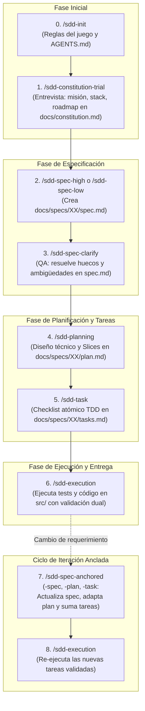

# SDD Universal Workflows & Multi-IDE Installer

Herramienta de distribución, instalación instantánea y orquestación de flujos de trabajo **Spec-Driven Development (SDD)** para los principales entornos y agentes de IA (**Antigravity**, **Cursor**, **VS Code / Copilot** y **OpenCode / Continue**).

Permite mantener una **única fuente de verdad** (Single Source of Truth) en plantillas Markdown canónicas y desplegarlas automáticamente con las rutas, extensiones y metadatos requeridos por cada IDE mediante un simple comando `curl | bash` o PowerShell.

---

## ⚡ Instalación Rápida (One-Liner)

Abre la terminal en la raíz del proyecto donde quieras habilitar la metodología SDD y ejecuta:

### Linux / macOS / Windows Git Bash:
```bash
curl -fsSL https://raw.githubusercontent.com/Thebetus7/SW2-G17-SDD-26-2/main/install.sh | bash
```

### Windows (PowerShell nativo):
```powershell
irm https://raw.githubusercontent.com/Thebetus7/SW2-G17-SDD-26-2/main/install.ps1 | iex
```

El script desplegará un menú interactivo en consola con **navegación por flechas (`↑` / `↓`) y confirmación con `Enter`**:

```text
==========================================================
    🚀 SDD Workflows Installer (Spec-Driven Dev)
==========================================================

Usa las flechas [↑/↓] para moverte y presiona [Enter] para elegir:

  ❯ Antigravity          (.agents/workflows/ y .agents/skills/)
    Cursor               (.cursor/commands/, rules/ y .cursorrules)
    OpenCode / Continue  (.continue/prompts/ y rules/)
    VS Code / Copilot    (.github/skills/, prompts/ y copilot-instructions.md)
    Todos los anteriores
```

---

## 📂 Adaptación y Compatibilidad por Entorno

| Entorno / IDE | Ubicaciones Generadas | Mecanismo de Invocación |
| :--- | :--- | :--- |
| **Antigravity** | • `.agents/skills/<nombre>/SKILL.md`<br>• `.agents/workflows/<nombre>.md` | Comandos slash directos en el chat (`/sdd-init`, etc.) o activación por nombre de Skill. |
| **Cursor** | • `.cursor/commands/<nombre>.md`<br>• `.cursor/rules/<nombre>.mdc`<br>• `.cursorrules` (archivo maestro en raíz) | Al escribir `/` en el chat de Cursor aparecen los comandos nativos de autocompletado y reglas contextuales. |
| **VS Code (GitHub Copilot)** | • `.github/skills/<nombre>/SKILL.md`<br>• `.github/prompts/<nombre>.prompt.md`<br>• `.github/copilot-instructions.md` | Soporte nativo de *Agent Skills* (`/skills`), *Prompt Files* reutilizables en Copilot Chat e instrucciones maestras de repositorio. |
| **OpenCode / Continue** | • `.continue/prompts/<nombre>.prompt`<br>• `.continue/rules/<nombre>.md` | Comandos slash directos en el panel de Continue con interpolación de variables `{{{ input }}}`. |

---

## 🏛️ Estructura Documental en tu Proyecto (`docs/`)

Una vez instalado, el desarrollo bajo SDD organiza la documentación en carpetas versionadas dentro de `docs/`:

```text
📁 MI-PROYECTO/
├── 📄 AGENTS.md                        <-- Reglas del juego, comandos maestros y jerarquía
├── 📁 docs/
│   ├── 📄 constitution.md              <-- Misión, stack, suite de testing (Caja Negra y Blanca) y roadmap
│   └── 📁 specs/
│       ├── 📁 01-modulo-core/
│       │   ├── 📄 spec.md              <-- Requerimientos EARS, Gherkin y contratos de datos
│       │   ├── 📄 plan.md              <-- Arquitectura técnica y Vertical Slices
│       │   └── 📄 tasks.md             <-- Checklist atómico de tareas TDD
│       └── 📁 02-siguiente-feature/
│           ├── 📄 spec.md
│           ├── 📄 plan.md
│           └── 📄 tasks.md
└── 📁 src/                             <-- Código de producción
```

---

## 🔄 El Ciclo de Vida Formal SDD (8 Fases)



### Detalle de los Comandos Incluidos:

1. **`/sdd-init`**: Orquestador metodológico. Configura la precedencia de carpetas, jerarquía de verdad y genera el archivo maestro `AGENTS.md`.
2. **`/sdd-constitution-trial`**: Entrevista guiada interactiva (*Grill-Me*). Pregunta todo lo necesario y redacta `docs/constitution.md` con la misión, tech stack, roadmap (Docker, `.env`, Git), estándares de código y suite de testing.
3. **`/sdd-constitution`**: Plantilla canónica directa para redactar o consultar la constitución del proyecto.
4. **`/sdd-spec-high`**: Especificación formal exhaustiva con sintaxis EARS, escenarios Gherkin BDD y contratos de interfaces tipados en `docs/specs/XX/spec.md`.
5. **`/sdd-spec-low`**: Especificación ágil y concisa para tareas puntuales o de menor complejidad.
6. **`/sdd-spec-clarify`**: Filtro de QA. Audita el último `spec.md`, detecta ambigüedades o vacíos y los resuelve con el usuario antes de planificar.
7. **`/sdd-planning`**: Plan técnico de arquitectura, diagramas de secuencia, invariantes y partición en Vertical Slices en `docs/specs/XX/plan.md`.
8. **`/sdd-task`**: Desglose en checklist atómico secuenciado con ciclo TDD (Red-Green-Refactor) en `docs/specs/XX/tasks.md`.
9. **`/sdd-execution`**: Motor de ejecución paso a paso del checklist bajo **Validación Dual** obligatoria (Tests de Caja Blanca + Tests de Caja Negra).
10. **`/sdd-spec-anchored`** *(y variantes `-spec`, `-plan`, `-task`)*: Evolución e iteración anclada sobre specs existentes: actualiza el `spec.md`, adapta el `plan.md` y suma las nuevas tareas a `tasks.md` manteniendo el historial intacto.

---

## ⚖️ Principio Innegociable de Validación Dual

La metodología prohíbe dar una tarea por completada sin superar ambas caras de la validación:
- **Caja Blanca (White-Box)**: Tests unitarios y de integración estructurales que validan branches, cálculos y manejo de errores internos con cobertura demostrable.
- **Caja Negra (Black-Box)**: Tests de aceptación BDD (Gherkin) que validan el comportamiento observable por el cliente/usuario desde el exterior.

---

## 🚀 Despliegue y Fork

Consulta la guía detallada en [DEPLOY.md](DEPLOY.md) para aprender a subir tu propio fork a GitHub y configurar tus URLs canónicas.
