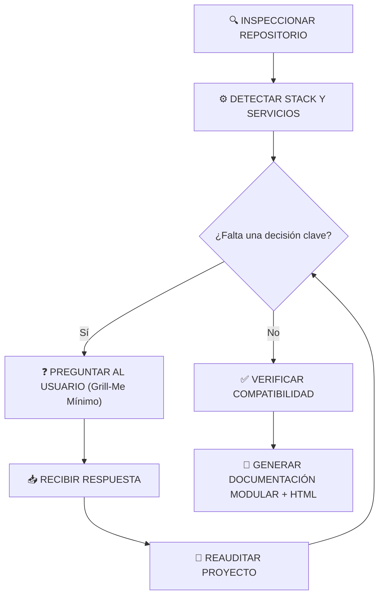
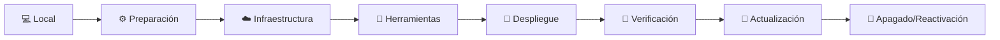
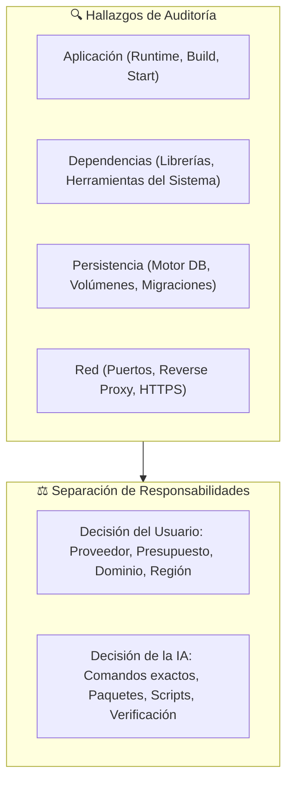
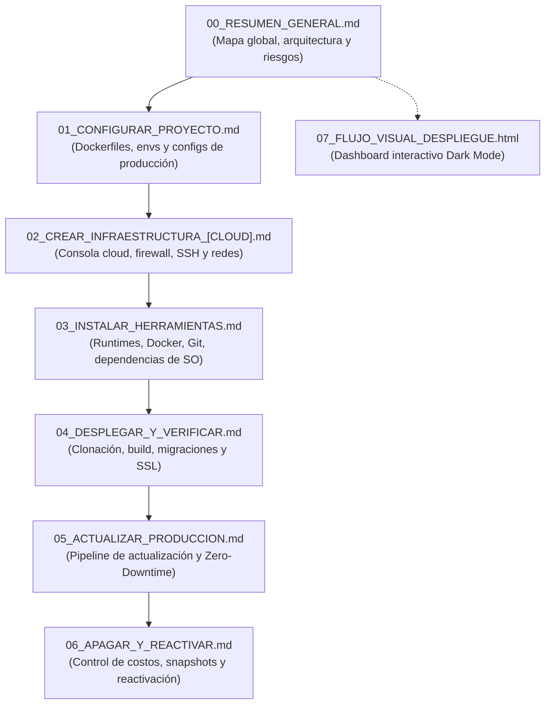

# 🚀 DOC-DEPLOY: Generador de Documentación de Despliegue, Infraestructura y Flujo Visual Interactivo

Este workflow crea una **suite completa de documentación técnica para desplegar, instalar, verificar, actualizar, mantener, apagar y reactivar un proyecto** en un entorno de producción real.

El workflow analiza el proyecto real, determina las herramientas y servicios necesarios, solicita únicamente las decisiones de infraestructura que el usuario todavía no haya definido y genera:

```text
📁 [CARPETA_DESPLIEGUE]/
├── 📄 00_RESUMEN_GENERAL.md
├── 📄 01_CONFIGURAR_PROYECTO.md
├── 📄 02_CREAR_INFRAESTRUCTURA_[CLOUD].md
├── 📄 03_INSTALAR_HERRAMIENTAS.md
├── 📄 04_DESPLEGAR_Y_VERIFICAR.md
├── 📄 05_ACTUALIZAR_PRODUCCION.md
├── 📄 06_APAGAR_Y_REACTIVAR.md
└── 🌐 07_FLUJO_VISUAL_DESPLIEGUE.html
```

> [!NOTE]
> Los archivos Markdown (`00` a `06`) constituyen la **documentación textual modular y navegable**, estructurada en tarjetas visuales de pasos con verificación y troubleshooting.
> El archivo HTML (`07`) constituye la **representación visual interactiva en formato diagrama de flujo y componentes**, con soporte de Dark Mode y exploración paso a paso sin dependencias externas.

---

# 0. REGLA SUPREMA — CERO INVENTIVA DE INFRAESTRUCTURA Y COMANDOS

> [!IMPORTANT]
> **REGLA DE ORO INNEGOCIABLE:**
> La IA tiene terminantemente prohibido inventar o asumir silenciosamente:
> - Proveedores de nube (AWS, GCP, Azure, DigitalOcean, VPS, Render, etc.).
> - Sistemas operativos o distribuciones Linux (Ubuntu, Debian, Alpine, etc.).
> - Tipos de instancia, tamaños de máquina o cuotas de CPU/RAM.
> - Comandos de consola, rutas del sistema de archivos o puertos de red.
> - Dependencias de runtime, paquetes nativos o librerías de sistema.
> - Precios, políticas de facturación, dominios o registros DNS.



> [!CAUTION]
> **Nunca generar una guía aparentemente completa utilizando valores ficticios o placeholders ambiguos.** Si una decisión no puede inferirse con certeza, la IA debe detenerse y preguntar.

---

# 1. OBJETIVO Y PIPELINE DEL CICLO OPERATIVO

`/doc-deploy` debe producir una guía que permita a cualquier ingeniero o auditor llevar el proyecto desde su estado de desarrollo hasta producción sin ambigüedades:



El usuario final debe poder operar el sistema sin tener que adivinar:
- Qué paquetes instalar y en qué orden exacto.
- Dónde ejecutar cada instrucción (`[PC LOCAL]`, `[SSH / SERVIDOR]`, `[CONTENEDOR]`).
- Qué archivo editar y qué variable configurar exactamente.
- Cómo comprobar de forma observable que cada servicio quedó saludable.
- Qué hacer paso a paso si ocurre un error en tiempo de ejecución.
- Cómo desplegar nuevas versiones con mínimo o cero tiempo de inactividad (*Zero-Downtime*).

---

# 2. PRINCIPIO DE MÍNIMAS PREGUNTAS (GRILL-ME ESTRATÉGICO)

> [!TIP]
> **Prioridad:** Preguntar la **menor cantidad posible de decisiones de alto impacto**.

1. Si el usuario no especificó proveedor ni modo de hosting, la IA debe realizar primero una **auditoría profunda del repositorio** para determinar qué puede inferirse de forma objetiva (ej. `Dockerfile`, `docker-compose.yml`, bases de datos, scripts).
2. Si tras la auditoría el camino es evidente, confirmarlo brevemente.
3. Solo si faltan decisiones estructurales irreductibles (ej. ¿VPS propio o PaaS administrado?), la IA formulará una o dos preguntas clave con opciones recomendadas.

---

# 3. AUDITORÍA PREVIA OBLIGATORIA DEL REPOSITORIO

Antes de formular preguntas, la IA debe auditar exhaustivamente los artefactos del proyecto:

| Categoría | Archivos a Inspeccionar | Propósito de la Detección |
|:---|:---|:---|
| **Gobernanza y Visión** | `AGENTS.md`, `README.md`, `docs/constitution.md` | Entender la misión, restricciones de hosting y lineamientos del equipo. |
| **Especificaciones y Arquitectura** | `docs/specs/**/plan.md`, `docs/specs/**/spec.md` | Topología de datos, capas de servicios, puertos y dependencias externas. |
| **Dependencias y Runtime** | `package.json`, `requirements.txt`, `pyproject.toml`, `composer.json`, `go.mod`, `pom.xml` | Versiones de lenguaje, scripts de build, comandos de start y migraciones. |
| **Contenedores y Orquestación** | `Dockerfile`, `docker-compose.yml`, `compose.yml`, `.dockerignore` | Servicios multicontenedor, mapeo de puertos, volúmenes de datos y redes. |
| **Variables y Secretos** | `.env.example`, `.env.template`, `config/`, `settings.py` | Catálogo de variables de entorno requeridas en producción sin revelar secretos. |
| **Servidores Web y Proxies** | `nginx.conf`, `Caddyfile`, `systemd/`, `scripts/` | Enrutamiento inverso, certificados SSL/TLS y demonios de sistema. |
| **Automatización y CI/CD** | `.github/workflows/`, `gitlab-ci.yml`, `Makefile` | Pipelines de testing y scripts de automatización ya existentes. |

---

# 4. REGLA SUPREMA DE SEGURIDAD SOBRE SECRETOS Y CREDENCIALES

> [!WARNING]
> **PROHIBICIÓN ABSOLUTA DE FILTRAR SECRETOS:**
> La IA puede inspeccionar archivos `.env` locales para identificar los *nombres* de variables necesarias, pero **NUNCA DEBE TRASLADAR SECRETOS REALES A LA DOCUMENTACIÓN NI AL HTML**.

Bajo ninguna circunstancia se incluirán valores reales de:
- Contraseñas de bases de datos o cuentas de usuario.
- Claves privadas SSH o certificados SSL privados (`.key`).
- API Keys de servicios cloud, OpenAI, Stripe, pasarelas de pago, etc.
- Secretos de firma criptográfica (`JWT_SECRET`, `SESSION_KEY`, etc.).

### Estándar de Placeholders Seguros:
En los archivos de documentación y ejemplos de comandos, se utilizará obligatoriamente la convención:
- `<TU_IP_PUBLICA>`
- `<TU_DOMINIO>`
- `<TU_DB_PASSWORD_PRODUCCION>`
- `<TU_JWT_SECRET_SEGURO>`
- `<TU_API_KEY>`

Cada placeholder debe acompañarse de una nota explicando: **Dónde generarlo**, **Dónde introducirlo** y **Qué nivel de entropía/seguridad requiere**.

---

# 5. MATRIZ DE DETECCIÓN Y DECISIONES TÉCNICAS



### Tabla de Responsabilidades:

| Ámbito | Responsable | Elementos Gobernados |
|:---|:---:|:---|
| **Estrategia y Negocio** | 👤 **Usuario** | Proveedor Cloud, presupuesto máximo, ubicación geográfica/región de datos, adquisición de dominio, certificados existentes. |
| **Ingeniería Operativa** | 🤖 **IA** | Secuencia cronológica de comandos, paquetes de sistema (`apt`/`apk`), configuración de systemd/docker, scripts de backup, comandos de verificación observable y estructura de los documentos. |

---

# 6. ESTÁNDAR VISUAL DE TARJETAS DE PASOS ESTRUCTURADOS (STEP CARDS)

> [!IMPORTANT]
> **FORMATO OBLIGATORIO PARA TODAS LAS GUÍAS OPERATIVAS (01 A 06):**
> Cada paso debe presentarse como una **Tarjeta de Paso Estructurada** con iconografía identificativa, contexto de ejecución explícito, bloque de comando con sintaxis coloreada, salida esperada verificable y procedimiento de solución de problemas (*Troubleshooting*).

### Estructura Canónica de Cada Paso:

```markdown
### 🚀 Paso X: [Verbo de Acción en Infinitivo + Componente Concreto]

> [!NOTE]
> **Propósito:** [Explicación concisa de qué hace este paso y por qué es necesario]
> **Contexto de Ejecución:** `[PC LOCAL]` | `[SSH / SERVIDOR]` | `[CONTENEDOR]`
> **Ruta de Trabajo:** `/ruta/absoluta/o/relativa/donde/ejecutar`

```bash
# Comando exacto, listo para ejecutar (sin placeholders ambiguos)
docker compose up -d --build
```

> [!TIP]
> **Verificación Observable & Salida Esperada:**
> Ejecuta `docker compose ps` y valida que la salida confirme los servicios activos:
> ```text
> NAME                IMAGE               STATUS              PORTS
> mi_app_backend      mi_app:latest       Up 15 seconds       0.0.0.0:8000->8000/tcp
> mi_app_db           postgres:16-alpine  Up 15 seconds       5432/tcp
> ```

> [!WARNING]
> **Solución de Fallos Frecuentes (Troubleshooting):**
> - **Síntoma:** El contenedor sale con error `bind: address already in use`.
> - **Causa:** Otro proceso está utilizando el puerto asignado.
> - **Solución:** Identifica el proceso con `sudo lsof -i :8000` o reasigna el puerto en el archivo `.env`.
```

---

# 7. ESTRUCTURA MODULAR DE LA SUITE DOCUMENTAL (MARKDOWN)

La suite de despliegue generada en la carpeta de destino debe seguir de forma inmutable la siguiente arquitectura documental:



---

## 7.1 Detalle de Responsabilidad por Documento

### `00_RESUMEN_GENERAL.md`
- **Misión:** Mapa mental completo y tablero de control del despliegue.
- **Componentes Obligatorios:**
  - Ficha técnica del proyecto (Nombre, Stack, Proveedor seleccionado, Entorno).
  - Diagrama Mermaid de Arquitectura de Producción (comunicación entre clientes, reverse proxy, contenedores y base de datos).
  - Tabla de prerrequisitos (cuentas, claves, accesos).
  - Matriz de puertos y seguridad de red.
  - Tabla de estimación y control de costos mensuales.
  - Barra de navegación rápida entre documentos.

### `01_CONFIGURAR_PROYECTO.md`
- **Misión:** Preparación del código fuente y artefactos antes de tocar el servidor remoto.
- **Componentes Obligatorios:**
  - Configuración y validación de `Dockerfile` multicapa optimizado para producción.
  - Orquestación en `docker-compose.prod.yml` o equivalente con políticas de reinicio (`restart: unless-stopped`) y límites de memoria.
  - Archivo `.env.production.example` con la totalidad de variables necesarias explicadas una a una.
  - Configuración de servidores web de borde (`nginx.conf` o `Caddyfile`) con compresión gzip/brotli y cabeceras de seguridad HTTP.
  - Verificación local previa mediante build de prueba.

### `02_CREAR_INFRAESTRUCTURA_[CLOUD].md`
- **Misión:** Provisión de máquinas virtuales, redes y seguridad en el proveedor cloud.
- **Componentes Obligatorios:**
  - Guía paso a paso de consola web o CLI del proveedor real (AWS Lightsail/EC2, DigitalOcean Droplet, GCP Compute, VPS, etc.).
  - Configuración estricta de Firewall / Security Groups:
    | Puerto | Protocolo | Origen | Servicio | Justificación |
    |:---:|:---:|:---:|:---|:---|
    | `22` | TCP | `0.0.0.0/0` (o IP fija) | SSH | Administración remota segura vía par de llaves. |
    | `80` | TCP | `0.0.0.0/0` | HTTP | Desvío obligatorio y renovación de certificados ACME. |
    | `443` | TCP | `0.0.0.0/0` | HTTPS | Tráfico web cifrado para usuarios finales. |
  - Generación, almacenamiento seguro y permisos del par de claves SSH (`chmod 400 ~/.ssh/clave.pem`).
  - Asignación de IP estática/elástica y configuración de registros DNS (`A`, `CNAME`).

### `03_INSTALAR_HERRAMIENTAS.md`
- **Misión:** Aprovisionamiento del sistema operativo del servidor.
- **Componentes Obligatorios:**
  - Primera conexión SSH con comando exacto y flags recomendados.
  - Creación de usuario administrador no root (`sudo useradd -m ...`).
  - Actualización de repositorios y paquetes del sistema (`apt update && apt upgrade -y`).
  - Instalación oficial de Docker Engine y Docker Compose plugin sin versiones desactualizadas.
  - Configuración de permisos de usuario (`usermod -aG docker $USER`).
  - Configuración de memoria Swap de seguridad (para prevenir caídas por Out-Of-Memory en servidores pequeños).
  - Tabla de verificación con comando y salida esperada para cada herramienta instalada.

### `04_DESPLEGAR_Y_VERIFICAR.md`
- **Misión:** El primer despliegue real de punta a punta (*From Zero to Running*).
- **Componentes Obligatorios:**
  - Clonación segura del repositorio en el servidor (mediante Deploy Key de GitHub o HTTPS).
  - Creación del archivo `.env.production` real en el servidor a partir de la plantilla.
  - Construcción y arranque de contenedores con `docker compose -f docker-compose.prod.yml up -d --build`.
  - Ejecución de migraciones de base de datos y seeds de inicialización.
  - Emisión y renovación automática de certificados SSL/TLS (Let's Encrypt / Certbot / Caddy).
  - Batería de pruebas de verificación física (HTTP status codes, logs en tiempo real, persistencia tras reinicio).
  - Sección profunda de **Troubleshooting Contextual** para los 5 fallos más probables del stack.

### `05_ACTUALIZAR_PRODUCCION.md`
- **Misión:** Procedimiento rutinario y seguro de actualización de código sin pérdida de datos.
- **Componentes Obligatorios:**
  - Flujo dual claramente separado: `[A. PC LOCAL]` (commit, push, tags) y `[B. SERVIDOR REMOTO]` (pull, rebuild, migrate).
  - Estrategia de **Zero-Downtime Deployment** o ventana de mantenimiento programada.
  - Protocolo obligatorio de **Respaldo Rápido previo a actualización** (dump de base de datos).
  - Procedimiento de **Rollback Inmediato** si la nueva versión presenta errores en producción.

### `06_APAGAR_Y_REACTIVAR.md`
- **Misión:** Gobernanza de ciclo de vida, ahorro de costos y reactivación segura.
- **Componentes Obligatorios:**
  - Diferencia operativa y financiera entre **Detener (Stop/Pause)** y **Eliminar (Terminate/Destroy)**.
  - Matriz de costos residuales (Discos EBS/Block Storage e IPs elásticas que siguen facturando aún con la máquina apagada).
  - Procedimiento de creación de snapshot / copia de seguridad antes del apagado.
  - Protocolo paso a paso de **Reactivación**:
    ```mermaid
    flowchart LR
        A["Recurso Apagado"] --> B["Iniciar Instancia"]
        B --> C["Verificar IP/DNS"]
        C --> D["Arrancar Servicios"]
        D --> E["Test Observable"]
    ```
  - Checklist de verificación tras encendido (verificar si la IP pública cambió, recertificar SSL si aplica, comprobar montajes).

---

# 8. ESPECIFICACIÓN DEL ARTEFACTO VISUAL INTERACTIVO (`07_FLUJO_VISUAL_DESPLIEGUE.html`)

> [!IMPORTANT]
> **REQUERIMIENTOS DEL DASHBOARD INTERACTIVO:**
> - **Concepto Central:** Debe presentarse como un **flujo interactivo tipo diagrama de componentes y nodos del pipeline de despliegue**.
> - **Interacción por Nodos:** Cada componente o nodo del diagrama es interactivo; al seleccionarlo, muestra dinámicamente en un panel principal sus respectivos pasos estructurados, comandos, verificaciones y alertas.
> - **Soporte Nativo de Modo Oscuro (Dark Mode):** Interruptor fluido (Light / Dark) en la barra superior con persistencia en `localStorage`. Paleta refinada de alto contraste y legibilidad técnica.
> - **Botones de Copiado Instantáneo:** Cada comando cuenta con botón de copiar con feedback visual inmediato (`¡Copiado!`).
> - **Checklist de Progreso Documental:** Permite al desarrollador ir marcando casillas de verificación interactivas para seguir visualmente el avance de su despliegue.
> - **100% Autocontenido:** Cero dependencias externas (sin CDN de Tailwind, sin scripts externos que requieran internet). Debe abrirse instantáneamente con doble clic en local.

---

# 9. CONTRATO DE CALIDAD Y REGLAS DE CIERRE

Antes de declarar el estado `GENERATED`, la IA debe verificar:

- [ ] **Completitud:** Ningún comando contiene parámetros ficticios (`docker run ...` o `[puerto]`); todos usan la sintaxis `<TU_PARAMETRO>` debidamente explicada.
- [ ] **Contexto:** Cada bloque de código declara explícitamente su ámbito: `[PC LOCAL]`, `[SSH / SERVIDOR]` o `[CONTENEDOR]`.
- [ ] **Verificación Dual:** Cada comando de cambio de estado tiene asociado su correspondiente comando de verificación observable.
- [ ] **Sincronización:** El archivo HTML `07_FLUJO_VISUAL_DESPLIEGUE.html` contiene exactamente el 100% de los pasos, comandos y alertas documentados en los archivos Markdown `00` a `06`.
- [ ] **Navegabilidad:** Cada archivo Markdown incluye al inicio y al final enlaces cruzados relativos hacia el paso anterior, el índice (`00_RESUMEN_GENERAL.md`) y el paso siguiente.
