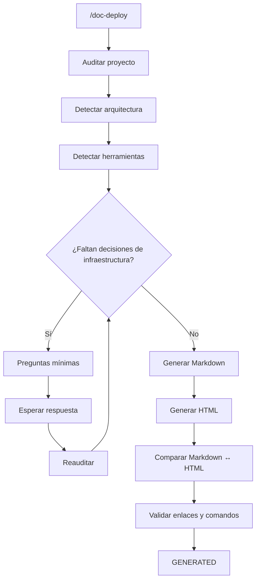

# DOC-DEPLOY: Generador de Documentación de Despliegue, Instalación y Flujo Visual

Este workflow crea una **suite completa de documentación técnica para desplegar, instalar, verificar, actualizar, mantener, apagar y reactivar un proyecto** en un entorno de producción.

El workflow analiza el proyecto real, determina las herramientas y servicios necesarios, solicita únicamente las decisiones de infraestructura que el usuario todavía no haya definido y genera:

```text
[CARPETA_DESPLIEGUE]/

├── 00_RESUMEN_GENERAL.md
├── 01_CONFIGURAR_PROYECTO.md
├── 02_CREAR_INFRAESTRUCTURA_[CLOUD].md
├── 03_INSTALAR_HERRAMIENTAS.md
├── 04_DESPLEGAR_Y_VERIFICAR.md
├── 05_ACTUALIZAR_PRODUCCION.md
├── 06_APAGAR_Y_REACTIVAR.md
└── 07_FLUJO_VISUAL_DESPLIEGUE.html
```

Los archivos Markdown constituyen la **documentación textual modular y navegable**.

El archivo HTML constituye la **representación visual interactiva de toda la documentación generada**.

---

# 0. REGLA SUPREMA — NO INVENTAR INFRAESTRUCTURA NI COMANDOS

La IA no debe inventar:

```text
proveedor;
sistema operativo;
servicios cloud;
tipo de instancia;
herramientas;
puertos;
comandos;
dependencias;
variables;
rutas;
arquitectura;
políticas de seguridad;
precios;
configuración de red;
```

cuando esa información no pueda determinarse con seguridad.

Debe seguir:

```text
INSPECCIONAR
    ↓
DETECTAR
    ↓
PREGUNTAR SI FALTA UNA DECISIÓN RELEVANTE
    ↓
RECIBIR RESPUESTA
    ↓
VERIFICAR
    ↓
GENERAR DOCUMENTACIÓN
```

Nunca debe generar una guía aparentemente completa utilizando valores ficticios.

---

# 1. OBJETIVO PRINCIPAL

`/doc-deploy` debe producir una guía que permita a una persona llevar el proyecto desde:

```text
PROYECTO LOCAL
      ↓
PREPARACIÓN
      ↓
INFRAESTRUCTURA
      ↓
INSTALACIÓN
      ↓
DESPLIEGUE
      ↓
VERIFICACIÓN
      ↓
ACTUALIZACIÓN
      ↓
APAGADO
      ↓
REACTIVACIÓN
```

sin tener que descubrir por su cuenta:

```text
qué instalar;
dónde instalarlo;
qué comando ejecutar;
qué archivo modificar;
qué variable configurar;
qué puerto utilizar;
cómo comprobar que funcionó;
qué hacer si falla;
cómo actualizar posteriormente.
```

---

# 2. PRINCIPIO DE MÍNIMAS PREGUNTAS

Si el usuario no especificó cómo desea desplegar el proyecto, la IA debe realizar primero una auditoría del repositorio para determinar qué puede inferirse de forma objetiva.

Solo después debe preguntar las decisiones que realmente falten.

La prioridad es:

> **Preguntar la menor cantidad posible de decisiones de alto impacto.**

No realizar un cuestionario completo si el proyecto ya permite determinar parte de la infraestructura.

---

# 3. AUDITORÍA PREVIA OBLIGATORIA

Antes de hacer preguntas, inspeccionar:

```text
AGENTS.md
README.md
docs/
package.json
composer.json
requirements.txt
pyproject.toml
pom.xml
build.gradle
go.mod
Dockerfile
docker-compose.yml
compose.yml
.env.example
.env
nginx.conf
Caddyfile
systemd/
scripts/
.github/
```

solo cuando existan.

También inspeccionar otros archivos de configuración específicos del stack detectado.

---

# 4. REGLA DE SEGURIDAD SOBRE SECRETOS

La IA puede inspeccionar configuraciones para detectar:

```text
nombres de variables;
dependencias;
puertos;
servicios;
estructura de configuración.
```

Pero:

> **Nunca debe copiar secretos reales hacia la documentación.**

Nunca incluir:

```text
contraseñas;
API keys;
tokens;
private keys;
credenciales;
secretos JWT;
cookies;
contenido sensible de .env.
```

En la documentación utilizar:

```text
<TU_API_KEY>
<TU_DB_PASSWORD>
<TU_SECRET>
```

y explicar dónde obtener el valor.

---

# 5. INFORMACIÓN QUE DEBE DETERMINAR

La auditoría debe detectar:

## 5.1 Aplicación

```text
framework;
versión;
runtime;
comando de build;
comando de ejecución;
comando de test;
comando de producción.
```

---

## 5.2 Dependencias

Detectar:

```text
dependencias del lenguaje;
dependencias nativas;
compiladores;
librerías del sistema;
herramientas de build;
servicios auxiliares.
```

Ejemplos:

```text
Node.js
PHP
Python
Java
Go
Rust
GCC
libpq
OpenSSL
ImageMagick
```

---

## 5.3 Persistencia

Detectar:

```text
motor;
herramienta de migración;
seeders;
estrategia de inicialización;
volúmenes;
backups cuando estén definidos.
```

Ejemplos:

```text
PostgreSQL
MySQL
SQLite
MongoDB
Redis
```

---

## 5.4 Arquitectura del proyecto

Determinar:

```text
frontend;
backend;
base de datos;
workers;
colas;
cache;
proxy;
storage;
servicios externos.
```

Representar las relaciones.

Ejemplo:

```text
Internet
   ↓
Nginx
   ↓
Backend
   ├── PostgreSQL
   ├── Redis
   └── External API
```

No agregar componentes que no existan.

---

# 6. DETECCIÓN DE MODO DE DESPLIEGUE

Determinar si el proyecto utiliza o puede utilizar:

```text
Docker Compose
Docker
Native Server
Systemd
PM2
Nginx
Caddy
Managed Platform
PaaS
VPS
Cloud VM
Container Service
```

La IA debe preferir la estrategia más coherente con el proyecto existente.

No convertir automáticamente todos los proyectos a Docker.

---

# 7. PREGUNTAS MÍNIMAS DE INFRAESTRUCTURA

Si la información necesaria no está definida, la IA debe preguntar.

Las preguntas deben agrupar decisiones relacionadas.

### Pregunta 1 — Destino

> ¿Dónde deseas desplegar el proyecto?

Opciones de ejemplo:

```text
A) AWS
B) Google Cloud
C) Azure
D) DigitalOcean
E) Hetzner
F) VPS propio
G) Otro
```

Si el proyecto o el usuario ya lo definió:

```text
NO preguntar nuevamente.
```

---

### Pregunta 2 — Modalidad

> ¿Cómo deseas ejecutar la aplicación?

```text
A) Docker / Docker Compose
B) Instalación nativa en servidor
C) Plataforma administrada / PaaS
D) Otra
```

Si `Dockerfile` + `docker-compose.yml` ya existen y son claramente compatibles con producción, la IA puede proponerlos sin volver a preguntar, pero debe permitir al usuario cambiar la estrategia.

---

### Pregunta 3 — Infraestructura adicional

Solo preguntar si no puede determinarse:

```text
¿La base de datos estará:

A) En el mismo servidor
B) En un servicio administrado
C) En otro servidor
D) Ya existe una instancia externa
```

No formular esta pregunta si el proyecto ya lo determina claramente.

---

# 8. REGLA DE OPTIMIZACIÓN DE PREGUNTAS

No preguntar:

```text
¿Qué sistema operativo?
¿Qué servidor web?
¿Qué firewall?
¿Qué versión de Docker?
¿Qué puerto?
¿Qué usuario Linux?
```

una por una si todas dependen de una misma elección de infraestructura.

Primero resolver:

```text
Proveedor + tipo de despliegue
```

y después derivar técnicamente:

```text
SO;
herramientas;
puertos;
paquetes;
configuración.
```

---

# 9. DECISIONES DEL USUARIO VS DECISIONES DE LA IA

## Usuario decide

```text
proveedor;
restricciones presupuestarias;
infraestructura obligatoria;
estrategia de hosting cuando existan alternativas relevantes;
ubicación/región cuando tenga impacto;
políticas de datos críticas;
dominio;
requisitos operativos.
```

## IA decide

```text
comandos concretos;
paquetes;
estructura de archivos;
scripts;
orden operativo;
configuración técnica de bajo impacto;
comandos de verificación;
formato documental.
```

siempre respetando las decisiones superiores.

---

# 10. VERIFICACIÓN DE LA INFORMACIÓN DEL PROVEEDOR

Cuando la documentación dependa de la consola web de un proveedor:

> **La IA debe verificar la interfaz actual antes de redactar instrucciones visuales.**

No inventar:

```text
nombres de botones;
ubicaciones;
menús;
campos;
etiquetas;
opciones;
procesos de creación.
```

Debe preferirse la documentación oficial del proveedor cuando sea necesario verificar la interfaz.

La guía debe diferenciar entre:

```text
PASO CONFIRMADO
```

y:

```text
COMPORTAMIENTO QUE PUEDE VARIAR SEGÚN LA CONSOLA
```

---

# 11. GUÍA VISUAL DE CONSOLA

Las instrucciones deben describir:

```text
sección;
menú;
botón;
campo;
valor;
acción;
resultado.
```

Ejemplo:

```text
1. Abre la consola del proveedor.
2. Ingresa a la sección correspondiente a máquinas virtuales.
3. Selecciona "Crear instancia".
4. Selecciona la imagen de sistema previamente definida.
5. Configura los recursos indicados.
6. Configura las reglas de red.
7. Crea el recurso.
```

Cuando sea posible, indicar además:

```text
ubicación visual aproximada;
nombre visible del elemento;
qué debe observarse después.
```

Nunca describir posiciones visuales inventadas.

---

# 12. DOCUMENTACIÓN MODULAR

La documentación Markdown debe utilizar esta estructura fija.

```text
00_RESUMEN_GENERAL.md
01_CONFIGURAR_PROYECTO.md
02_CREAR_INFRAESTRUCTURA_[CLOUD].md
03_INSTALAR_HERRAMIENTAS.md
04_DESPLEGAR_Y_VERIFICAR.md
05_ACTUALIZAR_PRODUCCION.md
06_APAGAR_Y_REACTIVAR.md
```

El contenido puede adaptarse al proyecto, pero la responsabilidad de cada archivo permanece.

---

# 13. `00_RESUMEN_GENERAL.md`

Debe contener:

```text
Título
Proyecto
Proveedor
Entorno
Arquitectura
Componentes
Prerequisitos
Flujo completo
Estructura de documentación
Riesgos importantes
Navegación
```

Debe contener un flujo visual:

```text
LOCAL
 ↓
CONFIGURACIÓN
 ↓
INFRAESTRUCTURA
 ↓
HERRAMIENTAS
 ↓
DESPLIEGUE
 ↓
VERIFICACIÓN
 ↓
ACTUALIZACIÓN
 ↓
APAGADO / REACTIVACIÓN
```

---

# 14. `01_CONFIGURAR_PROYECTO.md`

Debe documentar lo necesario antes del despliegue.

Incluir, según corresponda:

```text
Dockerfile
compose.yml
docker-compose.yml
.dockerignore
nginx.conf
Caddyfile
entrypoint
scripts
variables de entorno
configuración de producción
```

Cuando se proporcionen archivos completos:

> Deben conservar la configuración necesaria y explicar qué partes son variables del proyecto.

No incluir secretos.

---

# 15. `02_CREAR_INFRAESTRUCTURA_[CLOUD].md`

Debe documentar:

```text
cuenta;
región;
recurso;
sistema operativo;
tipo de máquina;
almacenamiento;
red;
firewall;
security groups;
SSH;
IP;
dominio;
DNS;
HTTPS;
otros recursos.
```

Solo incluir componentes que realmente sean necesarios.

---

# 16. `03_INSTALAR_HERRAMIENTAS.md`

Debe describir:

```text
conexión SSH;
actualización del sistema;
Git;
Docker;
Docker Compose;
runtime;
dependencias nativas;
Nginx;
Caddy;
PM2;
Systemd;
otras herramientas.
```

solo cuando sean necesarias.

Debe incluir una tabla:

```text
| Herramienta | Por qué se necesita | Instalación | Verificación |
```

---

# 17. `04_DESPLEGAR_Y_VERIFICAR.md`

Debe cubrir el primer despliegue completo:

```text
clonar repositorio;
entrar al proyecto;
configurar variables;
crear servicios;
construir;
levantar;
migrar;
seedear;
crear usuarios;
generar estáticos;
abrir puertos;
configurar proxy;
configurar HTTPS;
verificar.
```

Debe incluir comandos reales.

---

# 18. VERIFICACIÓN

Toda instalación importante debe tener una prueba de verificación.

Ejemplo:

```text
docker --version
git --version
curl --version
```

Después:

```text
docker compose ps
docker compose logs --tail=50
curl -I http://localhost
```

La documentación debe especificar:

```text
COMANDO
↓
RESULTADO ESPERADO
↓
INTERPRETACIÓN
```

---

# 19. TROUBLESHOOTING

`04_DESPLEGAR_Y_VERIFICAR.md` debe incluir problemas frecuentes detectables en el proyecto.

No crear una lista genérica enorme.

Priorizar:

```text
puerto ocupado;
servicio no inicia;
conexión DB;
credenciales;
permisos;
volúmenes;
build;
RAM;
DNS;
HTTPS;
proxy;
logs;
dependencias.
```

Formato:

```text
Problema:
...

Síntoma:
...

Diagnóstico:
...

Solución:
...

Verificación:
...
```

---

# 20. `05_ACTUALIZAR_PRODUCCION.md`

Debe documentar el procedimiento repetible después de nuevos cambios.

Separar claramente:

```text
A. PC LOCAL
B. SERVIDOR
```

### PC LOCAL

```text
git status
git add
git commit
git push
```

### SERVIDOR

```text
SSH
cd proyecto
git pull
build
restart
migrate
verify
```

Solo utilizar los comandos apropiados al proyecto.

---

# 21. REGLA DE ACTUALIZACIÓN SEGURA

El documento debe advertir cuándo una actualización puede afectar:

```text
base de datos;
volúmenes;
migraciones;
backups;
compatibilidad;
variables;
servicios;
downtime.
```

No utilizar comandos destructivos sin advertencia explícita.

---

# 22. `06_APAGAR_Y_REACTIVAR.md`

Debe explicar el comportamiento real del proveedor y del tipo de recurso.

Incluir cuando corresponda:

```text
Stop / Pause
Terminate / Delete
Costos residuales
Discos
IP
Snapshots
Load Balancer
Servicios administrados
Reactivación
```

No afirmar costos exactos si no fueron verificados.

---

# 23. CONTROL DE COSTOS

Cuando el proveedor genere costos por recursos persistentes, documentar:

```text
qué recurso sigue cobrando;
qué recurso puede detenerse;
qué recurso debe eliminarse;
qué información se pierde;
cómo verificar que no quedan recursos activos.
```

No asumir que detener una máquina implica costo cero.

---

# 24. REACTIVACIÓN

Debe existir siempre que el tipo de infraestructura lo permita.

Flujo:

```text
RECURSO APAGADO
      ↓
START / RESUME
      ↓
VERIFICAR IP / DNS
      ↓
LEVANTAR SERVICIOS
      ↓
VERIFICAR
      ↓
SISTEMA OPERATIVO
```

Debe indicarse cualquier consecuencia conocida del apagado, como:

```text
cambio de IP;
servicios detenidos;
contenedores no iniciados;
DNS;
certificados;
montajes.
```

---

# 25. NAVEGACIÓN ENTRE DOCUMENTOS

Cada archivo Markdown debe incluir al inicio o final:

```markdown
---

[← Paso anterior](./ARCHIVO_ANTERIOR.md)
[↑ Índice](./00_RESUMEN_GENERAL.md)
[Siguiente paso →](./ARCHIVO_SIGUIENTE.md)
```

El índice debe permitir recorrer toda la instalación.

---

# 26. REGLA DE COMANDOS 100% FUNCIONALES

No utilizar comandos con parámetros ambiguos como:

```text
docker run ...
```

sin explicar los valores.

Todo valor dependiente del usuario debe escribirse explícitamente:

```text
<TU_IP_PUBLICA>
<TU_DOMINIO>
<TU_USUARIO>
<TU_REPOSITORIO>
<TU_PASSWORD>
```

y explicar:

```text
Dónde obtenerlo.
Dónde introducirlo.
Qué formato debe tener.
```

No utilizar placeholders ambiguos como:

```text
[IP]
[server]
[password]
```

sin definición.

---

# 27. COMANDOS POR CONTEXTO

Cada comando debe indicar dónde ejecutarse:

```text
[PC LOCAL]
[SSH / SERVIDOR]
[CONTENEDOR]
[CONSOLA CLOUD]
```

Ejemplo:

```text
[SSH / SERVIDOR]

git pull origin main
```

Esto evita ejecutar accidentalmente comandos en el contexto incorrecto.

---

# 28. BLOQUES INFORMATIVOS

Utilizar siempre que sea compatible con Markdown:

```markdown
> [!IMPORTANT]

> [!WARNING]

> [!CAUTION]

> [!TIP]
```

Para:

```text
seguridad;
pérdida de datos;
costos;
IP;
credenciales;
comandos destructivos;
errores frecuentes.
```

---

# 29. CONTRATO DE CONTENIDO DEL HTML

El archivo:

```text
07_FLUJO_VISUAL_DESPLIEGUE.html
```

es una **representación visual completa de la documentación Markdown**.

Regla absoluta:

> **El HTML debe contener TODO el contenido textual de los archivos Markdown generados.**

No está permitido:

```text
resumir;
omitir;
parafrasear;
eliminar instrucciones;
reemplazar comandos por referencias;
mostrar solamente una síntesis.
```

Debe contener:

```text
todos los títulos;
todos los párrafos;
todos los comandos;
todas las tablas;
todas las listas;
todas las advertencias;
todos los checklists;
todo troubleshooting;
toda navegación relevante;
todo contenido textual generado.
```

El HTML puede cambiar la **presentación**, pero no el **contenido**.

---

# 30. REGLA DE SINCRONIZACIÓN HTML ↔ MARKDOWN

Después de generar todos los Markdown:

```text
Markdown
    ↓
extraer contenido completo
    ↓
renderizar visualmente
    ↓
HTML
```

Nunca generar primero un HTML resumido y luego intentar complementarlo.

El HTML debe ser construido a partir de la versión final de los Markdown.

---

# 31. ESPECIFICACIÓN VISUAL INMUTABLE DEL HTML

## REGLA ABSOLUTA

> **LA ESTRUCTURA VISUAL DEL HTML ESTÁ FIJADA POR ESTE DOCUMENTO.**

La IA **NO PUEDE CAMBIAR**:

```text
layout general;
orden de navegación;
componentes principales;
posición de sidebar;
barra superior;
estructura de contenido;
sistema de navegación;
estilo de bloques de código;
estilo de alertas;
estructura de tablas;
footer;
mecanismos de interacción.
```

El contenido puede cambiar.

La UI estructural no.

---

# 32. ARQUITECTURA VISUAL OBLIGATORIA

El HTML debe tener exactamente estas regiones:

```text
┌──────────────────────────────────────────────────────────────┐
│ TOPBAR                                                       │
│ Proyecto · Proveedor · Entorno · Estado · Buscar             │
├────────────────┬─────────────────────────────────────────────┤
│                │                                             │
│ SIDEBAR        │ MAIN CONTENT                                │
│                │                                             │
│ 00 Resumen     │ Breadcrumb                                  │
│ 01 Configurar  │ Título                                      │
│ 02 Infra       │ Introducción                                │
│ 03 Herramientas│ Contenido completo                          │
│ 04 Desplegar   │                                             │
│ 05 Actualizar  │                                             │
│ 06 Apagar      │                                             │
│                │                                             │
│                │                                             │
├────────────────┴─────────────────────────────────────────────┤
│ FOOTER · Anterior · Índice · Siguiente                      │
└──────────────────────────────────────────────────────────────┘
```

No utilizar otra estructura principal.

---

# 33. TOPBAR FIJA

La barra superior debe contener siempre:

```text
Nombre del proyecto
Proveedor
Entorno
Estado del despliegue
Campo de búsqueda
```

Ejemplo:

```text
Proyecto: Mi Sistema
AWS
Producción
READY
Buscar...
```

El contenido cambia.

La estructura no.

---

# 34. SIDEBAR FIJA

La navegación lateral debe mostrar siempre:

```text
00 RESUMEN
01 CONFIGURAR PROYECTO
02 CREAR INFRAESTRUCTURA
03 INSTALAR HERRAMIENTAS
04 DESPLEGAR Y VERIFICAR
05 ACTUALIZAR PRODUCCIÓN
06 APAGAR Y REACTIVAR
```

Cada elemento debe mostrar:

```text
número;
nombre;
estado.
```

Ejemplo:

```text
✓ 00 Resumen
✓ 01 Configuración
● 02 Infraestructura
○ 03 Herramientas
○ 04 Despliegue
○ 05 Actualización
○ 06 Apagado
```

---

# 35. CONTENIDO PRINCIPAL

Cada documento se renderiza como una página/sección independiente.

Debe conservar:

```text
jerarquía de títulos;
texto;
listas;
tablas;
código;
alertas;
checklists.
```

La representación puede mejorar la lectura.

No modificar el contenido semántico.

---

# 36. CÓDIGOS

Todos los bloques de código del HTML deben tener:

```text
lenguaje;
botón Copiar;
área desplazable si es necesario.
```

Ejemplo:

```text
┌─────────────────────────────────────────┐
│ bash                            Copiar  │
├─────────────────────────────────────────┤
│ docker compose up -d --build            │
│                                         │
└─────────────────────────────────────────┘
```

Al presionar:

```text
Copiar
```

debe copiarse únicamente el contenido del comando.

---

# 37. ALERTAS VISUALES

Los bloques Markdown:

```text
IMPORTANT
WARNING
CAUTION
TIP
```

deben convertirse en tarjetas visuales consistentes.

Ejemplo:

```text
┌────────────────────────────────────────┐
│ ⚠ WARNING                              │
│ No elimines el volumen de PostgreSQL.  │
└────────────────────────────────────────┘
```

No cambiar el mensaje.

---

# 38. TABLAS

Todas las tablas Markdown deben convertirse en tablas HTML:

```text
responsive;
legibles;
con encabezado fijo cuando sea conveniente;
con desplazamiento horizontal en pantallas pequeñas.
```

No convertir automáticamente una tabla en texto.

---

# 39. CHECKLISTS

Los elementos:

```text
- [ ] ...
- [x] ...
```

deben representarse visualmente como checklist.

Ejemplo:

```text
☐ Docker instalado
☐ Git instalado
☑ SSH configurado
```

El estado debe conservarse.

---

# 40. DIAGRAMAS

Los diagramas de arquitectura o flujo deben permanecer visibles.

Cuando el documento Markdown tenga:

```text
Mermaid
ASCII
diagramas de flujo
```

el HTML debe renderizarlos visualmente.

Si no es posible ejecutar Mermaid de forma confiable:

> convertir el diagrama a una representación visual equivalente sin eliminar su contenido.

No ocultar el diagrama.

---

# 41. NAVEGACIÓN DEL HTML

El HTML debe proporcionar siempre:

```text
Anterior
Índice
Siguiente
```

en el footer.

También debe permitir:

```text
clic en sidebar → cambiar de sección;
```

sin abandonar la página cuando sea posible.

---

# 42. BÚSQUEDA

La barra superior debe permitir buscar contenido dentro de toda la documentación.

Debe buscar:

```text
títulos;
texto;
comandos;
herramientas;
errores;
variables.
```

Al encontrar coincidencias:

```text
resaltar;
navegar al resultado;
```

No utilizar un servicio externo.

---

# 43. RESPONSIVIDAD

La UI debe funcionar en:

```text
desktop;
tablet;
móvil.
```

En pantallas pequeñas:

```text
sidebar
↓
navigation drawer / menú superior
```

pero manteniendo los mismos contenidos y componentes.

---

# 44. AUTOCONTENIDO DEL HTML

`07_FLUJO_VISUAL_DESPLIEGUE.html` debe ser:

```text
self-contained
```

Debe incluir dentro del propio archivo:

```text
HTML
CSS
JavaScript
iconos necesarios
contenido documental
```

No depender de:

```text
npm;
frameworks externos;
servidor;
build step;
internet;
CDN;
```

para abrirse localmente.

Debe poder ejecutarse:

```text
doble clic
```

y abrirse directamente en el navegador.

---

# 45. DISEÑO VISUAL FIJO

Utilizar siempre:

```text
Topbar oscura
Sidebar oscura
Contenido claro
Tarjetas blancas
Bordes suaves
Código en panel independiente
Alertas diferenciadas
Tipografía sans-serif
Espaciado consistente
```

No utilizar:

```text
gradientes excesivos;
animaciones decorativas;
fondos fotográficos;
efectos 3D;
neumorfismo;
glassmorphism;
interfaces experimentales.
```

La UI debe priorizar:

```text
lectura;
navegación;
copiado de comandos;
comprensión del flujo.
```

---

# 46. SISTEMA DE COLOR FIJO

Utilizar siempre esta semántica:

```text
Background:
#0b1220

Sidebar:
#111827

Primary:
#4f46e5

Success:
#16a34a

Warning:
#f59e0b

Danger:
#dc2626

Info:
#0ea5e9

Content:
#f8fafc

Card:
#ffffff

Text:
#0f172a

Muted:
#64748b
```

Estos valores forman parte del contrato visual.

No sustituirlos arbitrariamente en cada ejecución.

---

# 47. COMPONENTES FIJOS DEL HTML

El HTML debe disponer como mínimo de:

```text
1. Topbar
2. Sidebar
3. Breadcrumb
4. Progress indicator
5. Section header
6. Content cards
7. Code blocks
8. Copy buttons
9. Alert cards
10. Tables
11. Checklists
12. Diagram container
13. Search
14. Previous / Index / Next
15. Footer
```

No agregar elementos decorativos que distraigan de la documentación.

---

# 48. INDICADOR DE PROGRESO

El HTML debe mostrar el progreso del flujo:

```text
00 → 01 → 02 → 03 → 04 → 05 → 06
```

El estado representa documentación, no la ejecución real del servidor.

Ejemplo:

```text
00 ✓
01 ✓
02 ●
03 ○
04 ○
05 ○
06 ○
```

---

# 49. ESTADOS VISUALES

Utilizar:

```text
✓ Completed
● Current
○ Pending
⚠ Blocked
```

El estado puede determinarse a partir de la navegación/documentación.

No afirmar que un paso de despliegue fue ejecutado si solamente fue documentado.

---

# 50. NAVEGACIÓN DOCUMENTAL VS EJECUCIÓN REAL

Diferenciar claramente:

```text
DOCUMENTADO
```

de:

```text
EJECUTADO
```

El HTML no debe fingir que el servidor ya está desplegado.

---

# 51. VALIDACIÓN DEL HTML

Antes de finalizar, la IA debe comprobar:

```text
[ ] HTML válido
[ ] CSS embebido
[ ] JavaScript embebido
[ ] No existen dependencias CDN
[ ] Todos los enlaces internos funcionan
[ ] Todos los botones Copiar funcionan
[ ] La búsqueda funciona
[ ] Sidebar navega
[ ] Footer navega
[ ] Tablas funcionan en móvil
[ ] Código mantiene formato
[ ] Todo el contenido Markdown aparece
```

---

# 52. PRUEBA DE COMPLETITUD HTML

Debe realizarse una comprobación conceptual:

```text
Markdown 00
    ↓
HTML

Markdown 01
    ↓
HTML

Markdown 02
    ↓
HTML

Markdown 03
    ↓
HTML

Markdown 04
    ↓
HTML

Markdown 05
    ↓
HTML

Markdown 06
    ↓
HTML
```

Cada documento debe tener representación correspondiente.

No debe faltar ningún contenido textual.

---

# 53. HASH / CONTROL DE SINCRONIZACIÓN OPCIONAL

Cuando sea práctico, puede incluirse internamente en HTML:

```text
Generated from:
00_RESUMEN_GENERAL.md
01_CONFIGURAR_PROYECTO.md
...
```

y:

```text
Generated:
[fecha]
```

Esto permite identificar qué versión documental alimentó el HTML.

No sustituye la sincronización real.

---

# 54. DETECCIÓN DE DIFERENCIAS

Antes de finalizar:

```text
¿Existe alguna instrucción presente en Markdown
que no aparezca en HTML?
```

Si sí:

```text
→ corregir HTML.
```

También:

```text
¿Existe algún contenido en HTML que no exista en Markdown?
```

Si es contenido textual nuevo:

```text
→ eliminarlo
```

salvo que sea parte de la propia UI, como:

```text
Copiar
Buscar
Anterior
Siguiente
```

---

# 55. CALIDAD DE COMANDOS

Los comandos deben ser:

```text
específicos;
contextuales;
ejecutables;
seguros;
verificables.
```

Cada comando crítico debe explicar:

```text
dónde ejecutarlo;
qué hace;
qué resultado esperar.
```

---

# 56. DETECCIÓN DE RECURSOS NO NECESARIOS

La IA debe evitar desplegar componentes que el proyecto no necesita.

Por ejemplo:

```text
NO agregar Redis
```

si el proyecto no lo utiliza.

```text
NO agregar Nginx
```

si la plataforma ya proporciona routing adecuado y el proyecto no requiere proxy propio.

```text
NO agregar PostgreSQL
```

si utiliza SQLite y esa decisión es válida para el escenario.

````

La arquitectura debe derivarse del proyecto y de la decisión de infraestructura.

---

# 57. RESTRICCIONES DE RECURSOS

Si la infraestructura seleccionada es pequeña:

```text
CPU limitada
RAM limitada
disco limitado
````

la IA debe revisar:

```text
build;
compilación;
cache;
logs;
imágenes Docker;
volúmenes;
swap;
persistencia.
```

Si existe riesgo real de OOM:

```text
documentarlo;
```

y proporcionar una estrategia técnica apropiada.

---

# 58. SEGURIDAD

La guía debe revisar:

```text
SSH;
firewall;
credenciales;
variables;
puertos;
HTTPS;
permisos;
secretos;
exposición de DB;
logs.
```

No abrir:

```text
PostgreSQL 5432
MySQL 3306
Redis 6379
```

públicamente salvo que exista una razón explícita y documentada.

---

# 59. PUERTOS

Crear una tabla:

```text
| Puerto | Protocolo | Origen | Servicio | Justificación |
```

Solo incluir puertos realmente utilizados.

No abrir puertos innecesarios.

---

# 60. DOMINIO Y HTTPS

Si el proyecto es público y requiere dominio, documentar:

```text
DNS
A / AAAA / CNAME
proxy
certificado
HTTPS
renovación
```

Si el usuario no tiene dominio:

```text
documentar acceso mediante IP o mecanismo temporal,
según infraestructura.
```

---

# 61. RECURSOS DINÁMICOS

Todo valor que cambie según el despliegue debe marcarse:

```text
<TU_IP_PUBLICA>
<TU_DOMINIO>
<TU_USUARIO>
<TU_PROYECTO>
<TU_REPOSITORIO>
<TU_REGION>
```

La documentación debe explicar cómo obtener cada valor.

---

# 62. NO EXPONER INFORMACIÓN LOCAL

No incluir:

```text
C:\Users\NombreReal\...
/home/usuario-personal/...
```

salvo que sea necesario como ejemplo.

Utilizar:

```text
C:\ruta\a\tu\clave.pem
/home/tu-usuario/proyecto
```

---

# 63. ENTREGA FINAL

Después de generar todo:

```text
[CARPETA_DESPLIEGUE]/
├── 00_RESUMEN_GENERAL.md
├── 01_CONFIGURAR_PROYECTO.md
├── 02_CREAR_INFRAESTRUCTURA_[CLOUD].md
├── 03_INSTALAR_HERRAMIENTAS.md
├── 04_DESPLEGAR_Y_VERIFICAR.md
├── 05_ACTUALIZAR_PRODUCCION.md
├── 06_APAGAR_Y_REACTIVAR.md
└── 07_FLUJO_VISUAL_DESPLIEGUE.html
```

La IA debe informar:

```text
Proyecto detectado:
...

Proveedor:
...

Arquitectura:
...

Modo de despliegue:
...

Herramientas:
...

Documentación generada:
...

HTML visual:
...

Siguiente acción:
Abrir 00_RESUMEN_GENERAL.md
o
Abrir 07_FLUJO_VISUAL_DESPLIEGUE.html
```

---

# 64. ESTADOS DEL DOCUMENTO

La documentación puede utilizar:

```text
DRAFT
NEEDS_CLARIFICATION
READY
GENERATED
SUPERSEDED
```

### NEEDS_CLARIFICATION

Faltan decisiones de infraestructura relevantes.

### READY

La información necesaria está disponible y la guía puede generarse.

### GENERATED

La documentación y el HTML fueron generados y verificados.

---

# 65. REGLA DE BLOQUEO

Si falta una decisión que puede cambiar sustancialmente la documentación:

```text
NO GENERAR GUÍA FINAL.
```

Ejemplos:

```text
proveedor desconocido;
modalidad de despliegue desconocida;
ubicación de base de datos desconocida;
arquitectura incompatible;
dependencia crítica desconocida.
```

Preguntar.

---

# 66. NO BLOQUEAR POR DETALLES MENORES

No detenerse para preguntar:

```text
nombre del archivo de log;
nombre de una variable privada;
formato de un comentario;
orden de pequeños comandos;
estilo de redacción.
```

La IA debe resolver esos detalles técnicamente.

---

# 67. FLUJO COMPLETO DE `/doc-deploy`



---

# 68. PROTOCOLO OPERATIVO EXACTO

Al ejecutar:

```text
/doc-deploy
```

la IA debe:

```text
1. Leer AGENTS.md.
2. Revisar documentación existente.
3. Auditar el proyecto.
4. Detectar framework y runtime.
5. Detectar dependencias.
6. Detectar persistencia.
7. Detectar arquitectura.
8. Detectar Docker / Nginx / Systemd / PM2 / etc.
9. Detectar variables de entorno sin revelar secretos.
10. Detectar recursos necesarios.
11. Detectar qué decisiones ya están definidas.
12. Detectar qué decisiones de infraestructura faltan.
13. Formular el mínimo de preguntas necesarias.
14. DETENERSE.
15. Recibir respuesta.
16. Reauditar.
17. Repetir preguntas si una respuesta genera nuevas ambigüedades relevantes.
18. Determinar arquitectura final de despliegue.
19. Generar los 7 documentos.
20. Generar el HTML visual.
21. Verificar que HTML contiene todo el texto Markdown.
22. Verificar enlaces.
23. Verificar comandos.
24. Verificar navegación.
25. Verificar funcionamiento del HTML.
26. Establecer estado GENERATED.
27. Informar los archivos generados.
```

---

# 69. REGLA DE REAUDITORÍA

Después de las respuestas del usuario:

> **La IA debe volver a auditar todo el proyecto antes de generar la documentación definitiva.**

La respuesta puede revelar nuevas necesidades.

Ejemplo:

```text
Usuario:
Quiero Docker Compose en AWS.

La IA detecta posteriormente:
PostgreSQL persistente
+
volumen
+
backup
+
HTTPS
```

Si estas decisiones cambian la guía, deben resolverse antes de generar el documento definitivo.

---

# 70. TEST DE IMPLEMENTACIÓN

Antes de finalizar, la IA debe imaginar que entrega:

```text
00_RESUMEN_GENERAL.md
+
01...
+
...
+
07_FLUJO_VISUAL_DESPLIEGUE.html
```

a otra persona que nunca vio el proyecto.

Debe poder completar:

```text
crear infraestructura
→ instalar herramientas
→ desplegar
→ verificar
→ actualizar
→ apagar
→ reactivar
```

sin inventar pasos esenciales.

---

# 71. TEST DE DOCUMENTACIÓN COMPLETA

Verificar:

```text
[ ] Infraestructura
[ ] Instalación
[ ] Configuración
[ ] Despliegue
[ ] Verificación
[ ] Troubleshooting
[ ] Actualización
[ ] Apagado
[ ] Reactivación
[ ] Costos
[ ] Seguridad
[ ] Navegación
[ ] HTML visual
```

---

# 72. TEST DE CONSISTENCIA

Verificar:

```text
Proyecto
  ↕
Constitución / documentación existente

Código
  ↕
Arquitectura

Arquitectura
  ↕
Infraestructura

Infraestructura
  ↕
Comandos

Markdown
  ↕
HTML
```

No debe existir una contradicción entre estos niveles.

---

# 73. REGLA MAESTRA DEL HTML

> **La IA puede cambiar el contenido documental porque cada proyecto es diferente; no puede cambiar la estructura visual del HTML definida por este workflow.**

El HTML siempre debe mantener:

```text
TOPBAR
   ↓
SIDEBAR
   ↓
MAIN CONTENT
   ↓
FOOTER NAVIGATION
```

con:

```text
search;
copy buttons;
alerts;
tables;
checklists;
diagrams;
progress;
navigation.
```

---

# 74. REGLA MAESTRA DE `/doc-deploy`

> **Primero comprender el proyecto. Luego determinar la infraestructura. Preguntar únicamente lo que no puede saberse con seguridad. Después generar instrucciones exactas y verificables. Finalmente representar toda esa documentación en un HTML visual fijo, sin perder una sola instrucción.**

El flujo debe permanecer:

```text
AUDITAR
   ↓
DETECTAR
   ↓
PREGUNTAR SOLO LO NECESARIO
   ↓
ESPERAR
   ↓
REAUDITAR
   ↓
DEFINIR INFRAESTRUCTURA
   ↓
DOCUMENTAR
   ↓
GENERAR HTML
   ↓
SINCRONIZAR
   ↓
VERIFICAR
   ↓
GENERATED
```

La documentación final debe permitir responder:

```text
¿Qué tengo?

¿Qué necesito?

¿Qué debo crear?

¿Qué debo instalar?

¿Dónde ejecuto cada comando?

¿Qué debo configurar?

¿Cómo sé que funciona?

¿Qué hago cuando actualizo?

¿Cómo lo apago?

¿Cómo lo vuelvo a encender?

¿Qué costos o recursos debo controlar?
```

Y el HTML debe permitir responder exactamente las mismas preguntas, pero mediante una **interfaz visual de navegación estable y consistente entre todos los proyectos**.
