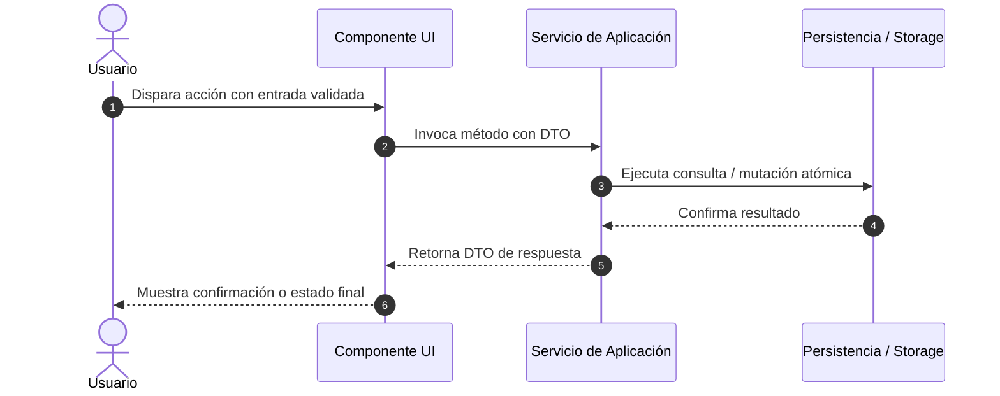

# Plan: Plan Técnico de Arquitectura e Implementación (SDD)

Este workflow estructura la solución arquitectónica y el desglose de implementación guiada por especificación.

---

## 1. Revisión de Especificación y Objetivos

- **Feature a Implementar**: [Referencia a la especificación funcional]
- **Enfoque Arquitectónico**: [Patrón de arquitectura elegido, ej. Clean Architecture, Modular Monolith]
- **Componentes Afectados**:
  - Frontend / UI
  - Capa de Aplicación / Servicios
  - Capa de Datos / Repositorios

---

## 2. Diagrama de Flujo / Secuencia

---

## 3. Desglose en Vertical Slices (Rebanadas Verticales)

Cada Slice debe ser autocontenido y probarse de extremo a extremo:

### Slice 1: Contratos y Dominio Base
- [ ] Definición de tipos, entidades y validadores de esquema.
- [ ] Tests unitarios de validación de entradas.

### Slice 2: Lógica de Negocio y Casos de Uso
- [ ] Implementación de casos de uso y servicios.
- [ ] Inyección de dependencias o mocks para pruebas aisladas.

### Slice 3: Integración de UI o API Endpoint
- [ ] Creación de endpoint o interfaz de usuario.
- [ ] Conexión del flujo completo.

---

## 4. Invariantes Técnicas Universales

1. **Sin dependencias circulares**: La dirección de dependencia apunta siempre al dominio.
2. **Cero efectos secundarios no controlados**: Cada función debe ser determinista donde sea aplicable.
3. **Manejo explícito de errores**: Nunca silenciar excepciones en bloques catch vacíos.
