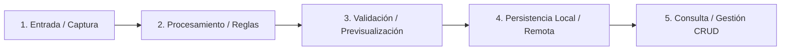

# SDD-Constitution-Trial: Constitución del Proyecto (Entrevista Guiada, Co-Diseño y Contexto Enriquecido)

Este workflow guía al asistente de IA en una **entrevista ágil de co-diseño** con el usuario para definir las bases arquitectónicas, flujos globales y directrices innegociables del proyecto, redactando el archivo maestro `docs/constitution.md`.

> **Propósito Fundamental**:
> Dotar a las fases posteriores (especialmente a `sdd-planning`, `sdd-spec-high` y `sdd-task`) de **todo el contexto arquitectónico, topológico y de flujos E2E necesario** para que el diseño técnico sea predecible, robusto, escalable y libre de inconsistencias relacionales.

---

## 1. Misión Operativa del Asistente (Modo Co-Diseño Proactivo)

Cuando el usuario invoque este workflow (`/sdd-constitution-trial`):

1. **Auditoría Previa**:
   - Inspecciona si ya existe `docs/constitution.md`. Si existe, lee sus secciones y consulta si se desea refinar aspectos específicos.
2. **Entrevista Ágil de Co-Diseño (Preguntas Base + Sugerencias Proactivas)**:
   - A partir de la idea general transmitida por el usuario, la IA aplica la **Lista Mínima de Preguntas Base** estructurada en las 5 dimensiones críticas detalladas abajo.
   - **Regla de Co-Diseño**: La IA no lanza preguntas vacías ni interroga pasivamente; **en cada pregunta propone inmediatamente opciones técnicas y flujos sugeridos acordes a la visión del usuario**, permitiendo que el usuario solo elija, afine o amplíe detalles rápidamente.
3. **Generación del Artefacto**:
   - Redacta de forma completa y estructurada el archivo `docs/constitution.md` al confirmarse el consenso.

---

## 2. Lista Mínima de Preguntas Base (5 Dimensiones Críticas)

Para alimentar a `planning` y `task` con el contexto que necesitan, el asistente debe explorar estas 5 dimensiones acompañadas de sugerencias técnicas:

### Dimensión 1: Flujo de Valor Principal y Recorridos de Usuario E2E
*Objetivo: Entender el mapa de vuelo completo de la solución.*
- **Pregunta Base**: ¿Cuál es el recorrido paso a paso (*Happy Path*) que experimenta el usuario desde que abre la aplicación hasta que completa su objetivo principal? ¿Qué caminos secundarios o alternativos son críticos?
- *Sugerencia Proactiva de la IA*: Proponer un diagrama de flujo inicial de 3 a 5 etapas (ej. Captura/Ingreso $\rightarrow$ Procesamiento/IA $\rightarrow$ Previsualización $\rightarrow$ Persistencia $\rightarrow$ Catálogo/Gestión).

### Dimensión 2: Topología de Datos, Relaciones y Persistencia
*Objetivo: Evitar fallos de sincronización, tipos de datos o inconsistencias de claves foráneas.*
- **Pregunta Base**: ¿Cuáles son las entidades principales y cómo se relacionan (maestros vs. dependientes)? ¿La persistencia es local (SQLite/Drift), remota (PostgreSQL, Supabase) o híbrida con sincronización? ¿Cómo se resuelven las entidades co-dependientes si el catálogo está vacío?
- *Sugerencia Proactiva de la IA*: Recomendar el motor de datos idóneo, versionado de esquemas (`schemaVersion`), migraciones limpias en desarrollo, políticas antihuérfanos (`ON DELETE SET NULL / CASCADE`) y manejo de estados neutros ("Sin asignar" o categorías generales).

### Dimensión 3: Integraciones Externas y Hardware
*Objetivo: Prever dependencias físicas y contratos de servicios.*
- **Pregunta Base**: ¿El sistema interactúa con hardware del dispositivo (cámara, sensores, Bluetooth, NFC) o APIs externas (Google Gemini Vision, pasarelas de pago, autenticación OAuth)?
- *Sugerencia Proactiva de la IA*: Sugerir librerías maduras de la plataforma, inyección segura de credenciales (`--dart-define`, `.env`) y diseño desacoplado mediante el patrón Repository / Port-Adapter.

### Dimensión 4: Resiliencia, Conectividad y Modos de Fallo
*Objetivo: Diseñar degradación elegante (Graceful Degradation).*
- **Pregunta Base**: ¿Cómo debe comportarse la aplicación si el dispositivo pierde la conexión a internet (*Offline-First* o modo solo-lectura)? ¿Cuál es el plan de contingencia si una API externa tarda o falla?
- *Sugerencia Proactiva de la IA*: Proponer políticas de reintentos, caché local con refresco en background, y retroalimentación clara al usuario sin bloquear la operativa del sistema.

### Dimensión 5: Restricciones Duras y Límites No Negociables
*Objetivo: Delimitar el alcance y descartar tecnología no deseada.*
- **Pregunta Base**: ¿Qué plataformas objetivo son prioritarias (Android, iOS, Web, Desktop)? ¿Existen librerías, dependencias o patrones prohibidos o mandatorios por el equipo?
- *Sugerencia Proactiva de la IA*: Confirmar convenciones de arquitectura (Clean Architecture, Feature-First), linters recomendados y herramientas de testing dual (unitarias + BDD).

---

## 3. Los 7 Pilares de la Constitución Enriquecida

El archivo final debe contener una visión profunda estructurada en 7 pilares:

- **Pilar 1: Misión, Dominio y Vocabulario Ubicuo**: Propósito del software, actores y límites (*Out of Scope*).
- **Pilar 2: Flujo de Valor Global y Recorridos E2E**: Diagrama macro en Mermaid que mapee de extremo a extremo las transiciones del sistema.
- **Pilar 3: Tech Stack, Arquitectura y Suite de Testing**: Framework de UI, gestión de estado, patrón de arquitectura, runner de tests y estándares de calidad.
- **Pilar 4: Topología de Persistencia e Integraciones**: Modelo de entidades, estrategias de migración, hardware y servicios externos.
- **Pilar 5: Resiliencia y Políticas de Conectividad**: Reglas de degradación elegante, soporte offline y manejo de excepciones externas.
- **Pilar 6: Principios Innegociables (Quality Gates)**:
  1. *Spec-First Ágil*: Desarrollo guiado por especificaciones de negocio.
  2. *Validación Dual Obligatoria*: Superar simultáneamente Caja Blanca (Unit) y Caja Negra (BDD).
  3. *Autonomía de Criterio Técnico (Senior Defaults)*: Orquestación proactiva de persistencia sana, migraciones, ciclos de vida y flujos completos.
  4. *Integridad de Entidades Co-Dependientes y Flujos Cerrados*:
     - **Completitud de Ciclo de Vida (No Dead-Ends)**: Si una entidad dependiente ($B$) referencia a una entidad independiente ($A$), la IA debe orquestar simultáneamente los flujos de ambas partes; se prohíbe implementar entidades hijas sin proveer la gestión de su catálogo maestro.
     - **Patrón de Selección Tridimensional (The 3-Way Selector Pattern)**: Toda entrada dependiente debe soportar: selección existente, creación en caliente (*on-the-fly*) y opción neutra/fallback ("Sin asignar" o por defecto) cuando el catálogo esté vacío.
     - **Garantía Antihuérfanos**: Declaración contractual explícita de comportamiento ante borrado (`ON DELETE SET NULL`, `CASCADE` o `RESTRICT`).
  5. *Ergonomía sin Sobre-Especificación de UI*: Foco en reglas de negocio y contratos; la IA diseña las interfaces y resuelve los flujos CRUD completos de punta a punta.
  6. *Calidad de Código y Tipado Estricto*: Cero `any`, linters sin advertencias y código limpio.
  7. *Transaccionalidad e Idempotencia*: Mutaciones de datos atómicas y seguras.
- **Pilar 7: Procedimientos Operativos (Comandos Oficiales)**: Scripts estándar de desarrollo, tests, linters y migraciones.

---

## 4. Plantilla Oficial de Salida: `docs/constitution.md`

```markdown
# Constitución del Proyecto: [Nombre del Proyecto]

> Versión: 1.0.0 | Estado: Activa y Vinculante | Metodología: SDD-Constitution

---

## 1. Misión, Dominio y Alcance
- **Propósito**: [Descripción del valor central que resuelve el sistema]
- **Actores del Sistema**: [Roles y perfiles de usuario]
- **Core Concepts (Lenguaje Ubicuo)**: [Términos innegociables del negocio]
- **Límites (Out of Scope)**: [Qué NO hará el sistema en esta etapa]

---

## 2. Flujo de Valor Global y Recorridos E2E



### Recorridos Críticos de Usuario (User Journeys)
1. **Flujo Principal (Happy Path E2E)**: [Secuencia detallada paso a paso]
2. **Flujos Alternativos / Secundarios**: [Caminos alternos o variantes de negocio]

---

## 3. Tech Stack, Arquitectura y Testing
- **Frontend / UI**: [Framework, gestión de estado, diseño ergonómico]
- **Arquitectura de Capas**: [Clean Architecture / Feature-First / Modular]
- **Suite de Testing**:
  - **Caja Negra / Aceptación (BDD)**: [Herramienta BDD / E2E]
  - **Caja Blanca / Estructural (Unit TDD)**: [Runner nativo con cobertura de ramas]
- **Estándares de Código**: [Tipado estricto, linters y manejo explícito de errores con Result<S, E>]

---

## 4. Topología de Persistencia e Integraciones
- **Persistencia de Datos**: [Motor local/remoto, ORM, tablas principales]
- **Integridad Relacional y Claves Foráneas**: [Políticas antihuérfanos: ON DELETE SET NULL / CASCADE / RESTRICT]
- **Estrategia de Evolución y Migraciones**: [schemaVersion, migraciones y recreación limpia en dev]
- **Integraciones de Hardware**: [Cámara, escáner, sensores con permisos y ciclo de vida seguro]
- **Servicios Externos / APIs**: [APIs de IA, servicios en la nube con inyección segura de llaves]

---

## 5. Resiliencia y Políticas de Conectividad
- **Estrategia Offline / Online**: [Comportamiento ante desconexión: offline-first, fallback o cola]
- **Degradación Elegante**: [Manejo de timeouts, cuotas de APIs externas o fallos de red]

---

## 6. Principios Innegociables
1. **Spec-First Ágil**: El código responde a especificaciones sin burocracia paralizante.
2. **Validación Dual Obligatoria**: Cumplir simultáneamente tests de Caja Blanca y Caja Negra.
3. **Autonomía de Criterio Técnico (Senior Defaults)**: Orquestación proactiva de persistencia, migraciones y flujos completos.
4. **Integridad de Entidades Co-Dependientes y Flujos Cerrados**: Coexistencia obligatoria de ciclos de vida maestro/hijo, patrón de selección tridimensional (existente, en caliente, y fallback ante catálogo vacío) y prevención de huérfanos.
5. **Ergonomía sin Sobre-Especificación UI**: Foco en reglas de negocio; la IA resuelve conexiones CRUD y presentación limpia.
6. **Calidad de Código y Tipado Estricto**: Cero warnings, tipado seguro y código limpio.
7. **Idempotencia y Transaccionalidad**: Mutaciones consistentes y seguras.

---

## 7. Comandos Oficiales del Proyecto
| Acción | Comando |
| :--- | :--- |
| Levantar Entorno Dev | `...` |
| Tests Caja Blanca (Unit) | `...` |
| Tests Caja Negra (BDD) | `...` |
| Suite Completa & Cobertura | `...` |
| Formato & Linter | `...` |
| Migraciones / Esquema DB | `...` |
```
