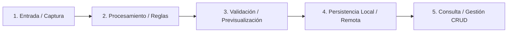

# SDD-Constitution-Trial: Constitución del Proyecto (Protocolo de 2 Tiempos: Cuestionamiento y Asistencia)

Este workflow guía al asistente de IA en una **entrevista estructurada en 2 tiempos** con el usuario: primero prioriza el análisis crítico y el cuestionamiento de cabos sueltos mediante preguntas clave, y luego asiste como copiloto técnico redactando el archivo maestro `docs/constitution.md`.

> **Regla de Oro: Prioridad al Cuestionamiento**:
> La IA **NUNCA debe asumir ni inventar decisiones de negocio a espaldas del usuario**. Si existen cabos sueltos, ambigüedades o caminos alternativos no definidos, la IA debe formular primero un cuestionario mínimo y directo con opciones recomendadas antes de generar el documento.

---

## 1. Protocolo Operativo en 2 Tiempos

Cuando el usuario invoque este workflow (`/sdd-constitution-trial`):

### TIEMPO 1: Análisis Crítico y Cuestionamiento de Cabos Sueltos (Grill-Me Inicial)
1. **Auditoría Previa**:
   - Inspecciona si ya existe `docs/constitution.md`. Si existe, lee sus secciones y pregunta qué puntos específicos se desean refinar.
2. **Detección de Cabos Sueltos en las 5 Dimensiones**:
   - La IA analiza la visión o requerimiento inicial del usuario e identifica qué aspectos críticos no están claros en:
     - *Dimensión 1 (Flujo Macro E2E)*: Puntos ciegos en el recorrido del usuario o estados intermedios.
     - *Dimensión 2 (Topología de Datos)*: Relaciones entre entidades, claves foráneas, o comportamiento ante catálogo vacío.
     - *Dimensión 3 (Hardware y APIs)*: Dependencias de sensores, cámara o servicios externos.
     - *Dimensión 4 (Resiliencia y Conectividad)*: Qué ocurre ante caída de internet o timeouts de APIs.
     - *Dimensión 5 (Restricciones)*: Plataformas objetivo y librerías prohibidas o mandatorias.
3. **Formulación de Preguntas Mínimas con Opciones Recomendadas**:
   - La IA plantea un bloque mínimo de preguntas directas y focalizadas sobre los cabos sueltos detectados.
   - Cada pregunta debe incluir opciones claras de respuesta, destacando una opción `(Recomendada)` con criterio de ingeniería para facilitar la decisión rápida del usuario sin obligarlo a redactar parrafadas.
   - La IA **se detiene y espera las respuestas del usuario** antes de redactar la constitución.

---

### TIEMPO 2: Asistencia Proactiva del Copiloto Técnico Senior
Una vez que el usuario responde y los cabos sueltos quedan resueltos:
1. **Orquestación Arquitectónica**:
   - La IA consolida los acuerdos y diseña la propuesta completa con los mejores estándares industriales (arquitectura limpia, testing dual, linters y persistencia sana).
2. **Redacción del Artefacto**:
   - Redacta de forma completa el archivo `docs/constitution.md` siguiendo la plantilla oficial de 7 pilares.

---

## 2. Los 7 Pilares de la Constitución Enriquecida

El archivo final `docs/constitution.md` debe contener una visión profunda estructurada en 7 pilares:

- **Pilar 1: Misión, Dominio y Vocabulario Ubicuo**: Propósito del software, actores y límites (*Out of Scope*).
- **Pilar 2: Flujo de Valor Global y Recorridos E2E**: Diagrama macro en Mermaid que mapee de extremo a extremo las transiciones del sistema.
- **Pilar 3: Tech Stack, Arquitectura y Suite de Testing**: Framework de UI, gestión de estado, patrón de arquitectura, runner de tests y estándares de calidad.
- **Pilar 4: Topología de Persistencia e Integraciones**: Modelo de entidades, estrategias de migración, hardware y servicios externos.
- **Pilar 5: Resiliencia y Políticas de Conectividad**: Reglas de degradación elegante, soporte offline y manejo de excepciones externas.
- **Pilar 6: Principios Innegociables (Quality Gates)**:
  1. *Spec-First Ágil*: Desarrollo guiado por especificaciones de negocio.
  2. *Validación Dual Obligatoria*: Superar simultáneamente Caja Blanca (Unit) y Caja Negra (BDD).
  3. *Autonomía de Criterio Técnico (Senior Defaults)*: Orquestación proactiva de persistencia sana, migraciones, ciclos de vida y flujos completos.
  4. *Integridad de Entidades Co-Dependientes y Flujos Cerrados*: Coexistencia obligatoria de ciclos de vida maestro/hijo, patrón de selección tridimensional (existente, en caliente, y fallback ante catálogo vacío) y prevención de huérfanos.
  5. *Ergonomía sin Sobre-Especificación de UI*: Foco en reglas de negocio y contratos; la IA diseña las interfaces y resuelve los flujos CRUD completos de punta a punta.
  6. *Calidad de Código y Tipado Estricto*: Cero `any`, linters sin advertencias y código limpio.
  7. *Transaccionalidad e Idempotencia*: Mutaciones de datos atómicas y seguras.
- **Pilar 7: Procedimientos Operativos (Comandos Oficiales)**: Scripts estándar de desarrollo, tests, linters y migraciones.

---

## 3. Plantilla Oficial de Salida: `docs/constitution.md`

```markdown
# Constitución del Proyecto: [Nombre del Proyecto]

> Versión: 1.0.0 | Estado: Activa y Vinculante | Metodología: SDD-Constitution

---

## 1. Misión, Dominio y Alcance
- **Propósito**: [Descripción del valor central que resuelve el sistema]
- **Actores del Sistema**: [Roles y perfiles de usuario]
- **Core Concepts (Lenguaje Ubicuo)**: [Términos innegociables del negocio]
- **Límites (Out of Scope)**: [Qué NO hará el sistema en esta etapa]

---

## 2. Flujo de Valor Global y Recorridos E2E



### Recorridos Críticos de Usuario (User Journeys)
1. **Flujo Principal (Happy Path E2E)**: [Secuencia detallada paso a paso]
2. **Flujos Alternativos / Secundarios**: [Caminos alternos o variantes de negocio]

---

## 3. Tech Stack, Arquitectura y Testing
- **Frontend / UI**: [Framework, gestión de estado, diseño ergonómico]
- **Arquitectura de Capas**: [Clean Architecture / Feature-First / Modular]
- **Suite de Testing**:
  - **Caja Negra / Aceptación (BDD)**: [Herramienta BDD / E2E]
  - **Caja Blanca / Estructural (Unit TDD)**: [Runner nativo con cobertura de ramas]
- **Estándares de Código**: [Tipado estricto, linters y manejo explícito de errores con Result<S, E>]

---

## 4. Topología de Persistencia e Integraciones
- **Persistencia de Datos**: [Motor local/remoto, ORM, tablas principales]
- **Integridad Relacional y Claves Foráneas**: [Políticas antihuérfanos: ON DELETE SET NULL / CASCADE / RESTRICT]
- **Estrategia de Evolución y Migraciones**: [schemaVersion, migraciones y recreación limpia en dev]
- **Integraciones de Hardware**: [Cámara, escáner, sensores con permisos y ciclo de vida seguro]
- **Servicios Externos / APIs**: [APIs de IA, servicios en la nube con inyección segura de llaves]

---

## 5. Resiliencia y Políticas de Conectividad
- **Estrategia Offline / Online**: [Comportamiento ante desconexión: offline-first, fallback o cola]
- **Degradación Elegante**: [Manejo de timeouts, cuotas de APIs externas o fallos de red]

---

## 6. Principios Innegociables
1. **Spec-First Ágil**: El código responde a especificaciones sin burocracia paralizante.
2. **Validación Dual Obligatoria**: Cumplir simultáneamente tests de Caja Blanca y Caja Negra.
3. **Autonomía de Criterio Técnico (Senior Defaults)**: Orquestación proactiva de persistencia, migraciones y flujos completos.
4. **Integridad de Entidades Co-Dependientes y Flujos Cerrados**: Coexistencia obligatoria de ciclos de vida maestro/hijo, patrón de selección tridimensional y prevención de huérfanos.
5. **Ergonomía sin Sobre-Especificación UI**: Foco en reglas de negocio; la IA resuelve conexiones CRUD y presentación limpia.
6. **Calidad de Código y Tipado Estricto**: Cero warnings, tipado seguro y código limpio.
7. **Idempotencia y Transaccionalidad**: Mutaciones consistentes y seguras.

---

## 7. Comandos Oficiales del Proyecto
| Acción | Comando |
| :--- | :--- |
| Levantar Entorno Dev | `...` |
| Tests Caja Blanca (Unit) | `...` |
| Tests Caja Negra (BDD) | `...` |
| Suite Completa & Cobertura | `...` |
| Formato & Linter | `...` |
| Migraciones / Esquema DB | `...` |
```
