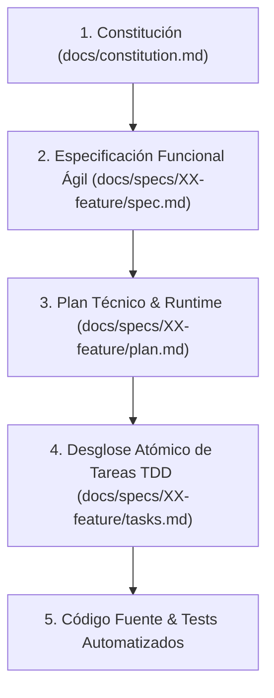

# SDD-Init: Inicializador y Orquestador del Flujo SDD (Spec-Driven Development)

Este workflow es el **núcleo metodológico de SDD**. Su propósito es instruir al asistente de IA y al equipo sobre las reglas del ciclo de vida, la jerarquía de verdad, la precedencia de decisiones, la estructura física de directorios y la generación/mantenimiento del archivo maestro `AGENTS.md` en la raíz del proyecto.

---

## 1. La Jerarquía de Verdad y Precedencia Innegociable

Cuando existan dudas, ambigüedades o conflictos durante el desarrollo, el asistente y el equipo deben obedecer estrictamente este orden jerárquico descendente:



1. **Constitución (`docs/constitution.md`)**: Define los principios innegociables, tech stack, misión, criterio de ingeniería y reglas globales. Nada en niveles inferiores puede contradecirla.
2. **Especificación (`docs/specs/XX-feature/spec.md`)**: Define el **QUÉ** funcional mediante requerimientos de negocio, contratos de datos y criterios de aceptación observables (EARS y Gherkin).
3. **Plan Técnico (`docs/specs/XX-feature/plan.md`)**: Define el **CÓMO** mediante arquitectura técnica, contratos tipados, garantías de runtime/persistencia y división en Vertical Slices.
4. **Tareas Atómicas (`docs/specs/XX-feature/tasks.md`)**: Checklist secuencial de tareas ejecutadas bajo ciclo TDD (Red-Green-Refactor) con validación dual.
5. **Código Fuente y Tests**: La manifestación física ejecutable que valida dualmente la especificación y los tests.

---

## 2. Regla Innegociable de Portabilidad y Rutas Relativas

Para garantizar que el repositorio sea 100% portable y funcione idénticamente en cualquier máquina, entorno o sistema operativo donde se clone:

> [!CAUTION]
> **PROHIBICIÓN ESTRICTA DE RUTAS ABSOLUTAS Y ESQUEMAS `file:///`**:
> 1. **Cero Rutas Absolutas**: Queda estrictamente prohibido incrustar rutas absolutas del host del desarrollador (`C:\...`, `/home/...`, `/Users/...`, etc.) en la documentación (`AGENTS.md`, `spec.md`, `plan.md`, `tasks.md`, `constitution.md`) o en el código fuente.
> 2. **Cero Esquemas `file:///`**: Ningún enlace Markdown debe generarse con el esquema `file:///` apuntando al disco local.
> 3. **Rutas Estrictamente Relativas al Proyecto**: Todas las referencias deben expresarse de manera relativa a la raíz del repositorio:
>    - ❌ **Incorrecto**: `[docs/constitution.md](file:///c:/EDBERTO/ULTIMO/SW2/PARCIAL1/x/docs/constitution.md)`
>    - ❌ **Incorrecto**: `c:/EDBERTO/ULTIMO/SW2/PARCIAL1/proyecto/docs/specs/`
>    - ✅ **Correcto**: `[docs/constitution.md](docs/constitution.md)` o simplemente `docs/constitution.md`
>    - ✅ **Correcto**: `[docs/specs/](docs/specs/)` o `docs/specs/XX-nombre/spec.md`
>    - ✅ **Correcto**: `src/`, `lib/`, `tests/`
> 4. **Aislamiento de Contexto Local**: Ninguna variable, ruta o identificador que pertenezca exclusivamente a la máquina local actual debe ser vertida en los artefactos del proyecto.

---

## 3. Principios de Agilidad y Criterio del Copiloto

Para evitar la parálisis por sobre-documentación y garantizar soluciones robustas en tiempo de ejecución:

### Regla Antiatrapamiento: Prohibición de Sobre-Especificación de UI
- Los documentos `spec.md` deben centrarse en el **valor de negocio, reglas lógicas y contratos de datos**.
- **Queda prohibido sobre-especificar la UI**: no se detallan estilos cosméticos, paddings, hexadecimales o micro-diálogos redundantes.
- La IA asume la responsabilidad de diseñar interfaces limpias, accesibles y ergonómicas, resolviendo las conexiones y los flujos CRUD completos de punta a punta.

### Mandato de Criterio Técnico (Senior Defaults)
- La IA no actúa como un transcriptor ciego: al recibir un requerimiento, **orquesta por defecto todas las configuraciones, ciclos de vida y conexiones de infraestructura** necesarias para que el software sea robusto en el mundo real (persistencia sana, migraciones de datos, manejo de errores y estados de carga).
- Se prohíbe dejar flujos incompletos o desarticulados (ej. crear datos sin proveer su visualización o persistencia coherente).

---

## 4. Estructura Canónica de Directorios del Proyecto

```text
📁 <RAIZ-DEL-PROYECTO>/
├── 📄 AGENTS.md                        <-- Guía de contexto, comandos y reglas maestras (rutas relativas)
├── 📁 docs/
│   ├── 📄 constitution.md              <-- Constitución del proyecto (misión, stack, roadmap)
│   └── 📁 specs/
│       ├── 📁 01-modulo-inicial/
│       │   ├── 📄 spec.md              <-- Requerimientos EARS, Gherkin y contratos de datos
│       │   ├── 📄 plan.md              <-- Arquitectura técnica, runtime y Vertical Slices
│       │   └── 📄 tasks.md             <-- Checklist atómico de tareas con ciclo TDD
│       └── 📁 02-siguiente-feature/
│           ├── 📄 spec.md
│           ├── 📄 plan.md
│           └── 📄 tasks.md
├── 📁 src/                             <-- Código de producción
└── 📁 tests/                           <-- Suites de tests (Caja Blanca + Caja Negra)
```

---

## 5. Protocolo de Ciclo de Vida Formal SDD

| Fase / Paso | Comando / Workflow | Entrada Requerida | Salida / Artefacto | Dinámica de Trabajo |
| :--- | :--- | :--- | :--- | :--- |
| **0. Inicializar** | `/sdd-init` | Reglas metodológicas | `AGENTS.md` (raíz) | Establece las reglas maestras, jerarquía con rutas relativas y comandos operativos. |
| **1. Constitución** | `/sdd-constitution-trial` | Visión del usuario | `docs/constitution.md` | Propuesta proactiva de la IA con stack, arquitectura y principios senior. |
| **2. Especificar** | `/sdd-spec-high`<br>o `/sdd-spec-low` | Requerimiento de negocio | `docs/specs/XX/spec.md` | Especificación ágil de negocio (EARS + Gherkin) sin sobre-especificación UI. |
| **3. Clarificar** | `/sdd-spec-clarify` | Último `spec.md` | `docs/specs/XX/spec.md` refinado | QA gate: resuelve dudas lógicas o vacíos de negocio reales (sin pedantería cosmética). |
| **4. Planificar** | `/sdd-planning` | `spec.md` aprobado | `docs/specs/XX/plan.md` | Arquitectura, contratos tipados, garantías de persistencia/runtime y slices. |
| **5. Desglosar Tareas**| `/sdd-task` | `spec.md` y `plan.md` | `docs/specs/XX/tasks.md` | Checklist atómico y secuencial con ciclo TDD y validación dual. |
| **6. Ejecución & Test**| `/sdd-execution` | `tasks.md` activo | Código + Tests en verde | Implementación con criterio técnico, verificaciones y cierre físico de tareas. |
| **7. Iteración Anclada**| `/sdd-spec-anchored` | Cambio o nueva necesidad | `docs/specs/XX/` actualizado | Evolución controlada preservando la trazabilidad documental. |
| **8. Re-Ejecución** | `/sdd-execution` | Nuevas tareas en `tasks.md` | Código actualizado + Tests | Implementación y verificación de cambios sin romper invariantes previos. |

> [!TIP]
> **Agilidad Operativa**:
> La jerarquía documental preserva el orden y la trazabilidad, pero los artefactos deben ser **sintéticos, precisos y directos al grano**. El objetivo es construir software confiable rápidamente, no generar burocracia documental.

---

## 6. Instrucción Operativa para el Asistente: Generación de `AGENTS.md`

Cuando el usuario invoque este workflow (`/sdd-init`):

1. **Auditoría Previa**:
   - Inspecciona si ya existe `AGENTS.md` o documentación en `docs/`.
   - Si existen, audita qué secciones faltan y preserva los acuerdos previos.
2. **Generación o Actualización de `AGENTS.md`**:
   - Crea o actualiza `AGENTS.md` en la raíz asegurando incluir:
     - **Jerarquía de verdad con enlaces estrictamente relativos**:
       - `[docs/constitution.md](docs/constitution.md)` (nunca con `file:///` ni rutas absolutas).
       - `[docs/specs/](docs/specs/)`.
     - **Mandato de Copiloto Técnico Senior**: Autonomía para orquestar persistencia, migraciones y ciclo de vida por defecto.
     - **Regla Antiatrapamiento de UI**: Enfoque funcional sin sobre-especificación cosmética.
     - **Estándares de Codificación**: Tipado estricto, manejo explícito de errores y linters.
     - **Comandos Oficiales del Proyecto**: Comandos para dev, tests unitarios, tests BDD, linters y migraciones.
     - **Invariantes operativas**: Prohibición de mocks en producción y validación dual obligatoria.
