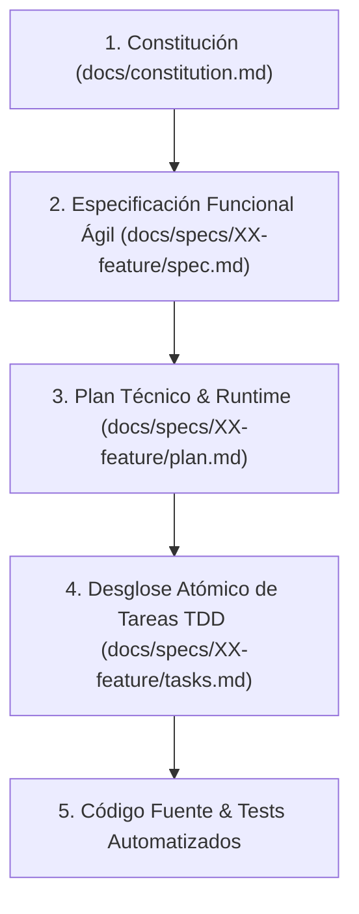

# SDD-Init: Inicializador y Orquestador del Flujo SDD (Spec-Driven Development)

Este workflow es el **núcleo metodológico de SDD**. Su propósito es instruir al asistente de IA y al equipo sobre las reglas del ciclo de vida, la jerarquía de verdad, la precedencia de decisiones, la estructura física de directorios y la generación/mantenimiento del archivo maestro `AGENTS.md` en la raíz del proyecto.

---

## 1. La Jerarquía de Verdad y Precedencia Innegociable

Cuando existan dudas, ambigüedades o conflictos durante el desarrollo, el asistente y el equipo deben obedecer estrictamente este orden jerárquico descendente (utilizando siempre referencias relativas a la raíz del proyecto):



1. **Constitución (`docs/constitution.md`)**: Define la verdad absoluta: visión del producto, flujos macro E2E, topología de datos/persistencia, tech stack y principios innegociables. Nada en niveles inferiores puede contradecirla.
2. **Especificación (`docs/specs/XX-feature/spec.md`)**: Define el **QUÉ** funcional anclado al flujo global, mediante requerimientos de negocio, contratos de datos y criterios de aceptación observables (EARS y Gherkin).
3. **Plan Técnico (`docs/specs/XX-feature/plan.md`)**: Define el **CÓMO** técnico: arquitectura técnica, contratos tipados, garantías de runtime/persistencia y división en Vertical Slices.
4. **Tareas Atómicas (`docs/specs/XX-feature/tasks.md`)**: Checklist secuencial de tareas ejecutadas bajo ciclo TDD (Red-Green-Refactor) con validación dual.
5. **Código Fuente (`src/` o `lib/`) y Tests (`tests/` o `test/`)**: La manifestación física ejecutable que valida dualmente la especificación y los tests.

---

## 2. Principios de Copiloto Técnico Senior y Desarrollo Ágil

1. **Autonomía de Criterio Técnico (Senior Defaults)**:
   - Al implementar cualquier requerimiento, la IA orquesta por defecto todas las configuraciones, ciclos de vida y conexiones de infraestructura necesarias para que el software sea robusto en el mundo real (persistencia sana, migraciones de datos, manejo de errores y estados de carga).
   - Se prohíbe dejar flujos incompletos o desarticulados (ej. crear datos sin proveer su visualización o persistencia coherente).
2. **Integridad Relacional y Simetría de Ciclos de Vida**:
   - Si una entidad dependiente referencia a un catálogo o entidad maestra, la IA debe orquestar los flujos de ambas partes. Toda entrada dependiente debe soportar el selector tridimensional: selección de existentes, creación en caliente (*on-the-fly*) y opción neutra/fallback cuando el catálogo esté vacío.
   - Toda relación en persistencia debe declarar explícitamente su política antihuérfanos (`ON DELETE SET NULL`, `CASCADE` o `RESTRICT`).
3. **Ergonomía sin Sobre-Especificación de UI**:
   - Los documentos `spec.md` se centran en el valor de negocio, reglas lógicas y contratos de datos.
   - Queda prohibido sobre-especificar la UI con detalles cosméticos o micro-diálogos redundantes. La IA asume el diseño ergonómico y las conexiones funcionales completas.
4. **Validación Dual Obligatoria**:
   - Todo feature debe validar simultáneamente las pruebas de Caja Blanca (unitarias/estructurales) y las de Caja Negra (BDD con escenarios observables).
5. **Calidad de Código y Tipado Estricto**:
   - Cero tolerancia a advertencias de linters, código muerto o tipos inseguros (`any`).

---

## 3. Estructura Canónica de Directorios del Proyecto

```text
.
├── AGENTS.md                        <-- Guía de contexto, comandos y reglas maestras
├── docs/
│   ├── constitution.md              <-- Constitución enriquecida (misión, flujos E2E, topología)
│   └── specs/
│       ├── 01-modulo-inicial/
│       │   ├── spec.md              <-- Requerimientos EARS, Gherkin y contratos de datos
│       │   ├── plan.md              <-- Arquitectura técnica, runtime y Vertical Slices
│       │   └── tasks.md             <-- Checklist atómico de tareas con ciclo TDD
│       └── 02-siguiente-feature/
│           ├── spec.md
│           ├── plan.md
│           └── tasks.md
├── src/                             <-- Código de producción (o lib/)
└── tests/                           <-- Suites de tests (o test/)
```

---

## 4. Protocolo de Ciclo de Vida Formal SDD (Orquestación de Comandos)

El asistente de IA guía activamente al usuario a través del ciclo de vida del proyecto, sugiriendo de forma natural el comando del siguiente paso tras completar cada fase:

| Fase / Paso | Comando / Workflow | Entrada Requerida | Salida / Artefacto | Dinámica de Trabajo |
| :--- | :--- | :--- | :--- | :--- |
| **0. Inicializar** | `/sdd-init` | Reglas metodológicas | `AGENTS.md` (raíz) | Establece las reglas maestras, jerarquía relativa y comandos operativos. |
| **1. Constitución** | `/sdd-constitution-trial` | Visión del usuario | `docs/constitution.md` | Entrevista de co-diseño con 5 dimensiones base; genera flujos E2E y topología para nutrir a planning. |
| **2. Especificar** | `/sdd-spec-high`<br>o `/sdd-spec-low` | Requerimiento de negocio | `docs/specs/XX/spec.md` | Especificación ágil de negocio (EARS + Gherkin) anclada al flujo global e integridad relacional. |
| **3. Clarificar** | `/sdd-spec-clarify` | Último `spec.md` | `docs/specs/XX/spec.md` refinado | QA gate: resuelve dudas lógicas o vacíos de negocio reales (sin pedantería cosmética). |
| **4. Planificar** | `/sdd-planning` | `spec.md` aprobado | `docs/specs/XX/plan.md` | Arquitectura, contratos tipados, garantías de persistencia/runtime y slices respetando orden de dependencia. |
| **5. Desglosar Tareas**| `/sdd-task` | `spec.md` y `plan.md` | `docs/specs/XX/tasks.md` | Checklist atómico secuencial con ciclo TDD, validación dual y orden topológico de dependencias. |
| **6. Ejecución & Test**| `/sdd-execution` | `tasks.md` activo | Código + Tests en verde | Implementación con criterio técnico, verificaciones y cierre físico de tareas. |
| **7. Iteración Anclada**| `/sdd-spec-anchored` | Cambio o nueva necesidad | `docs/specs/XX/` actualizado | Evolución controlada preservando la trazabilidad documental. |
| **8. Re-Ejecución** | `/sdd-execution` | Nuevas tareas en `tasks.md` | Código actualizado + Tests | Implementación y verificación de cambios sin romper invariantes previos. |

> [!TIP]
> **Interacción Automática del Copiloto**:
> Al culminar cada fase, el asistente debe informar el artefacto generado y sugerir de forma explícita el comando del siguiente paso lógico (ej. *"Se ha generado `docs/specs/01-auth/spec.md`. Puedes continuar con `/sdd-planning` para diseñar la arquitectura"*).

---

## 5. Instrucción Operativa para el Asistente: Generación de `AGENTS.md`

Cuando el usuario invoque este workflow (`/sdd-init`):

1. **Auditoría Previa**:
   - Inspecciona si ya existe `AGENTS.md` o documentación en `docs/`.
   - Si existen, audita qué secciones faltan y preserva los acuerdos previos.
2. **Generación o Actualización de `AGENTS.md`**:
   - Crea o actualiza `AGENTS.md` en la raíz del proyecto asegurando incluir:
     - **Jerarquía de verdad con enlaces relativos simples**: referencias directas a `docs/constitution.md` y `docs/specs/` (sin rutas absolutas del host ni esquemas `file:///`).
     - **Mandato de Copiloto Técnico Senior e Integridad Relacional**: autonomía para orquestar persistencia, migraciones, ciclo de vida y simetría de entidades vinculadas por defecto.
     - **Regla Antiatrapamiento de UI**: enfoque en valor de negocio sin sobre-especificación cosmética.
     - **Estándares de Codificación**: tipado estricto, manejo explícito de errores y linters.
     - **Comandos Oficiales del Proyecto**: comandos para dev server, tests unitarios, tests BDD, linters y migraciones.
     - **Invariantes operativas**: validación dual obligatoria y flujos completos de punta a punta.
3. **Sugerencia de Siguiente Paso**:
   - Tras crear o actualizar `AGENTS.md`, notifica al usuario e invita a definir la constitución del proyecto con el comando `/sdd-constitution-trial`.
