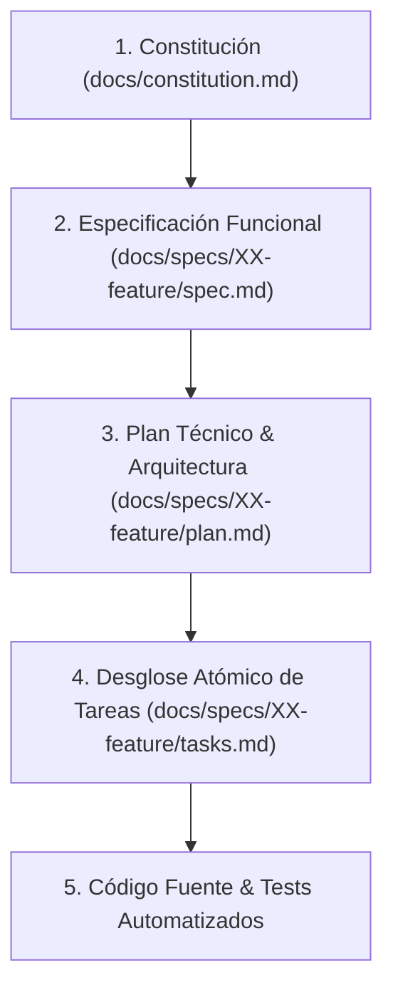

# SDD-Init: Inicializador y Orquestador del Flujo SDD (Spec-Driven Development)

Este workflow es el **núcleo metodológico de SDD**. Su propósito es instruir al asistente de IA y al equipo sobre las reglas innegociables del ciclo de vida, la jerarquía de verdad, la precedencia de decisiones, la estructura física de directorios y la generación/mantenimiento del archivo maestro `AGENTS.md` en la raíz del proyecto.

---

## 1. La Jerarquía de Verdad y Precedencia Innegociable

Cuando existan dudas, ambigüedades o conflictos durante el desarrollo, el asistente y el equipo deben obedecer estrictamente este orden jerárquico descendente:



1. **Constitución (desde la raíz del proyecto en `docs/constitution.md`)**: Define los principios innegociables, tech stack, misión y reglas de arquitectura del proyecto. Nada en niveles inferiores puede contradecirla.
2. **Especificación (`docs/specs/XX-feature/spec.md`)**: Define el **QUÉ** mediante requerimientos formales EARS, criterios de aceptación Gherkin y contratos de interfaces.
3. **Plan Técnico (`docs/specs/XX-feature/plan.md`)**: Define el **CÓMO** mediante arquitectura técnica, diagramas de secuencia, invariantes y división en Vertical Slices.
4. **Tareas Atómicas (`docs/specs/XX-feature/tasks.md`)**: Tareas trazables, verificables y secuenciales ejecutadas bajo ciclo TDD (Red-Green-Refactor).
5. **Código Fuente y Tests**: La manifestación física ejecutable que debe validar dualmente la especificación y los tests.

---

## 2. Estructura Canónica de Directorios del Proyecto

El desarrollo bajo SDD organiza la documentación en carpetas versionadas dentro de `docs/`:

```text
📁 <RAIZ-DEL-PROYECTO>/
├── 📄 AGENTS.md                        <-- Guía de contexto, comandos y reglas maestras
├── 📁 docs/
│   ├── 📄 constitution.md              <-- Constitución del proyecto (misión, stack, roadmap)
│   └── 📁 specs/
│       ├── 📁 01-modulo-inicial/
│       │   ├── 📄 spec.md              <-- Requerimientos EARS, Gherkin y contratos
│       │   ├── 📄 plan.md              <-- Arquitectura técnica y Vertical Slices
│       │   └── 📄 tasks.md             <-- Checklist atómico de tareas con ciclo TDD
│       └── 📁 02-siguiente-feature/
│           ├── 📄 spec.md
│           ├── 📄 plan.md
│           └── 📄 tasks.md
└── 📁 src/                             <-- Código de producción
```

---

## 3. Protocolo de Ejecución del Asistente (Ciclo de Vida Formal SDD)

El asistente de IA y el equipo de ingeniería deben seguir estrictamente este flujo de comandos y transiciones de estado:

| Fase / Paso | Comando / Workflow | Entrada Requerida | Salida / Artefacto Generado | Propósito / Dinámica |
| :--- | :--- | :--- | :--- | :--- |
| **0. Inicializar SDD** | `/sdd-init` | Reglas metodológicas | `AGENTS.md` (raíz) | Establece las reglas del juego, la precedencia de carpetas y comandos maestros del proyecto. |
| **1. Constitución** | `/sdd-constitution-trial` | Entrevista interactiva (Grill-Me) | `docs/constitution.md` | Define la misión, tech stack, roadmap, principios innegociables y convenciones operativas. |
| **2. Especificar** | `/sdd-spec-high`<br>o `/sdd-spec-low` | Idea o requerimiento | `docs/specs/XX/spec.md` | **High**: Riguroso con EARS y contratos tipados.<br>**Low**: Ágil para features simples o rápidos. |
| **3. Clarificar** | `/sdd-spec-clarify` | Último `spec.md` generado | `docs/specs/XX/spec.md` (refinado) | Auditoría de QA. Pregunta al usuario sobre huecos, ambigüedades o casos de borde para dejar el spec impecable. |
| **4. Planificar** | `/sdd-planning` | `spec.md` clarificado y aprobado | `docs/specs/XX/plan.md` | Diseño arquitectónico, diagramas de secuencia, invariantes y partición en Vertical Slices. |
| **5. Desglosar Tareas** | `/sdd-task` | `spec.md` y `plan.md` | `docs/specs/XX/tasks.md` | Lista de tareas atómicas, trazables y secuenciadas con ciclo TDD. |
| **6. Ejecución & Test** | `/sdd-execution` | `tasks.md` activo | Código en `src/` + Tests en verde | Ejecución paso a paso del checklist, tests automatizados y validación dual. |
| **7. Iteración Anclada** | `/sdd-spec-anchored`<br>*(o -spec / -plan / -task)* | Modificación a un spec existente | `docs/specs/XX/` actualizado | Permite evolucionar el feature: detalla los cambios en `spec.md`, adapta `plan.md` y añade las nuevas tareas en `tasks.md`. |
| **8. Re-Ejecución** | `/sdd-execution` | Nuevas tareas en `tasks.md` | Código actualizado + Tests | Cierra la iteración validando que las nuevas capacidades no rompan los invariantes previos. |

> [!CAUTION]
> **Prohibición Estricta de Salto de Fase**:
> 1. El asistente **NUNCA** debe comenzar a escribir código de producción sin tener aprobados previamente: `spec.md`, `plan.md` y `tasks.md`.
> 2. Toda nueva iteración o cambio de requerimiento debe ingresar por la **Fase 7 (Anclada)** para mantener la trazabilidad documental antes de volver a ejecutar código en la **Fase 8**.

---

## 4. Instrucción Operativa para el Asistente: Generación de `AGENTS.md`

Cuando el usuario invoque este workflow (`/sdd-init`):

1. **Auditoría Previa**:
   - Inspecciona si ya existe un archivo `AGENTS.md` o documentación en `docs/`.
   - Si ya existen, no sobrescribas a ciegas: audita qué secciones faltan y propón incrementos conservando las decisiones previas.
2. **Generación o Actualización de `AGENTS.md`**:
   - Si no existe `AGENTS.md`, créalo en la raíz del proyecto asegurando incluir:
     - **Regla de oro de precedencia**: Referencia directa a `docs/constitution.md` y `docs/specs/`.
     - **Estándares de Codificación y Calidad**: Reglas de tipado estricto (sin `any`), linters/formateadores, manejo de errores tipado y nomenclatura obligatoria.
     - **Comandos del proyecto**: Scripts para levantar dev server, tests unitarios, tests e2e, linters, typecheck y migraciones.
     - **Rutas de documentación**: Mapeo explícito a `docs/specs/`.
     - **Invariantes operativas**: Prohibición de mocks en producción, validación dual obligatoria y commit conventions.
