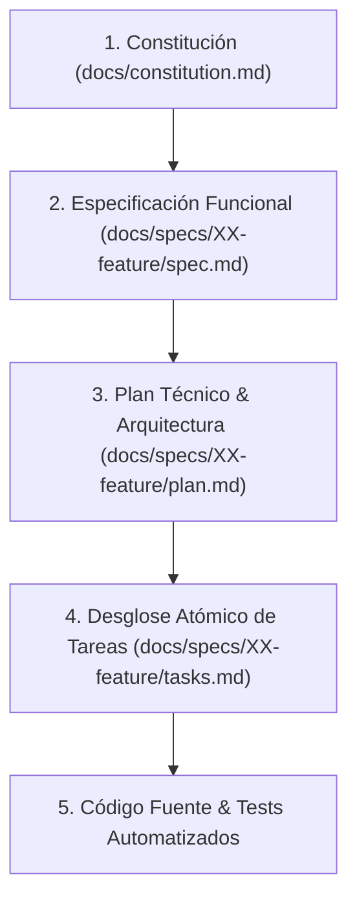

# SDD-Init: Inicializador y Orquestador del Flujo SDD (Spec-Driven Development)

Este workflow es el **núcleo metodológico de SDD**. Su propósito es instruir al asistente de IA y al equipo sobre las reglas innegociables del ciclo de vida, la jerarquía de verdad, la precedencia de decisiones, la estructura física de directorios y la generación/mantenimiento del archivo maestro `AGENTS.md` en la raíz del proyecto.

---

## 1. La Jerarquía de Verdad y Precedencia Innegociable

Cuando existan dudas, ambigüedades o conflictos durante el desarrollo, el asistente y el equipo deben obedecer estrictamente este orden jerárquico descendente:



1. **Constitución (`docs/constitution.md`)**: Define los principios innegociables, tech stack, misión y reglas de arquitectura del proyecto. Nada en niveles inferiores puede contradecirla.
2. **Especificación (`docs/specs/XX-feature/spec.md`)**: Define el **QUÉ** mediante requerimientos formales EARS, criterios de aceptación Gherkin y contratos de interfaces.
3. **Plan Técnico (`docs/specs/XX-feature/plan.md`)**: Define el **CÓMO** mediante arquitectura técnica, diagramas de secuencia, invariantes y división en Vertical Slices.
4. **Tareas Atómicas (`docs/specs/XX-feature/tasks.md`)**: Tareas trazables, verificables y secuenciales ejecutadas bajo ciclo TDD (Red-Green-Refactor).
5. **Código Fuente y Tests**: La manifestación física ejecutable que debe validar dualmente la especificación y los tests.

---

## 2. Estructura Canónica de Directorios del Proyecto

El desarrollo bajo SDD organiza la documentación en carpetas versionadas dentro de `docs/`:

```text
📁 <RAIZ-DEL-PROYECTO>/
├── 📄 AGENTS.md                        <-- Guía de contexto, comandos y reglas maestras
├── 📁 docs/
│   ├── 📄 constitution.md              <-- Constitución del proyecto (misión, stack, roadmap)
│   └── 📁 specs/
│       ├── 📁 01-modulo-inicial/
│       │   ├── 📄 spec.md              <-- Requerimientos EARS, Gherkin y contratos
│       │   ├── 📄 plan.md              <-- Arquitectura técnica y Vertical Slices
│       │   └── 📄 tasks.md             <-- Checklist atómico de tareas con ciclo TDD
│       └── 📁 02-siguiente-feature/
│           ├── 📄 spec.md
│           ├── 📄 plan.md
│           └── 📄 tasks.md
└── 📁 src/                             <-- Código de producción
```

---

## 3. Protocolo de Ejecución del Asistente (Fase por Fase)

El asistente de IA debe seguir este orden estricto de comandos o fases:

| Fase | Comando / Workflow | Entrada Requerida | Salida / Artefacto Generado |
| :--- | :--- | :--- | :--- |
| **0. Constitución** | `/sdd-constitution-trial` | Entrevista interactiva | `docs/constitution.md` |
| **1. Inicializar Agente** | `/sdd-init` | Reglas metodológicas y stack | `AGENTS.md` (raíz) |
| **2. Especificar** | `/spec-init` | Idea de requerimiento | `docs/specs/XX-feature/spec.md` |
| **3. Planificar** | `/plan` | `spec.md` validado | `docs/specs/XX-feature/plan.md` |
| **4. Ejecutar & Validar** | `/task-verify` | `plan.md` y `tasks.md` | Código en `src/` + Tests en verde |

> [!CAUTION]
> **Prohibición de Salto de Fase**: El asistente **NUNCA** debe comenzar a escribir código de producción sin antes tener una especificación aprobada (`spec.md`), su plan técnico (`plan.md`) y sus tareas trazadas (`tasks.md`).

---

## 4. Instrucción Operativa para el Asistente: Generación de `AGENTS.md`

Cuando el usuario invoque este workflow (`/sdd-init`):

1. **Auditoría Previa**:
   - Inspecciona si ya existe un archivo `AGENTS.md` o documentación en `docs/`.
   - Si ya existen, no sobrescribas a ciegas: audita qué secciones faltan y propón incrementos conservando las decisiones previas.
2. **Generación o Actualización de `AGENTS.md`**:
   - Si no existe `AGENTS.md`, créalo en la raíz del proyecto asegurando incluir:
     - **Regla de oro de precedencia**: Referencia directa a `docs/constitution.md` y `docs/specs/`.
     - **Comandos del proyecto**: Scripts para levantar dev server, tests, linters, base de datos y migraciones.
     - **Rutas de documentación**: Mapeo explícito a `docs/specs/`.
     - **Invariantes operativas**: Prohibición de mocks en producción, validación dual y commit conventions.
