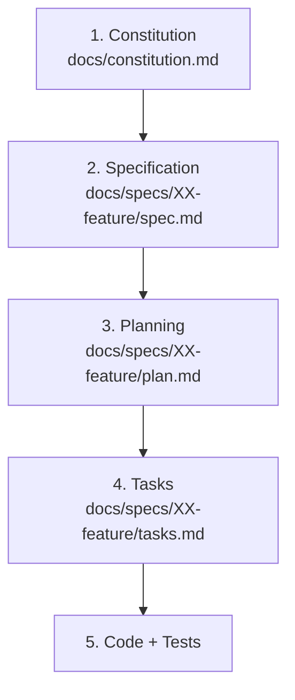
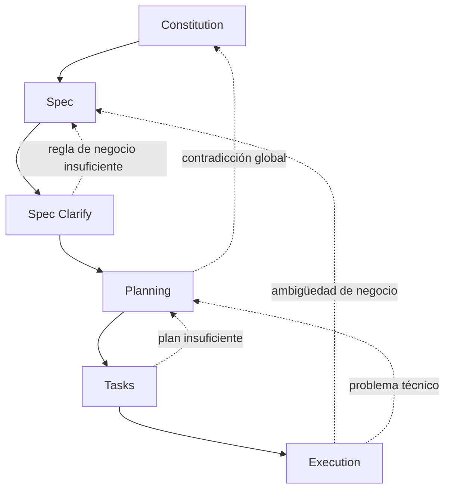

# SDD-Init: Inicializador y Orquestador del Flujo SDD (Spec-Driven Development)

Este workflow es el **núcleo metodológico del sistema SDD**. Su propósito es establecer las reglas globales mediante las cuales el asistente de IA y el equipo desarrollan, documentan, implementan y evolucionan el proyecto bajo un flujo **Spec-Driven Development**.

`/sdd-init` define:

* la jerarquía y precedencia entre artefactos;
* las responsabilidades de cada fase;
* los límites de autonomía del asistente;
* la separación entre decisiones de negocio y decisiones técnicas;
* la estructura documental;
* los estados de aprobación;
* la trazabilidad;
* el mecanismo de retroalimentación entre fases;
* la generación y mantenimiento de `AGENTS.md`.

Este workflow **no diseña la arquitectura concreta de una aplicación ni define su estructura física de código**. Esas decisiones pertenecen a `/sdd-planning`.

---

# 1. Jerarquía de Verdad y Precedencia por Ámbito

Cuando existan dudas, ambigüedades o conflictos durante el desarrollo, el asistente debe respetar la siguiente jerarquía:



La jerarquía representa **precedencia por ámbito**, no que un documento inferior sea inválido o irrelevante.

### Regla fundamental

> Un nivel inferior no puede contradecir una decisión explícita de un nivel superior, pero puede definir decisiones propias dentro de su ámbito.

Por ejemplo:

```text
Constitution
    ↓
Define que el sistema utiliza PostgreSQL.

Spec
    ↓
Define que un usuario puede cancelar una reserva.

Plan
    ↓
Define cómo persistir y ejecutar la cancelación.

Tasks
    ↓
Divide la implementación en trabajo ejecutable.

Code
    ↓
Materializa esas decisiones.
```

---

## 1.1 Constitution

**Archivo:**

```text
docs/constitution.md
```

Define las reglas globales del proyecto:

* misión y dominio;
* lenguaje ubicuo;
* flujos globales;
* restricciones funcionales globales;
* restricciones técnicas globales;
* stack aprobado;
* principios de calidad;
* políticas que realmente sean globales;
* reglas de gobernanza del proyecto.

La Constitución **no debe contener detalles de implementación propios de una feature**, salvo que sean restricciones globales.

---

## 1.2 Specification

**Archivo:**

```text
docs/specs/XX-feature/spec.md
```

Define el **QUÉ** funcional:

* actores;
* objetivos;
* comportamiento observable;
* reglas de negocio;
* requerimientos funcionales;
* datos funcionales;
* criterios de aceptación;
* escenarios Gherkin;
* relaciones funcionales entre entidades.

La especificación no debe decidir detalles internos de implementación como:

```text
clases
controladores
repositorios
ORM
SQL
estructura de carpetas
componentes concretos
```

---

## 1.3 Planning

**Archivo:**

```text
docs/specs/XX-feature/plan.md
```

Define el **CÓMO** técnico:

* arquitectura;
* estructura física de archivos;
* contratos técnicos;
* persistencia;
* integraciones;
* manejo de errores;
* ciclo de vida;
* políticas de relaciones;
* runtime;
* estrategia de pruebas;
* compatibilidad con código existente;
* vertical slices.

---

## 1.4 Tasks

**Archivo:**

```text
docs/specs/XX-feature/tasks.md
```

Define el **TRABAJO EJECUTABLE**:

* tareas;
* dependencias;
* orden de ejecución;
* criterios de finalización;
* evidencia requerida;
* estado de cada tarea.

---

## 1.5 Code + Tests

El código y los tests representan la **manifestación física ejecutable** del sistema.

No sustituyen a los artefactos superiores como fuente de intención.

Si el código contradice una especificación aprobada, el agente debe identificarlo como una desviación y determinar si:

1. el código está incorrecto;
2. la especificación está desactualizada;
3. el plan es incorrecto;
4. existe una nueva decisión que debe formalizarse.

Nunca debe corregir silenciosamente la documentación para justificar código existente.

---

# 2. Separación de Decisiones

El asistente debe distinguir tres tipos de decisiones.

## 2.1 Decisiones de negocio

Ejemplos:

```text
¿Un producto puede existir sin categoría?
¿Quién puede cancelar una venta?
¿Se puede eliminar un cliente?
¿Qué ocurre cuando una reserva expira?
```

Estas decisiones pertenecen al usuario, negocio o especificación funcional.

La IA **no debe inventarlas**.

Cuando una decisión de negocio sea necesaria y no esté documentada:

1. identificar la ambigüedad;
2. presentar opciones neutrales;
3. indicar brevemente el impacto;
4. esperar la decisión cuando sea material.

---

## 2.2 Decisiones arquitectónicas

Ejemplos:

```text
¿REST o GraphQL?
¿Repository Pattern o acceso directo al ORM?
¿Cola síncrona o asíncrona?
¿Dónde colocar una determinada lógica?
```

La IA puede proponer una solución técnica basándose en:

* stack existente;
* simplicidad;
* mantenibilidad;
* consistencia;
* rendimiento;
* seguridad;
* convenciones del proyecto.

Si existen alternativas con consecuencias arquitectónicas relevantes, debe plantearlas antes de consolidar el plan.

---

## 2.3 Decisiones técnicas de bajo impacto

La IA puede decidir autónomamente detalles que:

* no cambian el comportamiento funcional;
* no cambian el contrato público;
* no afectan datos críticos;
* no introducen una decisión arquitectónica relevante;
* son reversibles.

Ejemplos:

```text
nombre interno de variable;
orden de imports;
helper privado;
formato de código;
organización menor de un archivo.
```

---

# 3. Principio de Autonomía Técnica Senior

La IA debe actuar como **copiloto técnico senior**, no como generador pasivo de fragmentos de código.

Cuando implemente una feature, debe considerar el flujo completo:

```text
entrada
  ↓
validación
  ↓
lógica
  ↓
persistencia
  ↓
respuesta
  ↓
estado de interfaz
  ↓
visualización
  ↓
errores
  ↓
pruebas
```

Debe evitar deliberadamente implementaciones incompletas como:

```text
crear datos sin poder consultarlos;

guardar una relación sin definir su ciclo de vida;

crear un endpoint sin gestionar sus errores;

crear una entidad sin considerar sus dependencias;

implementar una pantalla que no esté conectada con la persistencia.
```

La autonomía técnica no autoriza a la IA a inventar reglas de negocio.

---

# 4. Integridad de Entidades y Ciclo de Vida

Las relaciones entre entidades deben analizarse considerando:

* creación;
* consulta;
* actualización;
* eliminación;
* ausencia;
* dependencia;
* integridad;
* estados inválidos;
* comportamiento ante eliminación de referencias.

Sin embargo, **ningún patrón concreto es obligatorio universalmente**.

Por ejemplo, el patrón:

```text
1. seleccionar existente
2. crear nuevo
3. opción neutra
```

puede utilizarse cuando el dominio lo requiera.

No debe imponerse automáticamente a todas las relaciones.

La pregunta funcional corresponde a Specification:

```text
¿Puede la entidad dependiente existir sin la entidad relacionada?
```

La decisión técnica corresponde a Planning:

```text
nullable FK
SET NULL
RESTRICT
CASCADE
selector
endpoint
modal
etc.
```

---

# 5. Ergonomía sin Sobre-Especificación de UI

Los documentos SDD deben concentrarse en:

* valor de negocio;
* comportamiento;
* reglas;
* datos;
* estados observables;
* errores;
* criterios de aceptación.

No deben sobre-especificar innecesariamente:

```text
colores;
píxeles;
márgenes;
animaciones;
microdiálogos;
posiciones exactas;
detalles cosméticos.
```

La IA puede tomar decisiones razonables de UX/UI cuando no alteren el comportamiento definido.

Si un aspecto visual modifica el comportamiento o una regla de negocio, debe documentarse.

---

# 6. Validación Basada en Riesgo

La calidad debe demostrarse mediante evidencia apropiada al tipo de cambio.

No se exige artificialmente el mismo conjunto de pruebas para todas las modificaciones.

### Caja negra

Debe utilizarse para validar flujos funcionales observables relevantes:

```text
usuario
    ↓
sistema
    ↓
resultado observable
```

Puede incluir:

* BDD;
* E2E;
* pruebas de integración orientadas al comportamiento.

### Caja blanca

Debe utilizarse cuando exista lógica interna que requiera validación específica:

* reglas complejas;
* cálculos;
* transformaciones;
* algoritmos;
* validaciones críticas;
* servicios complejos.

### Regla

> Todo cambio debe tener una estrategia de validación proporcional a su riesgo.

Los tests no deben existir únicamente para satisfacer una cantidad arbitraria.

---

# 7. Calidad de Código

El código producido debe respetar las convenciones del proyecto y priorizar:

* tipado fuerte;
* ausencia de `any` injustificado;
* manejo explícito de errores;
* código mantenible;
* ausencia de código muerto;
* ausencia de duplicación innecesaria;
* separación adecuada de responsabilidades;
* consistencia con la arquitectura existente;
* linting limpio cuando el proyecto disponga de linter.

Las excepciones técnicas deben estar justificadas cuando sean necesarias.

---

# 8. Estructura Canónica Documental

SDD administra los siguientes artefactos:

```text
.
├── AGENTS.md
│
└── docs/
    ├── constitution.md
    │
    └── specs/
        ├── 01-modulo-inicial/
        │   ├── spec.md
        │   ├── plan.md
        │   └── tasks.md
        │
        └── 02-siguiente-feature/
            ├── spec.md
            ├── plan.md
            └── tasks.md
```

### Responsabilidades

```text
AGENTS.md
    → instrucciones operativas para agentes

docs/constitution.md
    → gobernanza y restricciones globales

spec.md
    → comportamiento funcional

plan.md
    → arquitectura y diseño técnico

tasks.md
    → trabajo ejecutable
```

La estructura física del código **no se define en `/sdd-init`**.

Es responsabilidad de:

```text
/sdd-planning
```

---

# 9. Estados de los Artefactos

Cada artefacto relevante debe tener un estado explícito cuando el flujo lo requiera.

Estados permitidos:

```text
DRAFT
IN_REVIEW
NEEDS_CLARIFICATION
APPROVED
IN_PROGRESS
COMPLETED
BLOCKED
SUPERSEDED
```

## Regla de transición

Una fase no debe consumir como definitiva una entrada que todavía requiere decisiones.

Ejemplo:

```text
spec.md
Status: NEEDS_CLARIFICATION
```

impide iniciar un planning definitivo.

Después:

```text
spec.md
Status: APPROVED
```

permite:

```text
/sdd-planning
```

De forma equivalente:

```text
plan.md
Status: APPROVED
```

habilita:

```text
/sdd-task
```

---

# 10. Trazabilidad

El sistema debe conservar trazabilidad entre intención, diseño, trabajo y evidencia.

La cadena conceptual es:

```text
HU
 ↓
RF
 ↓
SC
 ↓
Plan Component
 ↓
Task
 ↓
Test / Evidence
```

No se exige una correspondencia artificial de uno a uno.

Por ejemplo:

```text
RF-01
    ↓
SC-01
SC-02
SC-03
```

es válido.

También puede ocurrir que una prueba cubra varios requerimientos relacionados.

Lo importante es que cada comportamiento funcional relevante pueda rastrearse hasta su implementación y evidencia correspondiente.

---

# 11. Retroalimentación y Corrección de Nivel

El flujo SDD no es estrictamente lineal.

Durante una fase puede descubrirse un problema perteneciente a una fase anterior.



### Regla fundamental

> Un problema debe corregirse en el nivel donde reside la decisión que lo originó.

Ejemplos:

```text
Requisito ambiguo
    → Spec

Arquitectura incorrecta
    → Planning

Tarea incompleta
    → Task

Bug de implementación
    → Execution

Contradicción con una regla global
    → Constitution
```

No se debe parchear código para ocultar una decisión documental incorrecta.

---

# 12. Compatibilidad con el Proyecto Existente

SDD no asume que el proyecto comienza desde cero.

Cuando exista código previo:

* preservar comportamiento existente salvo decisión explícita;
* inspeccionar las partes relevantes antes de modificar;
* respetar convenciones existentes;
* detectar dependencias;
* evitar sobrescribir cambios del usuario;
* considerar migraciones y compatibilidad;
* identificar regresiones potenciales.

`/sdd-planning` puede consultar selectivamente el código existente para diseñar una solución compatible.

No debe realizar una auditoría indiscriminada de todo el repositorio cuando no sea necesaria.

---

# 13. Protocolo de Ciclo de Vida Formal

| Fase  | Workflow                           | Entrada               | Salida                  | Propósito                |
| ----- | ---------------------------------- | --------------------- | ----------------------- | ------------------------ |
| **0** | `/sdd-init`                        | Reglas SDD            | `AGENTS.md`             | Inicializar gobernanza   |
| **1** | `/sdd-constitution-trial`          | Visión del proyecto   | `constitution.md`       | Definir reglas globales  |
| **2** | `/sdd-spec-high` / `/sdd-spec-low` | Necesidad funcional   | `spec.md`               | Definir comportamiento   |
| **3** | `/sdd-spec-clarify`                | `spec.md`             | `spec.md` aprobado      | QA funcional             |
| **4** | `/sdd-planning`                    | `spec.md` aprobado    | `plan.md`               | Diseñar solución técnica |
| **5** | `/sdd-task`                        | `spec.md` + `plan.md` | `tasks.md`              | Descomponer trabajo      |
| **6** | `/sdd-execution`                   | `tasks.md`            | Código + evidencia      | Implementar              |
| **7** | `/sdd-spec-anchored`               | Cambio/necesidad      | Artefactos actualizados | Evolución controlada     |
| **8** | `/sdd-execution`                   | Nuevas tareas         | Código actualizado      | Reejecutar cambios       |
| **9** | `/doc-deploy`                      | Código implementado   | Suite despliegue + HTML | Despliegue y operaciones |

---

# 14. Regla de Finalización de Fases

Una fase no se considera completada simplemente porque se haya generado un archivo.

Debe existir evidencia de que:

1. el artefacto fue creado o actualizado;
2. su contenido es coherente con los niveles superiores;
3. sus decisiones requeridas están resueltas;
4. su estado corresponde a la situación real;
5. no existen bloqueos conocidos para continuar.

Por ejemplo:

```text
spec.md creado
≠
spec.md aprobado
```

y:

```text
tests escritos
≠
tests ejecutados correctamente
```

---

# 15. Orquestación del Siguiente Paso

El asistente debe guiar activamente al usuario.

Después de completar una fase debe informar:

```text
- qué artefacto fue creado/modificado;
- qué estado tiene;
- qué decisiones quedaron resueltas;
- si existen bloqueos;
- cuál es el siguiente workflow lógico.
```

Ejemplo:

```text
Se ha generado:

docs/specs/01-auth/spec.md

Estado:
APPROVED

La especificación está lista para diseño técnico.

Siguiente paso:
 /sdd-planning
```

Si existen bloqueos:

```text
docs/specs/01-auth/spec.md

Estado:
NEEDS_CLARIFICATION

Antes de continuar con Planning deben resolverse:
- ...
- ...

Siguiente paso:
 /sdd-spec-clarify
```

---

# 16. Comandos Oficiales

Los workflows oficiales del sistema SDD son:

```text
/sdd-init
/sdd-constitution-trial

/sdd-spec-high
/sdd-spec-low
/sdd-spec-clarify

/sdd-planning
/sdd-task
/sdd-execution

/sdd-spec-anchored

/doc-deploy
```

El asistente debe preferir estos workflows para mantener la trazabilidad documental en lugar de saltarse fases deliberadamente.

---

# 17. Generación y Mantenimiento de AGENTS.md

Cuando el usuario invoque:

```text
/sdd-init
```

el asistente debe auditar primero el estado existente.

## 17.1 Auditoría previa

Comprobar:

```text
AGENTS.md
docs/
docs/constitution.md
docs/specs/
```

Si existen documentos previos:

* preservar acuerdos válidos;
* detectar contradicciones;
* evitar sobrescribir información útil;
* actualizar únicamente lo necesario;
* identificar configuraciones existentes que puedan afectar al flujo SDD.

La IA no debe borrar decisiones existentes sin una razón explícita.

---

# 18. Contenido mínimo de AGENTS.md

`AGENTS.md` debe funcionar como la guía operativa principal para agentes del proyecto.

Debe contener:

## 18.1 Jerarquía de verdad

Referencias relativas:

```text
docs/constitution.md
docs/specs/
```

Nunca utilizar:

```text
file:///
C:\Users\...
/home/user/...
```

ni rutas absolutas dependientes de la máquina.

---

## 18.2 Flujo SDD

Debe documentar:

```text
/sdd-init
    ↓
/sdd-constitution-trial
    ↓
/sdd-spec-high
    ↓
/sdd-spec-clarify
    ↓
/sdd-planning
    ↓
/sdd-task
    ↓
/sdd-execution
```

---

## 18.3 Reglas de autonomía

Debe indicar que el agente:

* puede tomar decisiones técnicas de bajo impacto;
* debe consultar decisiones de negocio no documentadas;
* debe respetar decisiones arquitectónicas aprobadas;
* no debe inventar requisitos;
* no debe ocultar inconsistencias documentales mediante código.

---

## 18.4 Reglas de calidad

Debe incluir:

```text
tipado estricto;
manejo explícito de errores;
linters;
tests apropiados al riesgo;
ausencia de código muerto;
compatibilidad con código existente;
verificación física antes de marcar tareas completas.
```

---

## 18.5 Comandos del proyecto

`AGENTS.md` debe registrar los comandos reales disponibles para:

```text
desarrollo;
build;
tests;
BDD/E2E;
tests unitarios;
lint;
type-check;
migraciones;
formateo;
otros comandos relevantes del stack.
```

La IA debe obtener estos comandos del proyecto existente cuando sea posible, en lugar de inventarlos.

---

# 19. Invariantes Operativas

Durante todo el ciclo SDD se deben respetar estas invariantes:

### Invariante 1 — No inventar negocio

```text
La IA puede proponer.
La IA no puede decidir silenciosamente una regla de negocio crítica.
```

### Invariante 2 — No contradecir niveles superiores

```text
Spec no contradice Constitution.
Plan no contradice Spec.
Tasks no contradicen Plan.
Code no contradice la intención aprobada.
```

### Invariante 3 — No saltar decisiones necesarias

Una fase bloqueada no debe tratarse como aprobada.

### Invariante 4 — Evidencia física

Una tarea solo puede marcarse como completada después de verificar físicamente el resultado cuando la tarea requiera ejecución.

### Invariante 5 — Trazabilidad

Los cambios funcionales relevantes deben poder rastrearse desde el requisito hasta su implementación y evidencia.

### Invariante 6 — Corrección en el nivel correcto

Los problemas descubiertos durante ejecución deben regresar al artefacto donde reside la decisión correspondiente.

### Invariante 7 — No sobre-especificar

Los documentos deben contener las decisiones necesarias para eliminar ambigüedad, no detalles innecesarios que restrinjan artificialmente la implementación.

---

# 20. Regla Maestra del Sistema SDD

La regla fundamental de todo el sistema es:

> **Primero se define la intención, después se valida la intención, luego se diseña la solución, se descompone el trabajo, se implementa y finalmente se verifica mediante evidencia.**

El asistente debe mantener siempre la separación:

```text
INTENCIÓN
    ↓
CONSTITUTION + SPEC

DISEÑO
    ↓
PLAN

TRABAJO
    ↓
TASKS

REALIZACIÓN
    ↓
CODE

EVIDENCIA
    ↓
TESTS + VERIFICATION
```

Cuando exista una contradicción, el asistente no debe ocultarla.

Debe localizar su origen, corregir el artefacto correspondiente y continuar el flujo desde ese punto.

---

# 21. Acción al Invocar /sdd-init

Cuando el usuario ejecute:

```text
/sdd-init
```

el asistente debe:

1. Auditar `AGENTS.md` y `docs/`.
2. Detectar documentación SDD existente.
3. Preservar acuerdos válidos.
4. Detectar contradicciones relevantes.
5. Crear o actualizar `AGENTS.md`.
6. No crear automáticamente `constitution.md` si todavía no existe.
7. No crear `spec.md`, `plan.md` ni `tasks.md` sin que corresponda a su fase.
8. Informar el estado final.
9. Recomendar como siguiente paso:

```text
/sdd-constitution-trial
```

si la Constitución todavía no está definida o necesita ser actualizada.

Si ya existe una Constitución válida y aprobada, debe indicar que el siguiente paso puede ser:

```text
/sdd-spec-high
```

o el workflow correspondiente al estado actual del proyecto.
