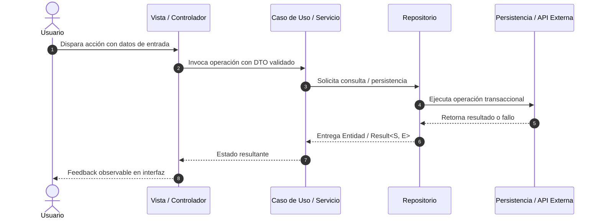

# SDD-Planning: Plan Técnico de Arquitectura, Runtime e Implementación (SDD)

Este workflow analiza la especificación funcional aprobada (`docs/specs/XX-nombre/spec.md`) y la constitución del proyecto (`docs/constitution.md`) para estructurar la solución técnica formal en `docs/specs/XX-nombre/plan.md`.

> **Propósito Técnico**: 
> Aterriza el **CÓMO**: arquitectura limpia, contratos de código estrictos, modelos de persistencia física, garantías de integridad relacional en runtime y división en *Vertical Slices*. No requiere entrevista obligatoria con el usuario; se genera directamente aplicando el criterio técnico Senior de la IA.

---

## 1. Resolución del Módulo a Planificar (`[XX.]`)

Cuando el usuario invoque este workflow (`/sdd-planning`):
1. **Con Argumento `[XX.]` o `[XX]`**: Localiza en `docs/specs/` la carpeta que coincida con ese identificador (ej. `docs/specs/01-auth/spec.md`).
2. **Sin Argumento**: Selecciona automáticamente el último módulo disponible con `spec.md`.

---

## 2. Protocolo de Ejecución del Asistente

El asistente ejecuta los siguientes pasos técnicos:

1. **Lectura de Entrada**:
   - Lee `docs/constitution.md` (stack tecnológico, flujos E2E, topología de datos y principios innegociables).
   - Lee `docs/specs/XX-nombre/spec.md` (requerimientos de negocio, contratos de datos y criterios Gherkin).
2. **Diseño de la Solución Técnica**:
   - Modela la arquitectura en capas (UI/Presentación, Controladores/Estado, Casos de Uso/Servicios, Entidades de Dominio, Repositorios/Persistencia).
   - Diseña el diagrama de secuencia técnico en Mermaid.
   - Define contratos de código fuertemente tipados (DTOs, Entidades inmutables, Interfaces y Tipos de error).
   - **Garantías de Runtime, Persistencia e Integridad del Grafo de Entidades**:
     - Políticas de claves foráneas y prevención de huérfanos (`ON DELETE SET NULL / CASCADE / RESTRICT`).
     - Arquitectura del selector tridimensional (existente, en caliente y estado neutro/vacío).
     - Control de versiones de esquema (`schemaVersion`) y migraciones limpias en desarrollo.
   - **Invariante de Flujo Cerrado**: asegura que todos los flujos CRUD queden completamente conectados sin estados ciegos.
   - Divide la implementación en *Vertical Slices* ejecutables bajo TDD respetando el orden de dependencia topológica.
3. **Generación del Artefacto**:
   - Escribe el archivo oficial `docs/specs/XX-nombre/plan.md`.

---

## 3. Plantilla Oficial de Salida: `docs/specs/XX-nombre/plan.md`

```markdown
# Plan Técnico: [Nombre del Módulo o Feature]

> Módulo: `docs/specs/XX-nombre/` | Especificación Base: `spec.md` | Estado: Diseñado | Metodología: SDD-Planning

---

## 1. Resumen Arquitectónico y Matriz de Componentes

- **Objetivo Técnico**: [Descripción concisa del objetivo de implementación]
- **Patrón Arquitectónico**: [Clean Architecture / Hexagonal / Feature-First según constitution.md]
- **Capas Involucradas**:
  - `Presentación / UI`: [Componentes visuales, gestión de estado y controladores reactivos]
  - `Dominio & Casos de Uso`: [Entidades inmutables, reglas de negocio y puertos/interfaces]
  - `Infraestructura & Datos`: [Implementación de repositorios, clientes API, adaptadores locales]

---

## 2. Diagrama de Secuencia Técnico



---

## 3. Contratos de Código e Interfaces Tipadas

### 3.1 Modelos de Dominio y Value Objects Inmutables
```typescript // o Dart / Python según el stack
// Entidades de dominio fuertemente tipadas
```

### 3.2 DTOs de Entrada, Salida y Jerarquía de Errores
```typescript
// DTOs con validación estricta y tipos de fallo explícitos (Result<S, E>)
```

### 3.3 Puertos de Entrada y Salida (Interfaces)
```typescript
// Contratos de repositorios y servicios externos
```

---

## 4. Garantías de Runtime, Persistencia e Integridad Relacional

1. **Integridad del Grafo de Entidades y Claves Foráneas**:
   - Mapeo de claves foráneas con políticas explícitas (`ON DELETE SET NULL`, `CASCADE` o `RESTRICT`).
   - Prevención de huérfanos e inconsistencias transaccionales.
2. **Patrón de Selección Tridimensional (The 3-Way Selector Pattern)**:
   - *Selección existente*: Consulta reactiva de elementos activos del catálogo maestro.
   - *Creación en caliente*: Mecanismo para dar de alta un nuevo padre sin perder los datos ya ingresados en el formulario hijo.
   - *Estado neutro / Fallback*: Valor por defecto o estado "Sin asignar" ante catálogo vacío (*Zero-State Invariant*), garantizando que jamás se bloquee la pantalla.
3. **Evolución del Esquema y Migraciones**:
   - Identificador de versión de esquema (`schemaVersion`).
   - Política clara de migración o recreación limpia en desarrollo ante cambios de entidad.
4. **Ciclo de Vida y Resiliencia de I/O**:
   - Manejo predecible de desconexión, timeouts o recursos de hardware.

---

## 5. Estrategia de Testing y Vertical Slices (TDD)

### Estrategia de Validación Dual
- **Caja Blanca (White-Box)**: Tests unitarios y de integración para dominio, DTOs y repositorios.
- **Caja Negra (Black-Box)**: Tests de aceptación que validan los escenarios Gherkin de `spec.md`.

### Desglose en Vertical Slices (Orden de Dependencia Topológica)
- **Slice 1**: Catálogo maestro / entidad padre (tablas, entidades y repositorios independientes).
- **Slice 2**: Entidad dependiente / hija con claves foráneas, pruebas de integridad y desvinculación.
- **Slice 3**: Casos de uso / controladores reactivos combinados.
- **Slice 4**: Integración de UI ergonómica con selector tridimensional y verificación de extremo a extremo.
```
