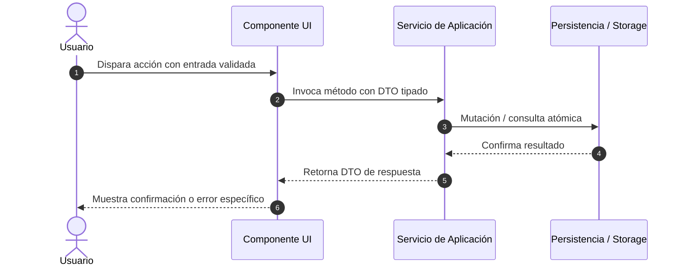

# SDD-Planning: Plan Técnico de Arquitectura e Implementación (SDD)

Este workflow estructura la solución técnica basada en el `spec.md` aprobado y genera el archivo `docs/specs/XX-feature/plan.md`.

---

## 1. Revisión de Especificación y Objetivos
- **Feature**: [Referencia a docs/specs/XX-feature/spec.md]
- **Enfoque Arquitectónico**: [Patrón de arquitectura elegido en docs/constitution.md]
- **Componentes Afectados**:
  - UI / Presentación
  - Servicios / Dominio
  - Persistencia / Repositorios

---

## 2. Diagrama de Flujo / Secuencia Técnico

---

## 3. Desglose en Vertical Slices (Rebanadas Verticales)

### Slice 1: Contratos, Entidades y Validaciones de Entrada
- [ ] Definición de tipos, validadores de esquema y DTOs.
- [ ] Tests unitarios de validación (Caja Blanca).

### Slice 2: Lógica de Negocio y Casos de Uso
- [ ] Implementación de servicios de dominio.
- [ ] Manejo explícito de excepciones y rollback de transacciones.

### Slice 3: Integración de UI / API Endpoints
- [ ] Creación de endpoint o interfaz de usuario.
- [ ] Conexión del flujo completo y pruebas de aceptación (Caja Negra).

---

## 4. Invariantes Técnicas Universales
1. **Sin dependencias circulares**: La dirección de dependencia apunta siempre al dominio.
2. **Cero tipos inseguros**: 100% tipado estricto sin `any`.
3. **Manejo explícito de errores**: Prohibido silenciar excepciones en bloques catch vacíos.
