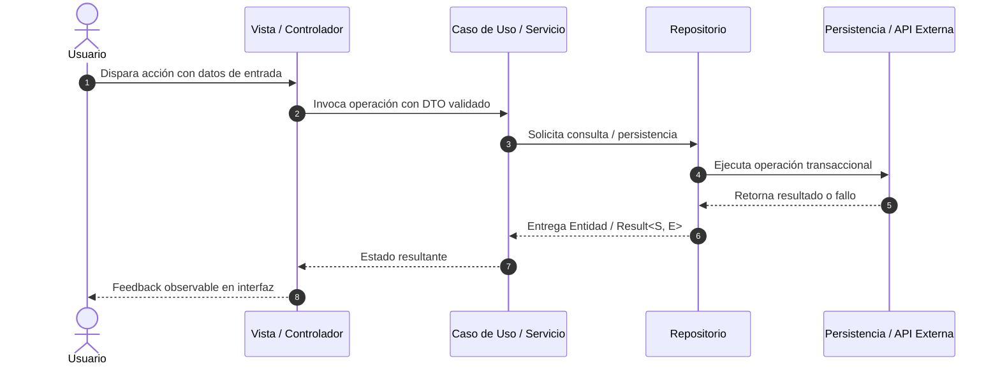

# SDD-Planning: Plan Técnico de Arquitectura, Runtime e Implementación (Protocolo de 2 Tiempos)

Este workflow analiza la especificación funcional aprobada (`docs/specs/XX-nombre/spec.md`) y la constitución del proyecto (`docs/constitution.md`) para estructurar la solución técnica en `docs/specs/XX-nombre/plan.md`, priorizando **primero el análisis técnico y el cuestionamiento de decisiones críticas con opciones recomendadas**, y luego asistiendo como copiloto técnico.

> **Regla de Oro: Primero Cuestionar Decisiones Críticas, Luego Diseñar**:
> La IA no debe asumir arbitrariamente políticas de borrado de datos, estrategias de migración o límites de timeouts de hardware/APIs sin consultar al usuario si existen alternativas viables. Formula un mínimo de preguntas con opciones claras y luego diseña el plan técnico.
>
> **Responsabilidad de Estructura Física y Lectura Acotada de SDD**:
> 1. **Plan define la Estructura de Archivos**: Es en este plan técnico donde se conoce, proyecta y define formalmente la **estructura física de directorios y archivos del proyecto** (código de producción, capas, módulos y tests).
> 2. **Lectura Estricta de SDD (`docs/`)**: Como insumos de entrada metodológicos, el asistente **solo debe leer la carpeta `docs/`** (`docs/constitution.md` y `docs/specs/XX-nombre/spec.md`). No requiere lecturas ni dependencias fuera del ámbito documental de SDD para estructurar el plan.

---

## 1. Protocolo Operativo en 2 Tiempos

Cuando el usuario invoque este workflow (`/sdd-planning`):

### TIEMPO 1: Análisis Técnico y Validación de Decisiones de Arquitectura (Grill-Me Técnico)
1. **Lectura de Entrada (Solo Ámbito SDD - Carpeta `docs/`)**:
   - Lee exclusivamente de la carpeta `docs/`: `docs/constitution.md` (para stack, arquitectura conceptual y comandos) y `docs/specs/XX-nombre/spec.md` (para requerimientos, contratos de datos y escenarios BDD).
2. **Detección de Cabos Sueltos Técnicos y Opciones Arquitectónicas**:
   - La IA audita la especificación y detecta decisiones de arquitectura que requieren confirmación:
     - *Políticas de persistencia y claves foráneas*: ¿Ante borrado del padre, se aplica `SET NULL`, `CASCADE` o `RESTRICT`?
     - *Timeouts y fallbacks de servicios externos*: ¿Cuántos segundos de espera antes de degradar o fallar?
     - *Evolución de esquema*: ¿Se incrementa `schemaVersion` y cómo se migran los datos existentes en dev?
3. **Formulación de Preguntas Mínimas con Opciones Recomendadas**:
   - La IA plantea un bloque mínimo de preguntas técnicas directas (máximo 2 a 3) enfocadas en esas decisiones críticas.
   - Cada pregunta incluye opciones concretas destacando una opción `(Recomendada)` fundamentada en robustez.
   - Si no existen ambigüedades técnicas y la arquitectura es directa y evidente, la IA notifica las decisiones que asumirá por estándar y avanza al Tiempo 2.
   - Si hay dudas o alternativas, la IA **espera la confirmación del usuario**.

---

### TIEMPO 2: Asistencia Proactiva del Copiloto Técnico Senior
Una vez confirmadas las decisiones técnicas:
1. **Diseño de la Solución y Definición de la Estructura Física**:
   - Define la **estructura física de archivos del proyecto / módulo** (rutas concretas de archivos a crear/modificar en el código y tests).
   - Modela contratos tipados (DTOs, Entidades inmutables, Interfaces).
   - Diseña el diagrama de secuencia Mermaid.
   - Establece las garantías de runtime, integridad del grafo de entidades y el patrón del selector tridimensional.
2. **Redacción del Artefacto**:
   - Escribe el archivo oficial `docs/specs/XX-nombre/plan.md`.

---

## 2. Plantilla Oficial de Salida: `docs/specs/XX-nombre/plan.md`

```markdown
# Plan Técnico: [Nombre del Módulo o Feature]

> Módulo: `docs/specs/XX-nombre/` | Especificación Base: `spec.md` | Estado: Diseñado | Metodología: SDD-Planning

---

## 1. Resumen Arquitectónico y Matriz de Componentes

- **Objetivo Técnico**: [Descripción concisa del objetivo de implementación]
- **Patrón Arquitectónico**: [Clean Architecture / Hexagonal / Feature-First según constitution.md]
- **Capas Involucradas**:
  - `Presentación / UI`: [Componentes visuales, gestión de estado y controladores reactivos]
  - `Dominio & Casos de Uso`: [Entidades inmutables, reglas de negocio y puertos/interfaces]
  - `Infraestructura & Datos`: [Implementación de repositorios, clientes API, adaptadores locales]

---

## 2. Estructura Física de Archivos del Proyecto / Módulo

```text
# Árbol de rutas físicas de código y tests a crear o modificar en el proyecto
<directorio-raíz-del-código>/
├── [capa_presentación]/
│   ├── [componentes_o_pantallas]
│   └── [controladores_o_gestión_estado]
├── [capa_dominio]/
│   ├── [entidades_o_modelos]
│   └── [casos_de_uso_o_interfaces]
├── [capa_infraestructura_o_datos]/
│   ├── [repositorios_o_clientes_api]
│   └── [persistencia_local_o_tablas]
└── [directorio_tests]/
    ├── [test_bdd_e2e_observable]
    └── [test_unitario_crítico]
```

---

## 3. Diagrama de Secuencia Técnico



---

## 4. Contratos de Código e Interfaces Tipadas

### 4.1 Modelos de Dominio y Value Objects Inmutables
```typescript // o Dart / Python según el stack
// Entidades de dominio fuertemente tipadas
```

### 4.2 DTOs de Entrada, Salida y Jerarquía de Errores
```typescript
// DTOs con validación estricta y tipos de fallo explícitos (Result<S, E>)
```

### 4.3 Puertos de Entrada y Salida (Interfaces)
```typescript
// Contratos de repositorios y servicios externos
```

---

## 5. Garantías de Runtime, Persistencia e Integridad Relacional

1. **Integridad del Grafo de Entidades y Claves Foráneas**:
   - Mapeo de claves foráneas con políticas acordadas (`ON DELETE SET NULL`, `CASCADE` o `RESTRICT`).
   - Prevención de huérfanos e inconsistencias transaccionales.
2. **Patrón de Selección Tridimensional (The 3-Way Selector Pattern)**:
   - *Selección existente*: Consulta reactiva de elementos activos del catálogo maestro.
   - *Creación en caliente*: Mecanismo para dar de alta un nuevo padre sin perder los datos ya ingresados en el formulario hijo.
   - *Estado neutro / Fallback*: Valor por defecto o estado "Sin asignar" ante catálogo vacío (*Zero-State Invariant*), garantizando que jamás se bloquee la pantalla.
3. **Evolución del Esquema y Migraciones**:
   - Identificador de versión de esquema (`schemaVersion`).
   - Política clara de migración o recreación limpia en desarrollo ante cambios de entidad.
4. **Ciclo de Vida y Resiliencia de I/O**:
   - Manejo predecible de desconexión, timeouts o recursos de hardware.

---

## 6. Estrategia de Testing y Flujo Funcional

- **Validación Dual**:
  - Test de Caja Negra (BDD) que recorre el flujo de punta a punta con timeout fail-fast (3-5s).
  - Tests de Caja Blanca (Unit) únicamente para lógica crítica o cálculos complejos.
- **Implementación por Flujo**:
  - Setup de tablas y dependencias $\rightarrow$ Implementación del flujo completo de punta a punta $\rightarrow$ Batería de pruebas de cierre.
```
