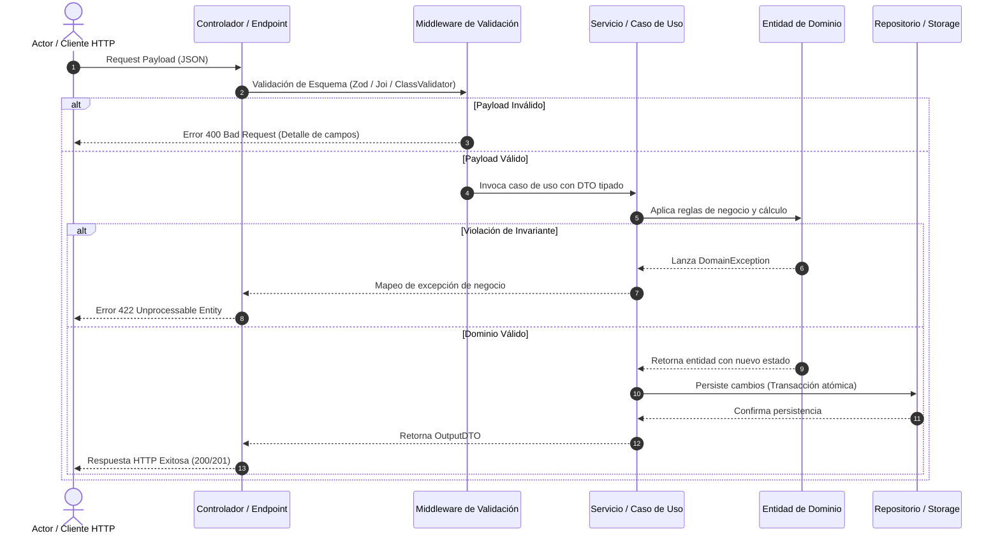

# SDD-Planning: Plan Técnico de Arquitectura e Implementación (SDD)

Este workflow analiza de manera autónoma la especificación funcional aprobada (`docs/specs/XX-nombre/spec.md`) y la constitución del proyecto (`docs/constitution.md`) para estructurar la solución técnica formal en `docs/specs/XX-nombre/plan.md`.

> **Propósito Técnico**: A diferencia de la especificación funcional (que es de Caja Negra y libre de código), el **Plan Técnico** aterriza el **CÓMO**: arquitectura detallada, contratos de código estrictos, modelos de persistencia, estrategia de testing dual y descomposición en rebanadas verticales (*Vertical Slices*). No requiere entrevista obligatoria con el usuario; se genera directamente a partir de los requerimientos y reglas ya formalizados.

---

## 1. Resolución del Módulo a Planificar (`[XX.]`)

Cuando el usuario invoque este workflow (`/sdd-planning`):

1. **Invocación con Argumento `[XX.]` o `[XX]`** (ej. `/sdd-planning 01.` o `/sdd-planning 01`):
   - Extrae el prefijo numérico indicado.
   - Localiza en `docs/specs/` la carpeta que coincida con ese identificador (ej. `docs/specs/01-auth/spec.md`).
2. **Invocación sin Argumento**:
   - Escanea el directorio `docs/specs/`.
   - Selecciona automáticamente el último módulo disponible con `spec.md` y notifica al usuario qué módulo se está planificando.
3. Si no existe la carpeta o falta `spec.md`, alerta al usuario indicando que debe completarse primero la fase `/sdd-spec-high`.

---

## 2. Protocolo de Ejecución del Asistente

El asistente ejecuta los siguientes pasos técnicos:

1. **Lectura de Entrada**:
   - Lee `docs/constitution.md` (stack tecnológico, convenciones de arquitectura, estándares de codificación y normas de calidad).
   - Lee `docs/specs/XX-nombre/spec.md` (Historias `HU-XX`, Requisitos Funcionales `RF-XX.Y` con EARS, Criterios de Aceptación `SC-XX.Y.Z` en Gherkin y tablas de datos funcionales).
2. **Diseño de la Solución Técnica**:
   - Modela la arquitectura de capas o módulos (UI, Controladores/Endpoints, Casos de Uso/Servicios, Entidades de Dominio, Repositorios/Persistencia).
   - Diseña el diagrama de secuencia técnico en Mermaid.
   - Traduce los datos funcionales a contratos de código tipados (DTOs, Interfaces y Tipos estrictos sin `any`).
   - Define el esquema de persistencia, índices y migraciones necesarias.
   - Establece la estrategia de validación dual (Caja Negra y Caja Blanca).
3. **Generación del Artefacto**:
   - Escribe el archivo oficial `docs/specs/XX-nombre/plan.md` con la plantilla técnica estándar.
   - Notifica al usuario el resumen del plan técnico generado y los próximos pasos (`/sdd-task`).

---

## 3. Plantilla Oficial de Salida: `docs/specs/XX-nombre/plan.md`

El archivo `plan.md` contendrá la siguiente estructura formal y exhaustiva:

```markdown
# Plan Técnico: [Nombre del Módulo o Feature]

> Módulo: `docs/specs/XX-nombre/` | Especificación Base: `spec.md` | Estado: Diseñado | Metodología: SDD-Planning

---

## 1. Resumen Técnico y Matriz de Trazabilidad

- **Objetivo Técnico**: [Descripción técnica concisa del objetivo de implementación]
- **Patrón Arquitectónico**: [Ej. Clean Architecture, Hexagonal, Modular MVC según constitution.md]
- **Componentes Afectados**:
  - `Presentación / API`: [Endpoints REST, GraphQL, Controladores o Vistas UI]
  - `Aplicación / Casos de Uso`: [Servicios de aplicación que orquestan los flujos]
  - `Dominio`: [Entidades, Value Objects, validadores de negocio]
  - `Infraestructura / Persistencia`: [Repositorios, adaptadores externos, bases de datos]

### Matriz de Mapeo (Especificación -> Arquitectura)
| Historia / Requisito | Componente Técnico Responsable | Contrato / Método Principal |
| :--- | :--- | :--- |
| `HU-01` / `RF-01.1` | `[Feature]Service` / `[Feature]Controller` | `execute(input: InputDTO): Promise<OutputDTO>` |
| `HU-02` / `RF-02.1` | `[Feature]Repository` | `save(entity: Entity): Promise<void>` |

---

## 2. Diagrama de Secuencia Técnico



---

## 3. Contratos de Código e Interfaces Tipadas

Tipado estricto alineado a los estándares de codificación (cero uso de `any`):

```typescript
// DTO de Entrada Tipado (Request)
export interface Create[Feature]DTO {
  readonly id: string;
  readonly name: string;
  readonly amount: number;
  readonly metadata?: Readonly<Record<string, string>>;
}

// DTO de Salida Tipado (Response)
export interface [Feature]ResponseDTO {
  readonly success: boolean;
  readonly resourceId: string;
  readonly createdAt: string; // ISO 8601 UTC
}

// Interfaz del Caso de Uso / Servicio de Aplicación
export interface I[Feature]Service {
  execute(command: Create[Feature]DTO): Promise<[Feature]ResponseDTO>;
}

// Interfaz del Repositorio (Puerto de Salida)
export interface I[Feature]Repository {
  findById(id: string): Promise<[Feature]Entity | null>;
  save(entity: [Feature]Entity): Promise<void>;
}
```

---

## 4. Diseño de Persistencia y Modelado de Datos

- **Estrategia de Persistencia**: [Relacional SQL (PostgreSQL, SQLite) / Documental (MongoDB) / Memoria]
- **Modelo de Entidad**:
  - `id`: UUID v4 (Primary Key)
  - `status`: Enum de negocio (`ACTIVE`, `SUSPENDED`, `ARCHIVED`)
  - `created_at`: Timestamp con zona horaria UTC
  - `updated_at`: Timestamp con zona horaria UTC
- **Índices y Restricciones**:
  - Claves únicas e índices de búsqueda para optimizar consultas frecuentes.
- **Atomicidad y Concurrencia**:
  - Transacciones atómicas (ACID) en operaciones de mutación múltiple.

---

## 5. Estrategia de Testing (Validación Dual)

La validación técnica asegura cobertura completa mediante dos perspectivas complementarias:

### 5.1 Pruebas de Caja Negra (Black-box Testing)
- **Ubicación**: `test/blackbox/` o `tests/e2e/`
- **Cobertura**: Mapeo directo y 1 a 1 de los escenarios Gherkin definidos en `spec.md`:
  - `SC-01.1.1`: Test funcional de flujo exitoso (Happy Path).
  - `SC-01.1.2`: Test funcional de validación de entradas y casos de borde (Edge Case).
- **Mecanismo**: Invocación externa a través del endpoint o la UI sin mockear la lógica de negocio interna.

### 5.2 Pruebas de Caja Blanca (White-box Testing)
- **Ubicación**: `test/whitebox/` o junto al código fuente (`__tests__/`)
- **Cobertura**:
  - Pruebas unitarias para validadores de esquema de DTOs.
  - Pruebas unitarias de métodos del servicio y entidades de dominio.
  - Manejo explícito de excepciones y ramas de control de errores.

---

## 6. Desglose en Vertical Slices (Rebanadas Verticales)

Implementación guiada por rodajas verticales completas de extremo a extremo:

### Slice 1: Contratos, DTOs y Validación de Entrada
- [ ] Definición de interfaces tipadas y esquemas de validación de bordes.
- [ ] Pruebas unitarias de validación (Caja Blanca).

### Slice 2: Dominio, Casos de Uso y Persistencia
- [ ] Entidades de dominio, lógica de negocio y transacciones atómicas.
- [ ] Adaptador de persistencia / repositorio y migraciones.
- [ ] Pruebas unitarias del servicio con mocks de infraestructura (Caja Blanca).

### Slice 3: Capa de Presentación / API e Integración de Flujo
- [ ] Endpoint / Controlador o componente UI conectado.
- [ ] Implementación y ejecución de tests de aceptación de Caja Negra (`SC-XX.Y.Z`).

---

## 7. Invariantes Técnicas Universales y Observabilidad

1. **Tipado Estricto (Zero Any)**: Prohibido el uso de `any` o conversiones inseguras (`as unknown as T`).
2. **Manejo Defensivo y Explícito de Errores**: Prohibido silenciar excepciones en bloques catch vacíos; cada error debe registrarse o mapearse a un código semántico.
3. **Inversión de Dependencias**: Las capas externas dependen de abstracciones del dominio; el dominio no depende de frameworks ni de bases de datos.
4. **Validación en los Bordes**: Los datos de entrada se sanean y validan antes de alcanzar la capa de aplicación (Zero Trust).
5. **Observabilidad y Logs**: Registro estructurado de eventos clave y errores sin exponer datos sensibles (PII).
```
