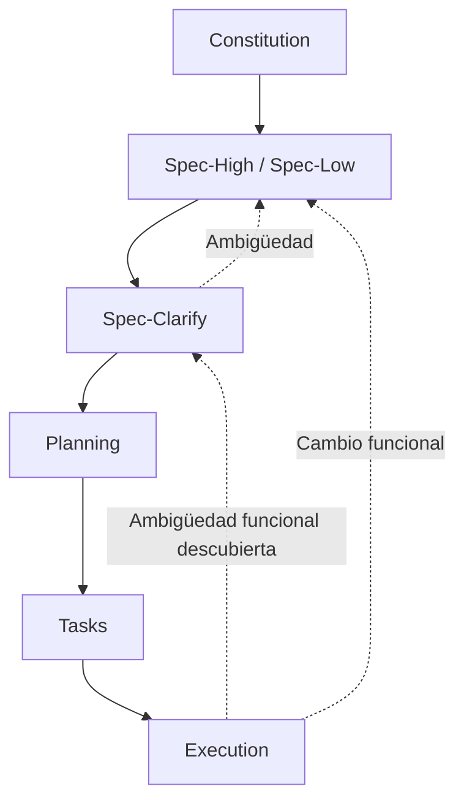

# SDD-Spec-Clarify: QA Gate de Especificación Funcional

Este workflow es el **gate formal de calidad funcional** del sistema SDD.

Su propósito es verificar que una `spec.md` esté suficientemente definida, sea coherente con la Constitución, no contenga ambigüedades relevantes y pueda pasar a `/sdd-planning` sin obligar al arquitecto o desarrollador a inventar comportamiento de negocio.

`/sdd-spec-clarify` no existe para embellecer, alargar o reescribir una Specification.

Existe para responder:

> **¿Dos implementadores razonables, leyendo exclusivamente la documentación aprobada, llegarían al mismo comportamiento funcional?**

Si la respuesta es no debido a una decisión de negocio no resuelta, el workflow debe **detenerse y preguntar**.

---

# 0. REGLA SUPREMA — NO APROBAR UNA ESPECIFICACIÓN AMBIGUA

Esta regla tiene precedencia absoluta dentro de este workflow.

La IA **NO DEBE marcar `spec.md` como `APPROVED`** si detecta una ambigüedad, incompletitud, contradicción o inconsistencia que pueda producir dos comportamientos funcionales razonables.

Esto incluye, entre otros:

```text
alcance;
actores;
permisos;
flujo;
reglas de negocio;
estados;
transiciones;
entradas;
salidas;
validaciones;
dependencias;
errores;
casos vacíos;
casos borde;
efectos secundarios;
criterios de aceptación;
terminología.
```

Ante un problema relevante:

```text
NO asumir
NO inventar
NO aprobar
NO ocultar
NO trasladar arbitrariamente a Planning
```

La IA debe:

```text
detectar
→ explicar
→ formular la pregunta mínima necesaria
→ detenerse
→ recibir respuesta
→ actualizar
→ reauditar
```

---

# 1. OBJETIVO DEL QA GATE

El objetivo es asegurar que `spec.md` sea:

```text
Clara
Coherente
Completa para su alcance
Observable
Trazable
Implementable
Consistente con Constitution
Libre de decisiones de negocio implícitas
```

El objetivo **NO** es hacer que el documento sea perfecto ni exhaustivo.

Debe quedar:

> **Lo suficientemente definido para que Planning pueda diseñar la solución sin inventar comportamiento funcional.**

---

# 2. POSICIÓN DENTRO DEL FLUJO SDD



`Spec-Clarify` se encuentra entre:

```text
Specification
        ↓
Clarification / QA
        ↓
Planning
```

Por tanto:

> **Planning no debe consumir una Specification que todavía tenga decisiones funcionales críticas pendientes.**

---

# 3. INDEPENDENCIA DEL ANÁLISIS

`/sdd-spec-high` construye la especificación.

`/sdd-spec-clarify` debe intentar **cuestionarla de forma independiente**.

La IA no debe asumir:

```text
"Como yo escribí el spec, entonces ya está completo."
```

Debe releerlo como si fuera un implementador que nunca participó en la entrevista.

Mentalidad:

```text
"¿Podría interpretar esto de otra manera?"
```

---

# 4. REGLA DE LA DOBLE INTERPRETACIÓN

Para cada decisión funcional relevante, la IA debe evaluar:

```text
¿Existe una única interpretación razonable?
```

Si:

```text
Sí
→ continuar.

No
→ preguntar.
```

Ejemplo:

```text
"El vendedor puede modificar una venta."

```

Puede significar:

```text
A) cualquier venta;
B) solo sus propias ventas;
C) solo ventas del mismo día;
D) solo ventas no confirmadas.
```

Existe ambigüedad.

Debe preguntarse antes de aprobar.

---

# 5. REGLA DE PREGUNTAS MÍNIMAS

Este workflow debe ser exigente con la calidad, pero eficiente con el usuario.

No debe realizar un interrogatorio innecesario.

Debe:

1. detectar todos los problemas;
2. clasificarlos;
3. eliminar redundancias;
4. agrupar problemas dependientes;
5. preguntar solo lo que requiere decisión humana.

La prioridad es:

> **Máxima reducción de ambigüedad con mínima cantidad de preguntas.**

---

# 6. NO TODA IMPERFECCIÓN BLOQUEA

Cada hallazgo debe clasificarse.

## 6.1 BLOCKING

Impide implementar correctamente sin inventar comportamiento.

Ejemplos:

```text
actor ambiguo;
permiso ambiguo;
resultado ambiguo;
regla contradictoria;
estado sin significado claro;
alcance abierto;
comportamiento diferente según interpretación;
dato crítico cuya obligatoriedad no está definida.
```

Acción:

```text
BLOQUEAR
+
PREGUNTAR
```

---

## 6.2 IMPORTANT

No necesariamente impide toda implementación, pero representa un riesgo funcional relevante.

Ejemplo:

```text
No está definido qué ocurre ante una dependencia externa
fallida en una operación importante.
```

La IA debe determinar si puede existir un comportamiento seguro y no ambiguo.

Si no puede:

```text
→ convertir en BLOCKING.
```

---

## 6.3 IMPROVEMENT

No afecta la interpretación funcional de la feature.

Ejemplos:

```text
redacción mejorable;
orden de una sección;
duplicación menor;
texto poco elegante.
```

No debe bloquear la fase.

---

## 6.4 CORRECT

La especificación ya cubre correctamente el punto.

---

# 7. REGLA DE BLOQUEO POR DECISIÓN

No se debe utilizar simplemente:

```text
"hay observaciones"
```

para bloquear o aprobar.

Debe evaluarse:

> **¿El hallazgo obliga a tomar una decisión que cambia el comportamiento funcional?**

Si sí:

```text
BLOCKING
```

Si no:

```text
IMPORTANTE / MEJORA
```

según corresponda.

---

# 8. AUDITORÍA DE CONSTITUCIÓN

La IA debe verificar que `spec.md` respete:

```text
docs/constitution.md
```

como fuente superior.

Debe comprobar:

```text
alcance global;
actores;
terminología;
restricciones;
principios;
flujo global;
integraciones globales;
políticas globales.
```

### Contradicción

Ejemplo:

```text
Constitution:
Una operación confirmada no puede modificarse.

Spec:
El cliente puede modificar cualquier operación.
```

Resultado:

```text
BLOCKING
```

La IA no debe elegir unilateralmente qué documento está correcto.

Debe determinar si:

```text
la Spec está equivocada
```

o:

```text
la Constitución necesita evolucionar.
```

---

# 9. AUDITORÍA DE ALCANCE

Comprobar:

```text
¿La feature tiene un objetivo único y claro?

¿Lo que se describe realmente pertenece a esta feature?

¿Hay funcionalidades nuevas escondidas dentro del documento?

¿Hay dependencias externas tratadas como si fueran parte
de la misma feature sin definición?
```

### Problema típico

```text
"Registrar venta"
```

y la Specification termina incluyendo:

```text
facturación;
contabilidad;
reportes;
notificaciones;
gestión de usuarios;
inventario avanzado.
```

Debe determinarse si:

```text
pertenece a la feature;
es un efecto necesario;
es una dependencia;
debe convertirse en otra feature.
```

No ampliar el alcance silenciosamente.

---

# 10. AUDITORÍA DE ACTORES

Para cada flujo relevante:

```text
¿Quién inicia la acción?
¿Quién puede ejecutarla?
¿Quién puede observar el resultado?
¿Quién está prohibido?
```

Debe detectar expresiones como:

```text
"usuario autorizado"
"personal"
"administrador"
"responsable"
"cliente"
```

cuando el significado no esté establecido.

Si existen dos interpretaciones funcionales posibles:

```text
→ preguntar.
```

---

# 11. AUDITORÍA DE PERMISOS

Los permisos deben poder determinarse sin inventar.

Para operaciones relevantes:

```text
Crear
Consultar
Actualizar
Eliminar
Cancelar
Confirmar
Aprobar
Rechazar
Anular
```

debe poder saberse quién puede realizarlas.

No basta con definir:

```text
"los usuarios autorizados pueden..."
```

si no está establecido qué usuarios están autorizados.

---

# 12. AUDITORÍA DEL FLUJO

La IA debe reconstruir mentalmente el flujo completo:

```text
Actor
 ↓
Precondición
 ↓
Entrada
 ↓
Acción
 ↓
Regla
 ↓
Resultado
 ↓
Postcondición
```

Debe detectar saltos como:

```text
crear → éxito
```

sin explicar:

```text
qué debe proporcionar el actor;
qué condiciones deben cumplirse;
qué ocurre si falla.
```

---

# 13. AUDITORÍA DE ENTRADAS

Cada operación relevante debe permitir determinar:

```text
qué necesita el actor;
qué datos son obligatorios;
qué datos son opcionales;
qué valores son válidos;
qué dependencias existen.
```

Debe detectar frases como:

```text
"ingresar los datos necesarios"
"completar la información"
"seleccionar un producto válido"
```

cuando "necesario" o "válido" no esté definido.

---

# 14. AUDITORÍA DE SALIDAS

Para cada operación debe poder determinarse:

```text
¿Qué cambia si tiene éxito?

¿Qué resultado obtiene el actor?

¿Qué estado queda establecido?

¿Qué información puede consultar después?
```

Ejemplo insuficiente:

```text
"El sistema registra la venta."
```

Debe poder saberse:

```text
¿La venta queda confirmada?
¿Queda pendiente?
¿Se modifica inventario?
¿Se actualiza el historial?
```

si estas consecuencias forman parte de la feature.

---

# 15. AUDITORÍA DE REGLAS DE NEGOCIO

Cada regla debe ser:

```text
explícita;
coherente;
objetiva;
verificable.
```

Evitar:

```text
"El sistema debe comportarse adecuadamente."
```

Preferir:

```text
"El sistema debe impedir la operación cuando el stock disponible
sea menor que la cantidad solicitada."
```

---

# 16. AUDITORÍA DE VALIDACIONES

La IA debe comprobar las validaciones funcionalmente relevantes:

```text
obligatoriedad;
rangos;
formatos;
límites;
unicidad;
dependencias;
fechas;
cantidades;
estados;
relaciones.
```

Debe detectar afirmaciones vagas como:

```text
"precio válido"
"cantidad válida"
"fecha correcta"
"usuario válido"
```

si no existe una definición observable.

---

# 17. AUDITORÍA DE ESTADOS

Cuando una entidad tenga estados, debe comprobarse:

```text
¿Qué estados existen?

¿Qué significa cada uno?

¿Qué acción produce cada transición?

¿Qué actor puede producirla?

¿Qué transiciones están prohibidas?

¿Qué ocurre ante una operación incompatible con el estado?
```

Ejemplo:

```text
BORRADOR
CONFIRMADO
CANCELADO
```

Pero si no está definido si:

```text
CONFIRMADO → CANCELADO
```

está permitido, existe una laguna.

---

# 18. AUDITORÍA DE TRANSICIONES

Toda transición importante debe tener:

```text
estado inicial;
evento/acción;
actor;
condición;
estado final.
```

Ejemplo:

```text
BORRADOR
    ↓ confirmar
CONFIRMADO
```

Debe conocerse:

```text
quién confirma;
cuándo puede confirmar;
qué pasa si no cumple las condiciones.
```

---

# 19. AUDITORÍA DE DEPENDENCIAS ENTRE ENTIDADES

Cuando una entidad dependa funcionalmente de otra:

```text
Producto → Categoría
Pedido → Cliente
Detalle → Producto
Venta → Vendedor
```

debe comprobarse:

```text
¿La dependencia es obligatoria?
¿Puede faltar?
¿Puede cambiar?
¿Puede eliminarse?
¿Puede existir temporalmente sin ella?
```

La Specification debe responder desde la perspectiva funcional.

No preguntar aquí:

```text
SET NULL
CASCADE
RESTRICT
nullable FK
```

porque eso pertenece a Planning.

---

# 20. AUDITORÍA DE ESTADOS VACÍOS

Para cualquier dependencia funcional importante, comprobar:

```text
¿Qué ocurre cuando el conjunto requerido está vacío?
```

Ejemplo:

```text
No existen categorías.
```

La Specification debe poder determinar si:

```text
la operación no puede realizarse;
la operación puede realizarse sin categoría;
el usuario puede crear una categoría;
existe otro comportamiento.
```

El mecanismo técnico queda para Planning.

---

# 21. AUDITORÍA DE CASOS BORDE

No se deben generar artificialmente decenas de casos.

Se deben detectar aquellos que puedan cambiar el comportamiento.

Ejemplos:

```text
cantidad = 0
cantidad negativa
máximo permitido
mínimo permitido
lista vacía
entidad inexistente
estado incompatible
duplicado
fecha límite
recurso agotado
```

La regla es:

> **Un caso borde merece escenario propio cuando su comportamiento puede ser diferente al camino principal.**

---

# 22. AUDITORÍA DE ERRORES

Para errores relevantes debe poder determinarse:

```text
qué condición genera el error;
si la operación se ejecuta o se bloquea;
qué resultado queda;
qué debe observar el actor.
```

No debe definirse aquí:

```text
HTTP 400
HTTP 422
Exception
middleware
```

Esas decisiones pertenecen a Planning.

---

# 23. AUDITORÍA DE EFECTOS SECUNDARIOS

Debe comprobarse si una operación modifica otros elementos.

Ejemplo:

```text
Registrar venta
    ↓
Venta creada
    ↓
Stock reducido
    ↓
Historial actualizado
```

Si esos efectos forman parte del comportamiento del negocio, deben estar especificados.

Esto evita que Execution implemente solo:

```text
"crear registro"
```

y omita consecuencias necesarias.

---

# 24. AUDITORÍA DE CRITERIOS DE ACEPTACIÓN

Cada comportamiento relevante debe poder verificarse mediante observaciones.

Un buen criterio debe responder:

```text
Given
¿en qué contexto?

When
¿qué sucede?

Then
¿qué debe observarse?
```

Evitar criterios como:

```text
"El sistema funciona correctamente."
```

o:

```text
"La interfaz debe ser intuitiva."
```

cuando no exista una definición verificable.

---

# 25. AUDITORÍA GHERKIN

Los escenarios deben representar comportamiento real.

Ejemplo:

```gherkin
Scenario: Registrar una venta correctamente
  Given el vendedor está autenticado
  And el producto existe y tiene stock disponible
  When registra una venta con cantidad válida
  Then la venta queda registrada
  And el stock disponible se actualiza
```

La IA debe comprobar que:

```text
Given
    ↓
realmente prepara el contexto

When
    ↓
representa la acción

Then
    ↓
representa un resultado observable
```

No debe aceptar escenarios que describan implementación interna.

---

# 26. AUDITORÍA DE TRAZABILIDAD

Debe existir una cadena lógica:

```text
HU
 ↓
RF
 ↓
SC
```

Por ejemplo:

```text
HU-01
 ├── RF-01.1
 │    ├── SC-01.1.1
 │    └── SC-01.1.2
 │
 └── RF-01.2
      └── SC-01.2.1
```

### Debe detectarse:

```text
HU sin RF;
RF sin HU cuando debería pertenecer a una historia;
SC huérfano;
SC que no cubre ningún requisito;
IDs duplicados;
IDs inconsistentes.
```

Sin embargo:

> **No exigir correspondencia artificial de 1 RF = 1 SC.**

Un requerimiento puede necesitar múltiples escenarios.

---

# 27. AUDITORÍA DE COBERTURA

Para cada flujo funcional importante, comprobar cuando corresponda:

```text
Happy Path
Error
Boundary
Empty State
Permission
State Transition
Dependency Failure
```

No todos son obligatorios siempre.

El criterio es:

> **¿Existe un escenario cuando una condición relevante cambia el comportamiento?**

---

# 28. AUDITORÍA DE LENGUAJE

Debe detectar:

```text
sinónimos involuntarios;
nombres inconsistentes;
conceptos duplicados;
términos no definidos;
uso inconsistente de singular/plural;
actor nombrado de diferentes formas.
```

Ejemplo:

```text
Cliente
Comprador
Usuario comprador
```

La IA debe determinar si:

```text
son conceptos distintos
```

o:

```text
representan el mismo concepto.
```

---

# 29. AUDITORÍA DE NEGOCIO VS IMPLEMENTACIÓN

La Specification debe describir:

```text
qué hace el sistema.
```

No:

```text
cómo está construido.
```

Detectar lenguaje como:

```text
controller;
repository;
service;
DTO;
ORM;
SQL;
migration;
endpoint;
component;
database table;
middleware;
```

Si aparecen, verificar si realmente representan una restricción funcional.

De lo contrario:

```text
→ marcar como DETAIL OUT OF SCOPE FOR SPEC
```

y trasladarlo a Planning.

---

# 30. AUDITORÍA DE UI

La Spec puede describir:

```text
resultado visible;
mensaje funcional;
estado;
acción disponible;
error observable.
```

No debe exigir:

```text
color;
píxeles;
posición;
animación;
tipografía;
estructura cosmética.
```

Un detalle de UI solo debe permanecer si tiene relevancia para comportamiento, accesibilidad o regla funcional.

---

# 31. AUDITORÍA DE DUPLICACIÓN

La IA debe detectar reglas repetidas de forma potencialmente contradictoria.

Ejemplo:

```text
RF-01:
Una venta confirmada no puede modificarse.

RF-05:
El vendedor puede modificar ventas confirmadas.
```

Aunque cada requisito parezca claro individualmente, juntos producen conflicto.

Debe evaluarse la coherencia **global del documento**, no solo cada sección aisladamente.

---

# 32. AUDITORÍA DE DEPENDENCIAS EXTERNAS

Si una feature depende de:

```text
otra feature;
servicio externo;
catálogo;
usuario;
hardware;
integración.
```

debe estar claro funcionalmente:

```text
qué dependencia existe;
qué necesita la feature;
qué ocurre si no está disponible;
si la dependencia es obligatoria.
```

El diseño técnico queda para Planning.

---

# 33. TEST DE IMPLEMENTACIÓN DOBLE

Una técnica obligatoria de este QA Gate es intentar producir mentalmente dos implementaciones funcionales distintas.

### Test:

```text
¿Puedo implementar esta especificación de dos formas
que ambas parezcan correctas leyendo únicamente el documento,
pero produzcan comportamientos distintos?
```

Si:

```text
NO
→ continuar.

SÍ
→ existe una ambigüedad funcional.
```

Este test es uno de los principales mecanismos para detectar especificaciones aparentemente completas pero realmente ambiguas.

---

# 34. TEST DE IMPLEMENTADOR EXTERNO

La IA debe imaginar:

> "Otro desarrollador recibe únicamente `constitution.md` + `spec.md`."

Entonces preguntar:

```text
¿Podría implementar la feature sin preguntarle al negocio?

¿Tendría que decidir una regla por su cuenta?

¿Tendría que adivinar un permiso?

¿Tendría que inventar un estado?

¿Tendría que decidir qué sucede ante un error?
```

Si cualquiera de esas respuestas es sí para una decisión funcional relevante:

```text
→ BLOCKING
```

---

# 35. REGLA DE NO TRASLADAR AMBIGÜEDADES A PLANNING

No utilizar Planning como mecanismo para resolver decisiones que pertenecen al negocio.

Incorrecto:

```text
Spec:
"Al cancelar ocurre lo correspondiente."

Planning:
"Decidimos conservar la reserva como cancelada."
```

Correcto:

```text
Spec-Clarify:
Pregunta qué debe ocurrir.

Usuario:
Decide.

Spec:
Documenta la decisión.

Planning:
Diseña cómo implementarla.
```

---

# 36. PROTOCOLO DE PREGUNTAS

Cuando se detecten BLOCKING o IMPORTANT que requieran decisión humana:

La IA debe:

1. agrupar problemas relacionados;
2. eliminar preguntas redundantes;
3. priorizar las de mayor impacto;
4. presentar opciones neutrales;
5. formular la mínima cantidad necesaria;
6. detenerse.

---

# 37. PRIORIZACIÓN

Orden:

```text
P0 — Contradicción
P1 — Alcance ambiguo
P2 — Actor / permiso
P3 — Flujo
P4 — Regla de negocio
P5 — Estado / transición
P6 — Datos
P7 — Validación
P8 — Error / borde
P9 — Mejora documental
```

No preguntar P9 mientras exista P0–P4 pendiente.

---

# 38. AGRUPACIÓN DE PREGUNTAS

Cuando varias observaciones tengan la misma causa, agruparlas.

Ejemplo:

En lugar de:

```text
¿Quién puede cancelar?
¿Quién puede modificar?
¿Quién puede aprobar?
```

si todo depende del mismo modelo de autorización, formular una pregunta estructurada:

```text
¿Cómo debe distribuirse la autorización de operaciones
sobre una venta?

- Crear
- Modificar
- Cancelar
- Confirmar
```

Esto reduce rondas y evita preguntas repetitivas.

No agrupar decisiones que sean independientes y puedan generar confusión.

---

# 39. OPCIONES NEUTRALES

Cuando una pregunta requiera facilitar la respuesta, usar:

```text
A)
B)
C)
D) Otro
```

Las opciones deben representar comportamientos.

No deben presentar una implementación técnica como decisión funcional.

---

# 40. REAUDITORÍA DESPUÉS DE RESPUESTAS

Después de que el usuario responda:

```text
NO actualizar y finalizar inmediatamente.
```

Primero:

```text
procesar respuesta
    ↓
actualizar modelo mental
    ↓
buscar contradicciones nuevas
    ↓
buscar ambigüedades derivadas
    ↓
verificar dependencias
```

Una respuesta puede resolver:

```text
¿quién puede cancelar?
```

y generar otra pregunta:

```text
¿qué ocurre con una venta cancelada que ya fue confirmada?
```

Por tanto:

> **Toda respuesta debe activar una nueva auditoría.**

---

# 41. MODIFICACIÓN DEL `spec.md`

Cuando el usuario responda preguntas de Clarify, la IA debe actualizar:

```text
docs/specs/XX-feature/spec.md
```

preservando:

```text
IDs;
trazabilidad;
decisiones ya válidas;
estructura;
contenido no afectado.
```

No debe reescribir innecesariamente todo el documento.

---

# 42. ESTADO DEL SPEC DURANTE CLARIFY

Estados permitidos:

```text
DRAFT
IN_REVIEW
NEEDS_CLARIFICATION
APPROVED
SUPERSEDED
```

### Al detectar problemas

```text
NEEDS_CLARIFICATION
```

### Después de resolverlos

```text
IN_REVIEW
```

### Después de la auditoría final sin bloqueos

```text
APPROVED
```

---

# 43. CRITERIO DE APPROVED

El `spec.md` puede pasar a:

```text
Status: APPROVED
```

únicamente cuando:

```text
[ ] Constitution es respetada.
[ ] No existen contradicciones relevantes.
[ ] El alcance está definido.
[ ] Los actores están claros.
[ ] Los permisos relevantes están claros.
[ ] El flujo principal está definido.
[ ] Las entradas relevantes están definidas.
[ ] Los resultados relevantes están definidos.
[ ] Las reglas de negocio están definidas.
[ ] Los estados relevantes están definidos.
[ ] Las transiciones relevantes están definidas.
[ ] Los errores relevantes son observables.
[ ] Los casos borde importantes están cubiertos.
[ ] Las dependencias funcionales están claras.
[ ] Los criterios de aceptación son verificables.
[ ] La trazabilidad HU → RF → SC es coherente.
[ ] No hay terminología contradictoria.
[ ] No hay decisiones técnicas invadiendo Spec.
[ ] No hay decisiones de negocio implícitas.
[ ] Un implementador externo no necesitaría inventar comportamiento funcional.
```

---

# 44. NO APROBAR POR "SUFICIENTEMENTE BUENO"

No se debe aprobar porque:

```text
"parece claro";
"seguramente se entiende";
"normalmente sería así";
"el desarrollador sabrá qué hacer";
```

Debe aprobarse porque:

```text
la información necesaria está documentada
y
las decisiones funcionales relevantes están determinadas.
```

---

# 45. NO BLOQUEAR POR PEDANTERÍA

El propósito del gate no es encontrar problemas artificiales.

No bloquear por:

```text
redacción estilística;
preferencias personales;
orden alternativo;
detalle visual;
nombres internos;
decisiones técnicas;
micro-mejoras.
```

La pregunta siempre debe ser:

> **¿Esto puede provocar una interpretación funcional diferente?**

Si no:

```text
NO BLOCK.
```

---

# 46. REPORTE DE QA

Cuando finalice la auditoría, presentar un resumen estructurado:

```text
Spec:
docs/specs/XX-feature/spec.md

Estado anterior:
IN_REVIEW

Hallazgos:
BLOCKING: X
IMPORTANT: X
IMPROVEMENT: X
CORRECT: X
```

Para cada bloqueo:

```text
BLOCKING-01
Problema:
...

Impacto:
...

Pregunta:
...
```

No realizar preguntas redundantes.

---

# 47. SALIDA CUANDO EXISTEN BLOQUEOS

Ejemplo:

```text
Estado:
NEEDS_CLARIFICATION

Se detectaron decisiones funcionales que deben resolverse
antes de aprobar la Specification.

BLOCKING-01
Problema:
No está definido si una venta confirmada puede cancelarse.

Impacto:
Existen dos comportamientos funcionales válidos.

Pregunta:
¿Qué debe ocurrir?

A) Puede cancelarse.
B) No puede cancelarse.
C) Puede anularse, pero no cancelarse.
D) Depende del estado.
E) Otro comportamiento.
```

Después:

```text
STOP
```

No continuar a Planning.

---

# 48. SALIDA CUANDO NO HAY BLOQUEOS

```text
Specification QA completado.

Archivo:
docs/specs/XX-feature/spec.md

Resultado:
APPROVED

Hallazgos:
BLOCKING: 0
IMPORTANT: 0
IMPROVEMENT: X

La Specification es suficientemente precisa
para iniciar Planning.

Siguiente paso:
/sdd-planning
```

---

# 49. CAMBIOS DE ALCANCE DESCUBIERTOS DURANTE CLARIFY

Si durante la revisión aparece una necesidad que realmente es otra feature:

```text
NO introducirla silenciosamente.
```

Debe clasificarse:

```text
Nueva feature
Cambio de alcance
Dependencia
Cambio constitucional
```

y dirigirse al workflow correspondiente.

---

# 50. CONTRADICCIÓN CONSTITUCIONAL

Si Clarify descubre una contradicción entre:

```text
Constitution
```

y:

```text
Spec
```

la Specification no debe "ganar" por ser más reciente.

Debe detenerse y determinarse si corresponde:

```text
corregir Spec
```

o:

```text
actualizar Constitution mediante:
/sdd-constitution-trial
```

---

# 51. PROBLEMAS DESCUBIERTOS EN FEATURES RELACIONADAS

Si Clarify descubre que otra Specification está causando contradicción:

```text
NO modificarla silenciosamente.
```

Debe identificar:

```text
spec afectada;
regla conflictiva;
impacto;
workflow necesario.
```

Cuando corresponda:

```text
/sdd-spec-anchored
```

---

# 52. TEST DE CONSISTENCIA GLOBAL

Al finalizar, comprobar:

```text
Constitution
    ↕
Spec

HU
    ↕
RF
    ↕
SC

Actor
    ↕
Permission

State
    ↕
Transition

Input
    ↕
Validation

Action
    ↕
Outcome

Dependency
    ↕
Behavior
```

Cualquier contradicción relevante debe impedir `APPROVED`.

---

# 53. TEST DE CAJA NEGRA

La IA debe ignorar mentalmente cómo podría implementarse.

Debe leer únicamente:

```text
Actor
+
Input
+
Context
+
Action
+
Expected Result
```

y comprobar si el comportamiento está completamente definido.

Esta técnica evita que conocimiento técnico externo "complete" silenciosamente una Specification.

---

# 54. TEST DE LENGUAJE NATURAL

Releer el documento como una persona no involucrada en su creación.

Detectar:

```text
"etc."
"y demás"
"cuando sea necesario"
"si corresponde"
"adecuadamente"
"correctamente"
"apropiado"
"válido"
"permitido"
```

y determinar si esas expresiones tienen significado definido.

No todas son automáticamente errores.

Solo bloquear cuando permitan múltiples comportamientos funcionales.

---

# 55. TEST DE AUSENCIA DE NEGOCIO IMPLÍCITO

Buscar cualquier decisión introducida mediante frases como:

```text
por defecto;
normalmente;
se espera;
se asume;
generalmente;
se recomienda;
```

Si la frase representa una regla funcional real:

```text
→ preguntar / convertir en decisión explícita.
```

Si es una simple aclaración no normativa:

```text
→ puede mantenerse.
```

---

# 56. TEST DE NO INVASIÓN TÉCNICA

Antes de aprobar:

```text
¿La Specification está describiendo comportamiento
o está describiendo implementación?
```

Si contiene implementación innecesaria:

```text
→ extraerla conceptualmente hacia Planning.
```

No bloquear únicamente por su presencia si no cambia la interpretación funcional, pero debe mantenerse la separación documental.

---

# 57. REGLA DE PERSISTENCIA DEL SIGNIFICADO

Cambios de redacción no deben cambiar accidentalmente la semántica.

Cuando se edite una Specification durante Clarify:

```text
preservar decisiones confirmadas;
preservar IDs;
preservar trazabilidad;
no cambiar comportamiento no relacionado;
no eliminar reglas por accidente.
```

---

# 58. AUDITORÍA FINAL OBLIGATORIA

Antes de aprobar:

```text
[ ] Releer Constitution
[ ] Releer Spec completa
[ ] Detectar contradicciones
[ ] Detectar ambigüedades
[ ] Detectar decisiones implícitas
[ ] Detectar estados incompletos
[ ] Detectar permisos incompletos
[ ] Detectar errores incompletos
[ ] Detectar dependencias incompletas
[ ] Verificar HU → RF → SC
[ ] Verificar escenarios
[ ] Ejecutar test de doble implementación
[ ] Ejecutar test de implementador externo
[ ] Verificar que Planning no tenga que inventar negocio
```

---

# 59. REGLA DE APROBACIÓN FINAL

Solo se permite:

```text
Status: APPROVED
```

cuando:

> **La Specification pueda ser entregada a un equipo técnico y estos puedan diseñar la implementación sin tener que tomar decisiones de negocio no documentadas.**

No significa que:

```text
la arquitectura esté definida;
la base de datos esté diseñada;
los archivos estén definidos;
las tareas estén creadas;
el código esté escrito.
```

Eso corresponde a las fases posteriores.

---

# 60. FLUJO COMPLETO

```text
/sdd-spec-clarify
        ↓
Identificar spec
        ↓
Leer Constitution
        ↓
Leer Spec
        ↓
Auditar alcance
        ↓
Auditar actores
        ↓
Auditar permisos
        ↓
Auditar flujo
        ↓
Auditar reglas
        ↓
Auditar estados
        ↓
Auditar datos
        ↓
Auditar errores
        ↓
Auditar casos borde
        ↓
Auditar dependencias
        ↓
Auditar criterios
        ↓
Auditar trazabilidad
        ↓
Test de doble implementación
        ↓
Test de implementador externo
        ↓
¿Problemas funcionales?
   │
   ├── SÍ
   │    ↓
   │  Clasificar
   │    ↓
   │  Priorizar
   │    ↓
   │  Agrupar
   │    ↓
   │  Preguntar
   │    ↓
   │  STOP
   │
   └── NO
        ↓
     Auditoría final
        ↓
     APPROVED
        ↓
   /sdd-planning
```

---

# 61. REGLA MAESTRA

> **`/sdd-spec-clarify` debe intentar demostrar que la Specification está equivocada antes de permitir que avance.**

> **Si encuentra una decisión funcional que puede interpretarse de más de una manera razonable, debe preguntar.**

> **Si no encuentra ninguna ambigüedad relevante, debe aprobar sin inventar trabajo adicional.**

La regla operacional es:

```text
AUDITAR
   ↓
CUESTIONAR
   ↓
DETECTAR
   ↓
CLASIFICAR
   ↓
PREGUNTAR SI ES NECESARIO
   ↓
STOP
   ↓
RECIBIR RESPUESTA
   ↓
ACTUALIZAR
   ↓
REAUDITAR
   ↓
¿SIGUE HABIENDO AMBIGÜEDAD?
   ├── SÍ → PREGUNTAR
   │
   └── NO
        ↓
     APPROVED
        ↓
   /sdd-planning
```

La finalidad de este workflow es proteger la frontera más importante del SDD:

```text
NEGOCIO
   ↓
SPECIFICATION
   ↓
ARQUITECTURA
   ↓
IMPLEMENTACIÓN
```

Una decisión que todavía pertenece al negocio **no debe cruzar esa frontera como una suposición técnica**.
