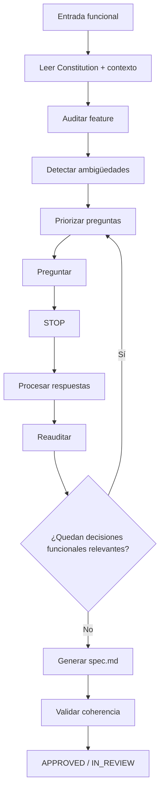

# SDD-Spec-High: Especificación Funcional de Alto Nivel

Este workflow transforma una necesidad funcional o una feature de negocio en una **especificación funcional completa, coherente, observable y trazable**, lista para pasar a `/sdd-spec-clarify` y posteriormente a `/sdd-planning`.

Su propósito es definir con precisión:

> **QUÉ debe hacer el sistema, bajo qué condiciones, quién puede hacerlo, qué reglas debe respetar y qué comportamiento observable debe producir.**

Este workflow **NO define cómo implementar técnicamente la solución**.

---

# 0. REGLA SUPREMA — NO INVENTAR COMPORTAMIENTO

Esta regla tiene precedencia absoluta dentro de este workflow.

La IA **NO DEBE inventar, completar silenciosamente, asumir ni decidir** ningún comportamiento funcional que no esté explícitamente definido cuando dicho comportamiento pueda modificar:

```text
alcance;
reglas de negocio;
permisos;
actores;
estados;
datos;
validaciones;
relaciones;
resultados;
errores;
transiciones;
efectos secundarios;
criterios de aceptación.
```

Ante cualquiera de estas condiciones:

```text
AMBIGUO
INCOMPLETO
CONTRADICTORIO
INCIERTO
INCONSISTENTE
```

la IA **DEBE preguntar**.

No puede resolverlo silenciosamente con:

```text
"asumiré que..."
"normalmente..."
"lo habitual es..."
"por defecto..."
"seguramente..."
```

cuando esa elección cambie el comportamiento del sistema.

---

# 1. OBJETIVO DEL WORKFLOW

`/sdd-spec-high` debe producir un `spec.md` que permita que otra IA, un desarrollador o un analista pueda responder sin inventar:

```text
¿Qué problema resuelve esta feature?

¿Quién participa?

¿Qué puede hacer cada actor?

¿Qué información entra?

¿Qué información sale?

¿Qué condiciones deben cumplirse?

¿Qué reglas de negocio existen?

¿Qué ocurre ante errores?

¿Qué ocurre ante estados vacíos?

¿Qué ocurre ante límites o casos borde?

¿Qué comportamiento es observable?

¿Cómo se valida que la feature funciona?
```

Si alguna de estas respuestas depende de una decisión de negocio no resuelta, la IA debe detenerse y preguntar.

---

# 2. ÁMBITO DE LA ESPECIFICACIÓN

`spec.md` describe la **intención funcional de una feature**.

Debe contener:

```text
actores;
objetivo;
alcance;
flujo funcional;
user stories;
requerimientos;
reglas de negocio;
datos funcionales;
precondiciones;
postcondiciones;
errores observables;
estados relevantes;
criterios de aceptación;
escenarios Gherkin.
```

No debe contener detalles técnicos como:

```text
controladores;
servicios;
repositorios;
ORM;
SQL;
migraciones;
estructura de carpetas;
nombres de clases;
endpoints concretos;
frameworks;
componentes internos;
patrones de arquitectura.
```

Esos detalles pertenecen a `/sdd-planning`.

---

# 3. RELACIÓN CON LA CONSTITUCIÓN

Antes de especificar una feature, la IA debe utilizar:

```text
AGENTS.md
docs/constitution.md
```

como contexto superior.

La Specification debe:

* respetar el lenguaje ubicuo;
* respetar actores globales;
* respetar restricciones globales;
* respetar principios globales;
* respetar flujos globales;
* no contradecir decisiones constitucionales.

No debe volver a preguntar decisiones ya resueltas en Constitution.

---

# 4. REGLA DE PRECEDENCIA

La especificación está subordinada a Constitution.

```text
Constitution
      ↓
    Spec
```

Si la Specification propuesta contradice una regla constitucional:

```text
NO continuar
```

La IA debe identificar la contradicción y determinar si:

1. la propuesta funcional es incorrecta;
2. la Constitución está obsoleta;
3. existe una nueva decisión global que requiere `/sdd-constitution-trial`.

No debe ocultar la contradicción modificando silenciosamente una de las dos fuentes.

---

# 5. PROTOCOLO GENERAL

El workflow debe seguir este ciclo:



---

# 6. TIEMPO 1 — DESCUBRIMIENTO FUNCIONAL

Cuando el usuario invoque:

```text
/sdd-spec-high
```

la IA debe realizar una auditoría antes de escribir.

---

## 6.1 Resolver la feature

Debe determinar:

```text
¿Existe ya un módulo correspondiente?
¿Existe ya un spec.md?
¿Cuál es el siguiente número?
¿Cuál es el nombre de la feature?
¿Es una feature nueva o una modificación?
```

La estructura será:

```text
docs/specs/XX-nombre/
```

con:

```text
docs/specs/XX-nombre/spec.md
```

Si existen varios candidatos, debe resolver la ambigüedad antes de continuar.

---

# 7. AUDITORÍA PREVIA DE CONTEXTO

La IA debe consultar al menos:

```text
AGENTS.md
docs/constitution.md
```

y, cuando exista:

```text
docs/specs/XX-nombre/spec.md
```

Si la feature depende de otra especificación relevante, puede consultar únicamente la documentación necesaria.

No debe hacer una auditoría indiscriminada de todo el repositorio.

---

# 8. DETECCIÓN OBLIGATORIA DE VACÍOS FUNCIONALES

Antes de generar requisitos, la IA debe analizar como mínimo:

```text
1. Actores y permisos
2. Flujo funcional
3. Entradas
4. Salidas
5. Reglas de negocio
6. Estados
7. Validaciones
8. Dependencias funcionales
9. Errores observables
10. Casos borde
11. Casos vacíos
12. Efectos secundarios funcionales
13. Terminología
14. Alcance
15. Criterios de aceptación
```

---

# 9. AMBIGÜEDAD FUNCIONAL

La IA debe detectar expresiones vagas como:

```text
"rápidamente"
"fácilmente"
"correctamente"
"normal"
"apropiado"
"cuando corresponda"
"si es necesario"
"usuario autorizado"
```

si no existe una definición objetiva.

Ejemplo:

```text
"El vendedor puede modificar una venta cuando corresponda."
```

Esto es insuficiente.

Debe preguntarse:

```text
¿En qué estados puede modificarse?
¿Quién determina que puede modificarse?
```

---

# 10. INCOMPLETITUD

Una necesidad aparentemente clara puede estar incompleta.

Ejemplo:

```text
"El cliente puede cancelar su pedido."
```

Todavía puede faltar:

```text
¿Puede cancelarlo en cualquier estado?
¿Hasta qué momento?
¿Qué ocurre con el pago?
¿Qué ocurre con el inventario?
¿Qué ve el usuario después?
```

La IA solo debe preguntar aquello cuya respuesta cambie el comportamiento.

---

# 11. CONTRADICCIONES

La IA debe comprobar tanto:

```text
entrada actual
```

como:

```text
Constitution
+
otras specs relacionadas
```

Ejemplo:

```text
Constitution:
Un pedido confirmado no puede modificarse.

Nueva spec:
El cliente puede modificar cualquier pedido.
```

La IA debe bloquear la generación de una especificación definitiva hasta resolver la contradicción.

---

# 12. INCONSISTENCIA TERMINOLÓGICA

El lenguaje de la Specification debe coincidir con el lenguaje constitucional.

Ejemplo:

```text
Constitution:
Cliente
```

pero la nueva feature utiliza:

```text
Comprador
Usuario comprador
Consumidor
```

La IA debe comprobar si:

```text
son conceptos diferentes
```

o:

```text
son sinónimos del mismo concepto.
```

No debe crear entidades conceptuales nuevas por accidente.

---

# 13. OPTIMIZACIÓN DE PREGUNTAS

La prioridad no es preguntar mucho.

La prioridad es:

> **Eliminar la mayor cantidad de incertidumbre funcional con la menor cantidad de preguntas.**

La IA debe analizar dependencias.

Ejemplo:

```text
¿Quién puede cancelar una reserva?
```

puede resolver simultáneamente:

```text
actor
+
permiso
+
flujo
+
regla
```

Es mejor que formular cuatro preguntas independientes.

---

# 14. PRIORIDAD DE LAS PREGUNTAS

Orden:

```text
P0 — Contradicciones
P1 — Alcance
P2 — Actores/permisos
P3 — Flujo principal
P4 — Reglas de negocio
P5 — Estados
P6 — Datos esenciales
P7 — Validaciones relevantes
P8 — Errores y casos borde
P9 — Detalles menores
```

No preguntar un detalle P9 mientras exista una decisión P0–P4 sin resolver.

---

# 15. PREGUNTAS AGRUPADAS

Se pueden agrupar preguntas relacionadas.

Ejemplo:

```text
¿Qué ocurre al cancelar una reserva?

A) Se elimina y no queda registro.
B) Se conserva como cancelada.
C) Se conserva y además se registra el motivo.
D) Depende del estado de la reserva.
E) Otro comportamiento.
```

Esto puede resolver:

```text
estado;
persistencia conceptual;
resultado visible;
auditoría.
```

Pero no debe mezclarse:

```text
comportamiento de negocio
+
decisión de arquitectura
```

en una misma pregunta.

---

# 16. RECOMENDACIONES DE LA IA

La IA puede ayudar mediante recomendaciones, pero debe distinguir:

```text
Recomendación
```

de:

```text
Decisión del usuario
```

Ejemplo:

```text
Recomendación:
Mantener la operación como "anulada" en lugar de eliminarla
facilita conservar el historial.

Decisión requerida:
¿Cuál comportamiento debe adoptar el sistema?

A) Eliminar
B) Anular
C) Otro
```

La IA no puede asumir que su recomendación fue aceptada.

---

# 17. NO HACER PREGUNTAS TÉCNICAS PREMATURAS

No preguntar en `/sdd-spec-high`:

```text
¿Usamos REST?
¿Repository Pattern?
¿UUID?
¿Service Layer?
¿PostgreSQL?
¿Laravel Controller?
¿Pinia?
¿Redis?
```

salvo que una de estas decisiones sea una **restricción funcional explícitamente relevante**.

Las decisiones técnicas pertenecen a:

```text
/sdd-planning
```

---

# 18. PATRONES DE DATOS DEPENDIENTES

Cuando exista una relación entre conceptos, la Specification debe preguntar por el **comportamiento**, no por la implementación.

Ejemplo:

```text
Producto → Categoría
```

Pregunta válida:

```text
¿Un producto puede existir sin una categoría?

A) Sí
B) No
C) Solo durante una etapa determinada
D) Otro comportamiento
```

No preguntar:

```text
¿FK nullable con SET NULL?
```

Eso pertenece a Planning.

---

# 19. ESTADOS VACÍOS

La IA debe detectar dependencias donde pueda existir un catálogo o conjunto vacío.

Ejemplo:

```text
Crear producto
    ↓
requiere seleccionar categoría
```

Debe determinarse funcionalmente:

```text
¿Qué ocurre si no existen categorías?
```

Posibles comportamientos:

```text
A) La operación no puede realizarse.
B) Puede realizarse sin categoría.
C) Se permite crear la categoría durante la operación.
D) Otro.
```

El mecanismo concreto se decide posteriormente.

---

# 20. VALIDACIONES

Toda validación que cambie el comportamiento debe definirse funcionalmente.

Ejemplos:

```text
edad mínima;
cantidad mínima/máxima;
rango de precios;
campos obligatorios;
formatos aceptados;
unicidad funcional;
límites;
fechas válidas.
```

No basta con escribir:

```text
"Los datos deben ser válidos."
```

La Specification debe expresar qué significa "válido".

---

# 21. ERRORES OBSERVABLES

La Specification debe describir qué comportamiento debe experimentar el actor cuando una operación no puede realizarse.

Ejemplo:

```text
Cuando el usuario intenta confirmar un pedido sin stock,
el sistema debe impedir la confirmación y comunicar que
no existe disponibilidad suficiente.
```

No debe definir:

```text
HTTP 422
ValidationException
Laravel Request
```

porque eso pertenece a Planning.

---

# 22. ESTADOS Y TRANSICIONES

Cuando la feature implique estados, deben definirse las transiciones funcionales.

Ejemplo:

```text
BORRADOR
   ↓
CONFIRMADO
   ↓
ENTREGADO
```

La IA debe determinar:

```text
¿Qué eventos producen la transición?
¿Qué actores pueden producirla?
¿Qué transiciones están prohibidas?
¿Qué ocurre ante una operación inválida?
```

No debe definir todavía cómo se almacenarán los estados.

---

# 23. ALCANCE EXPLÍCITO

Toda Specification debe distinguir:

## In Scope

Lo que la feature sí debe hacer.

## Out of Scope

Lo que explícitamente no forma parte de la feature.

Esto evita que Planning o Execution agreguen comportamiento accidentalmente.

Ejemplo:

```text
In Scope:
- Crear pedido.
- Consultar pedido.
- Cancelar pedido en estado permitido.

Out of Scope:
- Facturación electrónica.
- Envío físico.
- Integración contable.
```

---

# 24. USER STORIES

Las historias de usuario deben expresar valor funcional.

Formato:

```text
Como [actor],
quiero [acción],
para [valor/objetivo].
```

Ejemplo:

```text
Como vendedor,
quiero registrar una venta,
para dejar constancia de la operación realizada.
```

Las historias no deben contener decisiones técnicas.

---

# 25. IDENTIFICADORES

Cada historia utilizará:

```text
HU-XX
```

Cada requerimiento:

```text
RF-XX.Y
```

Cada escenario:

```text
SC-XX.Y.Z
```

Ejemplo:

```text
HU-01

RF-01.1
RF-01.2

SC-01.1.1
SC-01.1.2
SC-01.2.1
```

Los identificadores deben ser estables.

No deben cambiar innecesariamente durante revisiones.

---

# 26. EARS

Los requisitos pueden expresarse utilizando EARS cuando el patrón sea apropiado.

Patrones principales:

### Ubiquitous

```text
El sistema deberá [comportamiento].
```

### Event-Driven

```text
Cuando [evento], el sistema deberá [respuesta].
```

### State-Driven

```text
Mientras [estado], el sistema deberá [comportamiento].
```

### Optional Feature

```text
Cuando [condición], el sistema deberá [comportamiento].
```

### Unwanted Behavior

```text
Si [condición no deseada], el sistema deberá impedir [comportamiento].
```

### Regla

> **EARS es una herramienta de precisión, no una obligación mecánica.**

La IA debe utilizar el patrón que haga más claro el requisito.

No debe forzar un requisito artificialmente dentro de una plantilla EARS.

---

# 27. REGLAS DE NEGOCIO

Las reglas de negocio deben distinguirse de los requisitos.

Ejemplo:

```text
RB-01
Una venta confirmada no puede modificarse.
```

Después:

```text
RF-01.2
Cuando un usuario intente modificar una venta confirmada,
el sistema deberá impedir la operación.
```

Esto permite reutilizar la regla cuando varias partes del sistema dependan de ella.

---

# 28. GHERKIN

Los criterios de aceptación deben utilizar comportamiento observable.

Formato:

```gherkin
Feature: [nombre]

  Scenario: [comportamiento]
    Given [contexto]
    And [precondición]
    When [acción]
    Then [resultado observable]
```

---

# 29. COBERTURA DE ESCENARIOS

Cada flujo funcional relevante debe considerar, cuando aplique:

```text
Happy Path
Error
Boundary
Empty State
Permission
State Transition
Dependency Failure
```

No todos son obligatorios en todas las features.

Debe utilizarse el conjunto necesario para cubrir el riesgo funcional real.

---

# 30. RELACIÓN RF → SC

No se exige:

```text
1 RF = 1 SC
```

Puede existir:

```text
RF-01.1
    ↓
SC-01.1.1
SC-01.1.2
SC-01.1.3
```

También puede ocurrir que un escenario valide más de un requisito relacionado.

La trazabilidad debe ser explícita y comprensible.

---

# 31. DATOS FUNCIONALES

La Specification debe describir datos desde la perspectiva del comportamiento.

Ejemplo:

```text
Producto:
- nombre
- precio
- categoría
- estado
```

Debe indicar, cuando sea funcionalmente relevante:

```text
obligatoriedad;
formato;
rango;
unicidad;
dependencia;
valor permitido;
valor por defecto funcional;
estado.
```

No debe definir:

```text
VARCHAR(255)
INDEX
FOREIGN KEY
nullable()
$table->...
```

Eso pertenece a Planning.

---

# 32. ENTRADAS Y SALIDAS

Para cada flujo importante:

```text
Entrada
    ↓
Condiciones
    ↓
Procesamiento observable
    ↓
Salida
```

Debe quedar claro:

### Entradas

```text
qué información necesita el actor;
```

### Resultado

```text
qué ocurre cuando la operación tiene éxito;
```

### Error

```text
qué ocurre cuando no puede completarse.
```

---

# 33. PRECONDICIONES Y POSTCONDICIONES

Cuando sean relevantes:

### Precondiciones

Condiciones necesarias antes de la operación.

### Postcondiciones

Estado esperado después de completarla.

Ejemplo:

```text
Precondición:
El producto existe y está disponible.

Postcondición:
La venta queda registrada y el stock disponible disminuye.
```

No definir cómo se implementará la actualización del stock.

---

# 34. EFECTOS FUNCIONALES SECUNDARIOS

La IA debe detectar si una operación produce otros cambios observables.

Ejemplo:

```text
Registrar venta
    ↓
venta creada
    ↓
stock actualizado
    ↓
cliente obtiene historial actualizado
```

Si ese efecto es parte de la regla de negocio, debe estar en la Specification.

Esto evita implementar solamente el primer paso del flujo.

---

# 35. PERMISOS

Los permisos deben expresarse funcionalmente.

Ejemplo:

```text
RF-02.1

Cuando un vendedor intente registrar una venta,
el sistema deberá permitir la operación.
```

y:

```text
RF-02.2

Cuando un cliente intente registrar una venta,
el sistema deberá impedir la operación.
```

No definir aquí middleware, guards, policies o roles técnicos.

---

# 36. NO SOBRE-ESPECIFICAR UI

La Specification puede definir:

```text
el usuario debe recibir confirmación;
el error debe ser visible;
el estado debe ser distinguible;
la acción debe estar disponible para el actor autorizado.
```

Pero no debe definir innecesariamente:

```text
botón azul;
modal de 400px;
icono específico;
animación;
posición exacta;
margen;
tipografía.
```

La UI concreta se resolverá técnicamente.

---

# 37. AUDITORÍA DE COMPLETITUD

Antes de generar `spec.md`, la IA debe comprobar:

```text
[ ] ¿La feature tiene objetivo claro?
[ ] ¿El alcance está definido?
[ ] ¿Los actores están identificados?
[ ] ¿Los permisos están claros cuando aplican?
[ ] ¿El flujo principal está claro?
[ ] ¿Las entradas están definidas?
[ ] ¿Las salidas están definidas?
[ ] ¿Las reglas de negocio están claras?
[ ] ¿Las validaciones relevantes están definidas?
[ ] ¿Los estados relevantes están definidos?
[ ] ¿Los errores observables están definidos?
[ ] ¿Los casos vacíos relevantes están definidos?
[ ] ¿Los casos borde relevantes están definidos?
[ ] ¿Las dependencias funcionales están claras?
[ ] ¿Los efectos secundarios funcionales están definidos?
[ ] ¿La terminología coincide con Constitution?
[ ] ¿Existen contradicciones?
[ ] ¿Hay decisiones pendientes?
[ ] ¿Se introdujo alguna regla por inferencia?
[ ] ¿Se introdujo alguna decisión técnica prematuramente?
```

---

# 38. REGLA DE BLOQUEO

Si cualquiera de las siguientes condiciones existe:

```text
contradicción relevante;
regla de negocio ambigua;
actor ambiguo;
permiso ambiguo;
resultado ambiguo;
estado ambiguo;
dependencia funcional ambigua;
dato esencial ambiguo;
alcance ambiguo;
criterio de aceptación incompleto;
```

la IA debe:

```text
NO aprobar
NO pasar a Planning
NO inventar
NO ocultar
```

Debe volver a la fase de preguntas.

---

# 39. TIEMPO 2 — GENERACIÓN DEL `spec.md`

Solo cuando no existan decisiones funcionales relevantes pendientes, la IA debe crear o actualizar:

```text
docs/specs/XX-feature/spec.md
```

---

# 40. ESTRUCTURA CANÓNICA DE `spec.md`

```text
# Specification: [Feature]

Status: DRAFT | IN_REVIEW | NEEDS_CLARIFICATION | APPROVED | SUPERSEDED

## 1. Context

## 2. Objective

## 3. Scope

### 3.1 In Scope
### 3.2 Out of Scope

## 4. Actors

## 5. Global Flow Context

## 6. User Stories

## 7. Business Rules

## 8. Functional Requirements

## 9. Functional Data

## 10. Preconditions

## 11. Postconditions

## 12. Errors and Exceptional Behavior

## 13. Functional States and Transitions

## 14. Acceptance Criteria

## 15. BDD Scenarios

## 16. Traceability

## 17. Assumptions

## 18. Pending Decisions
```

---

# 41. ESTADO DEL `spec.md`

Estados permitidos:

```text
DRAFT
IN_REVIEW
NEEDS_CLARIFICATION
APPROVED
SUPERSEDED
```

## DRAFT

La especificación está siendo construida.

## IN_REVIEW

La especificación fue redactada y está siendo validada.

## NEEDS_CLARIFICATION

Existe al menos una decisión funcional relevante sin resolver.

## APPROVED

La especificación es suficientemente precisa para comenzar Planning.

## SUPERSEDED

Fue reemplazada por una versión posterior.

---

# 42. CRITERIO REAL DE APPROVED

Una Specification puede marcarse:

```text
Status: APPROVED
```

cuando:

1. el objetivo está claro;
2. el alcance está cerrado;
3. los actores relevantes están claros;
4. el comportamiento principal está definido;
5. las reglas de negocio relevantes están definidas;
6. las entradas y salidas relevantes están definidas;
7. los estados necesarios están definidos;
8. los errores observables relevantes están definidos;
9. los criterios de aceptación son verificables;
10. no existen contradicciones conocidas;
11. no existen decisiones funcionales críticas pendientes;
12. puede comenzar Planning sin que el arquitecto tenga que inventar comportamiento de negocio.

---

# 43. SUPUESTOS

Un supuesto solo puede existir si:

* es de bajo impacto;
* no modifica reglas de negocio;
* no altera alcance;
* puede reemplazarse posteriormente sin invalidar la feature.

Debe registrarse como:

```text
### Assumption

ASSUMPTION-01:
[Texto]

Impact:
Low

Reason:
[Motivo]
```

Los supuestos nunca deben convertirse automáticamente en requisitos.

---

# 44. PENDIENTES

Si un detalle puede resolverse correctamente en Planning, no debe forzarse dentro de Specification.

Debe trasladarse.

Ejemplo:

```text
PENDING FOR PLANNING:
Definir mecanismo técnico para persistir el estado.
```

Pero:

```text
PENDING FOR BUSINESS:
Definir si un pedido confirmado puede cancelarse.
```

sí bloquea `APPROVED`.

---

# 45. TRAZABILIDAD

La Specification debe mantener:

```text
HU
 ↓
RF
 ↓
SC
```

Ejemplo:

```text
HU-01
 ├── RF-01.1
 │    ├── SC-01.1.1
 │    └── SC-01.1.2
 │
 └── RF-01.2
      └── SC-01.2.1
```

La trazabilidad debe permitir localizar rápidamente:

```text
necesidad
→ comportamiento
→ requisito
→ evidencia
```

---

# 46. CONSISTENCIA INTERNA

Antes de aprobar, la IA debe verificar:

```text
HU ↔ RF
RF ↔ SC
RB ↔ RF
Actor ↔ Permission
State ↔ Transition
Input ↔ Validation
Action ↔ Outcome
Dependency ↔ Behavior
```

Ejemplo de inconsistencia:

```text
RF:
Solo el vendedor puede cancelar una venta.

SC:
Given un cliente autenticado
When cancela una venta
Then la venta queda cancelada.
```

La Specification está contradiciéndose.

La IA debe detectarlo y preguntar antes de aprobar.

---

# 47. REAUDITORÍA FINAL OBLIGATORIA

Después de construir el borrador del `spec.md`, la IA debe realizar una segunda revisión completa.

Debe preguntarse:

```text
¿Es coherente con Constitution?

¿Contradice otra regla?

¿Inventé alguna decisión?

¿Hay palabras ambiguas?

¿Existe una acción sin actor?

¿Existe un actor sin permisos claros?

¿Existe un estado sin transición?

¿Existe una transición sin condición?

¿Existe un requisito sin escenario?

¿Existe un escenario que contradiga un requisito?

¿Falta un caso borde importante?

¿Estoy especificando implementación en vez de comportamiento?
```

Si encuentra un problema relevante:

```text
NO APPROVED
```

y vuelve a preguntar.

---

# 48. REGLA DE DETENCIÓN

La IA debe detenerse y preguntar cuando:

```text
la respuesta del usuario es insuficiente;

dos respuestas se contradicen;

una regla constitucional contradice la feature;

un concepto puede interpretarse de dos maneras;

un actor puede tener permisos diferentes;

una operación puede producir resultados funcionales distintos;

un estado puede tener más de una interpretación;

una dependencia puede o no ser obligatoria;

un dato puede o no ser obligatorio;

un comportamiento importante no tiene criterio observable.
```

---

# 49. PROHIBICIÓN DE "COMPLETAR POR CONVENCIÓN"

No está permitido decidir funcionalmente basándose solamente en:

```text
"así lo hacen la mayoría de sistemas";

"es una buena práctica";

"es estándar";

"Laravel normalmente hace...";

"el usuario seguramente espera...";

"lo habitual es..."
```

Las convenciones pueden ayudar a resolver detalles técnicos de bajo impacto.

No pueden decidir reglas de negocio no definidas.

---

# 50. COMPATIBILIDAD CON FEATURES EXISTENTES

Si la nueva feature interactúa con otras:

```text
clientes;
productos;
ventas;
pedidos;
usuarios;
inventario;
etc.
```

la IA debe revisar las especificaciones existentes relevantes y detectar posibles conflictos.

No debe modificar otra feature silenciosamente.

Si una nueva necesidad requiere cambiar una regla existente:

```text
Identificar impacto
    ↓
Determinar qué spec debe evolucionar
    ↓
Usar /sdd-spec-anchored
```

cuando corresponda.

---

# 51. CAMBIOS POSTERIORES

Una Specification aprobada no debe editarse silenciosamente por conveniencia durante Execution.

Si aparece una nueva necesidad:

```text
Nueva necesidad
    ↓
¿Cambia comportamiento?
    ↓
Sí
    ↓
/sdd-spec-anchored
```

Si es únicamente una corrección técnica que no cambia comportamiento:

```text
Planning / Execution
```

puede resolverla.

---

# 52. REGLA PARA CAMBIOS DE ALCANCE

Si durante la especificación aparece:

```text
una nueva feature;
un nuevo actor;
una nueva regla importante;
un nuevo flujo;
una nueva integración funcional;
```

la IA debe determinar si:

```text
pertenece a la feature actual
```

o:

```text
debe convertirse en otra feature.
```

No debe expandir silenciosamente el alcance.

---

# 53. CRITERIO DE EFICIENCIA

La IA debe optimizar la Specification para que sea:

```text
completa
+
precisa
+
mínima
```

No debe confundir "completa" con "larga".

Una Specification es buena cuando elimina las decisiones funcionales relevantes, no cuando acumula texto.

Debe preferirse:

```text
1 regla clara
```

sobre:

```text
4 párrafos explicando lo mismo.
```

---

# 54. SALIDA FINAL

Cuando la Specification esté lista:

```text
Se ha generado:

docs/specs/XX-feature/spec.md

Estado:
APPROVED

La especificación define:
- objetivo;
- alcance;
- actores;
- comportamiento;
- reglas;
- criterios de aceptación;
- escenarios BDD;
- trazabilidad.

Las decisiones técnicas fueron deliberadamente reservadas para Planning.

Siguiente paso:
/sdd-spec-clarify
```

---

# 55. SALIDA CUANDO EXISTEN AMBIGÜEDADES

Cuando todavía existan decisiones funcionales pendientes:

```text
Estado:
NEEDS_CLARIFICATION

No se aprobará la Specification todavía.

Ambigüedades detectadas:
- ...
- ...

Preguntas necesarias:

1. ...
2. ...

El workflow queda detenido hasta resolverlas.
```

La IA no debe generar un `spec.md` definitivo fingiendo que esas decisiones ya fueron tomadas.

---

# 56. FLUJO COMPLETO DEL WORKFLOW

```text
/sdd-spec-high
      ↓
Leer Constitution
      ↓
Identificar feature
      ↓
Auditar contexto existente
      ↓
Extraer decisiones conocidas
      ↓
Detectar:
  - ambiguo
  - incompleto
  - contradictorio
  - inconsistente
      ↓
Priorizar por impacto
      ↓
Agrupar preguntas
      ↓
PREGUNTAR
      ↓
STOP
      ↓
Recibir respuesta
      ↓
REANALIZAR
      ↓
¿Queda ambigüedad relevante?
   ├── SÍ → volver a preguntar
   │
   └── NO
        ↓
     Redactar spec.md
        ↓
     Validar:
       HU ↔ RF ↔ SC
       reglas
       actores
       estados
       datos
       errores
       alcance
        ↓
     Status: IN_REVIEW
        ↓
     Auditoría final
        ↓
     Status: APPROVED
        ↓
     /sdd-spec-clarify
```

---

# 57. REGLA MAESTRA

> **`/sdd-spec-high` no existe para escribir rápidamente un `spec.md`; existe para eliminar la ambigüedad funcional antes de que una decisión de negocio llegue a Planning o Code.**

> **Cuando una decisión funcional relevante no esté definida, preguntar es obligatorio. Cuando esté definida por Constitution o por una Specification aprobada, no volver a preguntarla.**

La IA debe mantener siempre:

```text
CONSTITUTION
    ↓
Reglas globales

SPEC-HIGH
    ↓
Comportamiento funcional

SPEC-CLARIFY
    ↓
Verificación de suficiencia

PLANNING
    ↓
Implementación técnica
```

Y la regla operacional fundamental es:

```text
NO INVENTAR
   ↓
NO OMITIR
   ↓
NO CONTRADECIR
   ↓
PREGUNTAR CUANDO SEA NECESARIO
   ↓
REANALIZAR
   ↓
ESPECIFICAR
   ↓
VALIDAR
```
