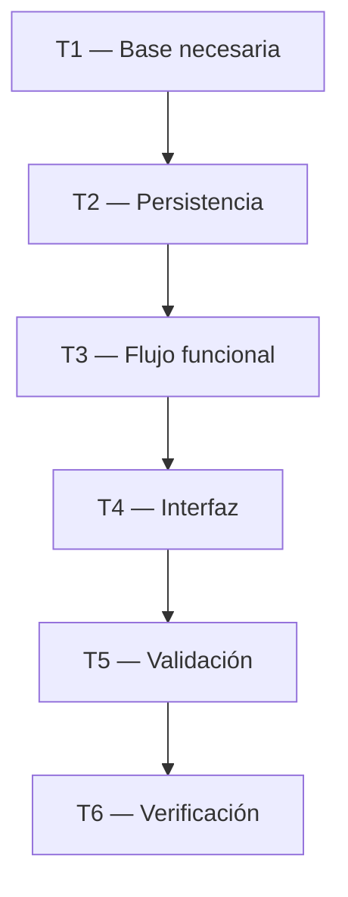
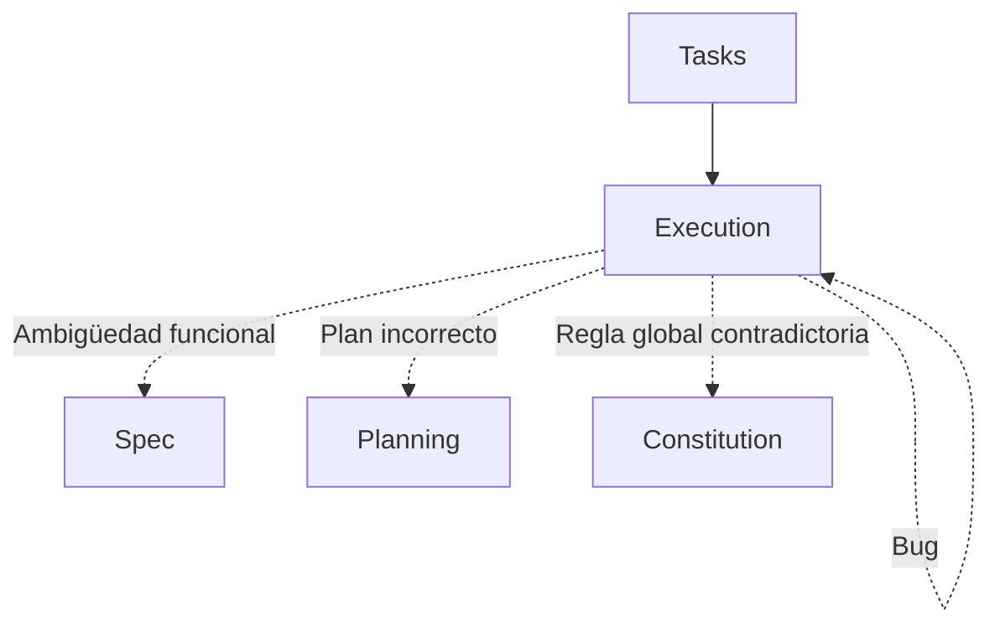

# SDD-Task: Descomposición Atómica y Ejecutable

Este workflow transforma una Specification y un Planning aprobados en un conjunto de **tareas ejecutables, trazables, dependientes y verificables**.

Su propósito es responder:

> **¿Qué trabajo concreto debemos realizar para materializar el `spec.md` siguiendo exactamente el `plan.md`, y cómo sabremos que cada trabajo está realmente terminado?**

`/sdd-task` es una fase de **descomposición**, no de descubrimiento de negocio ni de rediseño arquitectónico.

---

# 0. REGLA SUPREMA — NO INVENTAR NI REDISEÑAR

La IA no debe:

```text
inventar requisitos;
inventar reglas de negocio;
modificar el alcance;
rediseñar la arquitectura;
introducir patrones no definidos;
cambiar contratos;
crear decisiones técnicas de alto impacto;
```

únicamente para poder generar las tareas.

Si `spec.md` o `plan.md` dejan una decisión relevante sin resolver, la IA debe:

```text
DETENER
↓
IDENTIFICAR EL VACÍO
↓
DETERMINAR A QUÉ FASE PERTENECE
↓
SOLICITAR RESOLUCIÓN
```

No debe ocultar la ausencia de una decisión creando una tarea vaga como:

```text
"Decidir arquitectura"
```

cuando esa decisión debió resolverse en Planning.

---

# 1. OBJETIVO

El resultado de `/sdd-task` debe permitir que otro agente pueda ejecutar `tasks.md` sin tener que preguntarse:

```text
¿Qué debo construir?
¿Qué parte corresponde a esta tarea?
¿De qué depende?
¿Cómo sabré que terminó?
¿Qué archivos o componentes debo tocar según el plan?
¿Qué prueba corresponde?
¿Qué evidencia debo obtener?
```

Una tarea debe describir **trabajo ejecutable**, no intención abstracta.

---

# 2. ENTRADAS OBLIGATORIAS

Antes de generar tareas, la IA debe localizar:

```text
docs/constitution.md
docs/specs/XX-feature/spec.md
docs/specs/XX-feature/plan.md
```

El `spec.md` debe estar:

```text
Status: APPROVED
```

y el `plan.md` debe estar:

```text
Status: APPROVED
```

o en el estado equivalente definido por el proyecto.

Si alguno no está aprobado:

```text
NO GENERAR TASKS DEFINITIVOS
```

---

# 3. JERARQUÍA

Las tareas heredan las decisiones superiores:

```text
Constitution
      ↓
Spec
      ↓
Plan
      ↓
Tasks
      ↓
Execution
```

Por tanto:

```text
Task no puede contradecir Plan.
Task no puede inventar comportamiento que no esté en Spec.
Task no puede contradecir Constitution.
```

Una tarea solamente **operacionaliza** una decisión ya tomada.

---

# 4. ESTADO GLOBAL DEL `tasks.md`

El estado de las tareas debe aparecer **obligatoriamente en la parte superior del documento**, inmediatamente después del título.

Este resumen es el **estado operativo de la feature** y debe mantenerse actualizado durante `/sdd-execution`.

Formato obligatorio:

```markdown
# Tasks: [Feature]

## Task Progress

| Métrica | Cantidad |
|---|---:|
| Total de tareas | X |
| Tareas realizadas | X |
| Tareas por realizar | X |
| Tareas bloqueadas | X |
| Tareas en progreso | X |
| Progreso | X% |

**Estado:** READY
```

Como mínimo deben existir:

```text
Total de tareas
Tareas realizadas
Tareas por realizar
```

Las métricas adicionales:

```text
Tareas bloqueadas
Tareas en progreso
Progreso
```

son recomendadas porque permiten identificar rápidamente el estado real.

---

# 5. REGLA DE CÁLCULO DEL ESTADO

El resumen superior debe reflejar el contenido real de la tabla de tareas.

### Total

Todas las tareas existentes en `tasks.md`.

```text
TOTAL = todas las tareas
```

### Tareas realizadas

Todas las tareas con:

```text
Status: COMPLETED
```

o equivalente `[x]`.

```text
REALIZADAS = COMPLETED
```

### Tareas por realizar

Todas las tareas que todavía no estén completadas:

```text
PENDIENTES
+
IN_PROGRESS
+
TESTING
+
REVIEW
+
BLOCKED
```

Por tanto:

```text
POR REALIZAR = TOTAL - REALIZADAS
```

### Progreso

Cuando sea útil:

```text
PROGRESO = REALIZADAS / TOTAL × 100
```

Ejemplo:

```text
Total: 20
Realizadas: 8
Por realizar: 12
Progreso: 40%
```

---

# 6. REGLA DE CONSISTENCIA DEL RESUMEN

La IA debe verificar siempre:

```text
Total = Realizadas + Por realizar
```

Por ejemplo:

```text
20 = 8 + 12
```

Si existen:

```text
Total: 20
Realizadas: 8
Por realizar: 10
```

el documento está inconsistente.

Debe corregirse.

---

# 7. EL RESUMEN DEBE ESTAR SIEMPRE ARRIBA

No colocar el resumen:

```text
al final;
en una sección secundaria;
solo durante Execution;
en otro archivo.
```

Debe estar al principio:

```text
# Tasks: Feature

## Task Progress
...
```

Esto permite que un agente pueda abrir `tasks.md` y conocer inmediatamente:

```text
qué tan avanzada está la feature;
cuánto trabajo queda;
si existen bloqueos.
```

---

# 8. ACTUALIZACIÓN OBLIGATORIA DURANTE EXECUTION

Cada vez que una tarea cambie de estado, `/sdd-execution` debe actualizar:

```text
1. Estado de la tarea.
2. Resumen superior.
3. Evidencia correspondiente.
```

Ejemplo:

Antes:

```text
Total: 10
Realizadas: 4
Por realizar: 6
```

Después de completar una tarea:

```text
Total: 10
Realizadas: 5
Por realizar: 5
```

No dejar el resumen desactualizado.

---

# 9. EL RESUMEN ES DERIVADO, NO MANUAL

La IA debe considerar la lista de tareas como la fuente del conteo.

No debe modificar arbitrariamente:

```text
Realizadas: 7
```

si únicamente existen seis tareas marcadas como completadas.

La métrica superior debe poder reconstruirse a partir de las tareas.

---

# 10. EJEMPLO DE ESTADO INICIAL

```markdown
# Tasks: Registrar Venta

## Task Progress

| Métrica | Cantidad |
|---|---:|
| Total de tareas | 9 |
| Tareas realizadas | 0 |
| Tareas por realizar | 9 |
| Tareas bloqueadas | 0 |
| Tareas en progreso | 0 |
| Progreso | 0% |

**Estado:** READY
```

---

# 11. EJEMPLO DE ESTADO DURANTE EXECUTION

```markdown
# Tasks: Registrar Venta

## Task Progress

| Métrica | Cantidad |
|---|---:|
| Total de tareas | 9 |
| Tareas realizadas | 4 |
| Tareas por realizar | 5 |
| Tareas bloqueadas | 0 |
| Tareas en progreso | 1 |
| Progreso | 44.4% |

**Estado:** IN_PROGRESS
```

---

# 12. EJEMPLO DE ESTADO CON BLOQUEO

```markdown
# Tasks: Registrar Venta

## Task Progress

| Métrica | Cantidad |
|---|---:|
| Total de tareas | 9 |
| Tareas realizadas | 4 |
| Tareas por realizar | 5 |
| Tareas bloqueadas | 1 |
| Tareas en progreso | 0 |
| Progreso | 44.4% |

**Estado:** BLOCKED
```

Esto permite distinguir:

```text
trabajo todavía no realizado
```

de:

```text
trabajo que no puede realizarse actualmente.
```

---

# 13. ESTADOS DE LAS TAREAS

Las tareas deben manejar:

```text
PENDING
IN_PROGRESS
BLOCKED
TESTING
REVIEW
COMPLETED
```

### PENDING

Todavía no iniciada.

### IN_PROGRESS

En ejecución.

### BLOCKED

No puede continuar por una dependencia o decisión pendiente.

### TESTING

La implementación existe y está siendo validada.

### REVIEW

La tarea está lista para revisión.

### COMPLETED

Existe evidencia suficiente de finalización.

---

# 14. REGLA PARA `COMPLETED`

Una tarea solo puede marcarse:

```text
COMPLETED
```

cuando:

```text
trabajo realizado
+
criterio de finalización satisfecho
+
evidencia disponible
```

No basta:

```text
"código escrito"
```

---

# 15. REGLA PARA `BLOCKED`

Si una tarea requiere información que no está definida:

```text
Status: BLOCKED
```

debe registrar:

```text
Blocker:
...

Source:
Spec / Plan / External Dependency

Required action:
...
```

No debe continuar mediante una suposición de alto impacto.

---

# 16. REGLA PARA `IN_PROGRESS`

La IA debe marcar:

```text
IN_PROGRESS
```

cuando realmente haya comenzado a trabajar sobre esa tarea.

No marcar varias tareas como `IN_PROGRESS` si el agente realmente está ejecutando solo una, salvo que exista ejecución paralela real.

---

# 17. REGLA PARA `TESTING`

Cuando la implementación de una tarea esté realizada pero la evidencia todavía esté siendo validada:

```text
TESTING
```

Esto evita marcar como completado algo cuyo código existe pero todavía no ha demostrado que funciona.

---

# 18. REGLA PARA `REVIEW`

Cuando el trabajo esté terminado técnicamente pero requiera revisión adicional:

```text
REVIEW
```

La tarea no debe contarse como `COMPLETED` hasta satisfacer el criterio final de aceptación.

---

# 19. REGLA DE ACTUALIZACIÓN ATÓMICA DEL ESTADO

Cuando una tarea pase de:

```text
PENDING
```

a:

```text
COMPLETED
```

la IA debe actualizar en el mismo cambio:

```text
Estado de la tarea
+
Resumen superior
+
Evidencia
```

No dejar una tarea completada mientras el contador superior indique que sigue pendiente.

---

# 20. AUDITORÍA DEL ESTADO ANTES DE FINALIZAR

Antes de terminar cualquier ejecución sobre `tasks.md`, verificar:

```text
[ ] Total coincide con número real de tareas.
[ ] Realizadas coincide con tareas COMPLETED.
[ ] Por realizar = Total - Realizadas.
[ ] Bloqueadas coincide con tareas BLOCKED.
[ ] En progreso coincide con tareas IN_PROGRESS.
[ ] El porcentaje es correcto.
[ ] El estado global refleja la situación real.
```

---

# 21. DESCOMPOSICIÓN

El resto del documento sigue las reglas de descomposición siguientes.

Una tarea debe ser lo suficientemente pequeña para:

* entenderse sin contexto adicional;
* ejecutarse;
* verificarse;
* marcarse como completa;
* identificar sus cambios;
* aislar un posible fallo.

Pero no debe fragmentarse artificialmente.

---

# 22. NO CONFUNDIR ATOMICIDAD CON MICRO-TAREAS

Evitar:

```text
T1 Crear archivo.
T2 Escribir clase.
T3 Agregar import.
T4 Crear método.
T5 Guardar archivo.
```

Preferir:

```text
T1 Implementar la persistencia de la venta según el contrato
definido en plan.md, incluyendo creación, validación de
integridad y manejo de errores especificado.
```

La unidad de trabajo debe representar **valor o una pieza técnica coherente**, no cada línea de código.

---

# 23. FEATURE-FIRST / VERTICAL SLICES

La descomposición debe priorizar **flujos funcionales completos**.

Evitar una estructura puramente por capas como:

```text
Todas las migraciones
↓
Todos los modelos
↓
Todos los repositorios
↓
Todos los controllers
↓
Todas las pantallas
↓
Todos los tests
```

cuando eso provoque que durante mucho tiempo no exista ningún flujo funcional ejecutable.

Preferir:

```text
Vertical Slice 1
    ↓
flujo funcional completo

Vertical Slice 2
    ↓
flujo funcional completo

Vertical Slice 3
    ↓
flujo funcional completo
```

---

# 24. ESTRUCTURA DE UNA VERTICAL SLICE

Una vertical slice puede contener:

```text
Preparación necesaria
        ↓
Persistencia / dominio
        ↓
Lógica
        ↓
Interfaz / integración
        ↓
Validación
        ↓
Evidencia
```

pero solo incluye las piezas necesarias para cerrar ese flujo.

---

# 25. ORDEN DE DEPENDENCIAS

Las tareas deben organizarse mediante dependencias reales.

Ejemplo:



No forzar dependencias cuando puedan ejecutarse en paralelo.

---

# 26. ORDEN TOPOLÓGICO

La IA debe construir las tareas respetando dependencias.

Si:

```text
T3 depende de T1 y T2
```

entonces:

```text
T1
T2
T3
```

y no:

```text
T3
T1
T2
```

Las dependencias deben indicar:

```text
DEPENDS_ON
```

o una notación equivalente.

---

# 27. TIPOS DE TAREA

Se utilizan etiquetas:

```text
[SETUP]
[IMPL]
[TEST]
[VERIFY]
```

Opcionalmente:

```text
[DOCS]
[MIGRATION]
[INTEGRATION]
[REFACTOR]
```

si aportan claridad.

---

# 28. SETUP

`[SETUP]` contiene preparación necesaria para ejecutar la feature.

Puede incluir:

```text
dependencias;
configuración;
estructura prevista por Planning;
esquema;
migraciones;
fixtures;
datos de prueba;
infraestructura requerida.
```

No debe utilizarse para decisiones que todavía no estén resueltas.

---

# 29. IMPLEMENTACIÓN

`[IMPL]` debe representar trabajo técnico concreto derivado de `plan.md`.

Ejemplo:

```text
T2.1 [IMPL] Implementar la persistencia de pedidos utilizando
el contrato definido en plan.md y respetando las relaciones
establecidas.
```

No debe convertirse en:

```text
T2.1 [IMPL] Hacer el backend.
```

---

# 30. PRUEBAS

Las pruebas se descomponen según el riesgo y el comportamiento.

No existe una cantidad fija universal.

Puede utilizarse:

```text
[TEST]
BDD / E2E
Unit
Integration
Contract
```

según la estrategia de `plan.md`.

---

# 31. NO TEST-FIRST OBLIGATORIO

`/sdd-task` no debe imponer que absolutamente todo siga:

```text
RED
GREEN
REFACTOR
```

La estrategia de ejecución puede ser incremental:

```text
especificación
↓
vertical slice
↓
implementación
↓
prueba
↓
corrección
↓
siguiente slice
```

TDD puede utilizarse donde aporte valor.

No debe forzarse artificialmente.

---

# 32. VALIDACIÓN BASADA EN RIESGO

Las tareas de prueba deben responder al riesgo.

### BDD / E2E

Para flujos funcionales importantes.

### Unit

Para:

```text
reglas complejas;
cálculos;
transformaciones;
validaciones críticas;
algoritmos.
```

### Integration

Para:

```text
base de datos;
servicios;
APIs;
componentes que interactúan entre capas.
```

### Static checks

Cuando existan:

```text
lint;
type-check;
formatter;
análisis estático.
```

---

# 33. ESTRUCTURA DE UNA TAREA

Cada tarea debe contener:

```text
ID
Tipo
Título
Estado
Objetivo
Referencia
Dependencias
Trabajo
Criterio de finalización
Evidencia
```

Formato:

```markdown
### T2.1 [IMPL] Registrar una venta

**Status:** PENDING

**Traceability**
- HU: HU-01
- RF: RF-01.1
- SC: SC-01.1.1

**Depends on**
- T1.1

**Objective**
Implementar ...

**Work**
- ...
- ...
- ...

**Done when**
- ...

**Evidence**
- ...
```

---

# 34. TRAZABILIDAD

Cada tarea funcional relevante debe enlazar con los artefactos superiores.

Idealmente:

```text
Task
  ↓
Plan Component
  ↓
RF
  ↓
HU
  ↓
SC
```

Ejemplo:

```text
T2.1
 ├── PLAN-02
 ├── RF-01.1
 └── SC-01.1.1
```

Una tarea técnica transversal puede referenciar directamente un componente del plan si no existe una correspondencia funcional uno-a-uno.

---

# 35. NO FORZAR TRAZABILIDAD ARTIFICIAL

No inventar:

```text
RF-02.7
```

solo para que una tarea tenga un requisito asociado.

Una tarea puede ser:

```text
preparación;
infraestructura;
migración;
configuración;
refactor técnico necesario;
verificación global.
```

En esos casos debe indicar:

```text
Traceability:
PLAN-03
```

o:

```text
Cross-cutting
```

según corresponda.

---

# 36. CRITERIO DE DONE

Una tarea no se considera completada por haber escrito código.

Debe existir un criterio verificable.

Ejemplo:

```text
Done when:
- La operación está implementada.
- El escenario SC-01.1.1 pasa.
- La validación definida en Plan no presenta errores.
- Las comprobaciones relevantes fueron ejecutadas.
```

---

# 37. EVIDENCIA OBLIGATORIA

Cuando la tarea requiera ejecución, debe indicar qué evidencia permite demostrar su finalización.

Puede ser:

```text
comando ejecutado;
resultado de test;
lint;
type-check;
build;
captura de resultado;
salida CLI;
verificación funcional.
```

El tipo de evidencia depende del proyecto.

---

# 38. DEPENDENCIAS DE TAREA

Cada dependencia debe existir por una razón.

Ejemplo:

```text
T2.2 DEPENDS_ON T2.1
```

porque:

```text
T2.2 consume el contrato producido por T2.1.
```

No crear dependencias simplemente para imponer un orden arbitrario.

---

# 39. PARALELISMO

Cuando dos tareas sean independientes:

```text
T2.1
T2.2
```

pueden ejecutarse en paralelo si el entorno y el equipo lo permiten.

`tasks.md` debe representar la dependencia lógica, no una secuencia artificial.

---

# 40. CIERRE DE VERTICAL SLICE

Siempre que sea posible, una vertical slice debe terminar con:

```text
implementación
+
validación
+
evidencia
```

No dejar una slice en:

```text
backend terminado
pero
flujo inutilizable
```

o:

```text
UI terminada
pero
sin conexión real.
```

---

# 41. PRUEBAS DENTRO DE LAS SLICES

No acumular necesariamente todos los tests al final.

Preferir:

```text
Slice 1
→ implementar
→ validar
→ cerrar

Slice 2
→ implementar
→ validar
→ cerrar
```

Esto permite detectar problemas antes de que se multipliquen.

---

# 42. TESTS CONSOLIDADOS

Después de cerrar las vertical slices, debe existir una fase de verificación global que pueda ejecutar:

```text
suite funcional;
suite unitaria;
integración;
BDD / E2E;
lint;
type-check;
build;
```

según el plan.

No repetir innecesariamente las mismas pruebas ya ejecutadas durante cada slice.

---

# 43. EVITAR DUPLICACIÓN DE TESTS

Antes de añadir una tarea de prueba, la IA debe comprobar:

```text
¿Este escenario ya está cubierto?

¿La nueva prueba aporta una garantía distinta?

¿La cobertura pertenece al flujo o a lógica interna?
```

Si no aporta valor:

```text
NO crear tarea duplicada.
```

---

# 44. CRITERIOS DE FALLA

Si una prueba falla durante Execution, `tasks.md` no debe asumir automáticamente que el código está mal.

Posibles causas:

```text
bug de implementación;
error en Plan;
error en Spec;
problema de entorno;
dependencia externa;
test incorrecto;
dato de prueba incorrecto.
```

Debe existir un camino de retorno al nivel apropiado.

---

# 45. RETROALIMENTACIÓN



Regla:

> **El fallo se corrige donde reside su causa, no necesariamente donde apareció.**

---

# 46. NO USAR TASKS PARA OCULTAR PROBLEMAS

Incorrecto:

```text
T5.3 Investigar qué debería hacer el sistema.
```

si la respuesta es necesaria para implementar una regla de negocio.

Correcto:

```text
BLOCKED

Reason:
La Specification no define qué ocurre cuando...

Required:
Resolver en Spec.
```

---

# 47. ORDEN DE DESCOMPOSICIÓN

La IA debe preferir este orden conceptual:

```text
1. Preparación real
2. Fundaciones necesarias
3. Vertical Slice funcional
4. Validación de la Slice
5. Siguiente Slice
6. Verificación global
```

No debe crear:

```text
100 tareas técnicas
```

si realmente existen:

```text
4 flujos funcionales
```

que pueden describirse con tareas coherentes.

---

# 48. TASKS Y ESTRUCTURA FÍSICA

La estructura física debe provenir de:

```text
plan.md
```

Las tareas pueden referenciarla.

Ejemplo:

```text
app/Services/OrderService.php
resources/js/Pages/Orders/Create.vue
```

solo cuando esas rutas estén determinadas por Planning.

`/sdd-task` no debe inventar una estructura física diferente.

---

# 49. CAMBIOS EN CÓDIGO EXISTENTE

Las tareas deben indicar cuando una feature modifica código existente:

```text
Modify
Extend
Replace
Create
Delete
```

Si eliminar/reemplazar un elemento existente implica una decisión no resuelta:

```text
BLOCKED
```

en lugar de asumir.

---

# 50. MIGRACIONES Y DATOS

Si `plan.md` determina una migración:

```text
[SETUP] Migration
```

debe describir:

```text
qué cambio se implementará;
qué dependencia tiene;
cómo verificarlo;
qué evidencia se necesita.
```

No inventar una estrategia de migración que el Plan no haya decidido cuando exista una elección crítica.

---

# 51. INTEGRACIONES

Si una feature utiliza un servicio externo:

```text
[IMPL] Integración
```

debe indicar:

```text
qué contrato definido en Plan se implementa;
qué flujo cubre;
qué comportamiento de error debe respetarse;
qué prueba verifica la integración.
```

---

# 52. TESTING DE UI Y ASINCRONÍA

Cuando el proyecto utilice pruebas de interfaz o asincrónicas:

* evitar esperas indefinidas;
* evitar `pumpAndSettle` ciego cuando aplique;
* utilizar condiciones explícitas;
* utilizar timeouts razonables según el tipo de prueba y el entorno.

No imponer un timeout universal idéntico a todas las pruebas.

---

# 53. FAIL-FAST

Las tareas de validación deben evitar:

```text
bucles indefinidos;
esperas sin condición;
reintentos infinitos;
procesos colgados.
```

Cuando una prueba o comando quede bloqueado, debe tratarse como fallo de ejecución y analizarse su causa.

---

# 54. NO MEZCLAR TAREA Y EVIDENCIA FINAL

La tarea debe decir:

```text
qué hacer
```

y:

```text
qué demuestra que terminó.
```

No debe contener una descripción extensa del resultado esperado que pertenezca a `spec.md`.

---

# 55. ESTRUCTURA CANÓNICA DE `tasks.md`

El archivo debe comenzar obligatoriamente con el estado de progreso.

```markdown
# Tasks: [Feature]

## Task Progress

| Métrica | Cantidad |
|---|---:|
| Total de tareas | X |
| Tareas realizadas | X |
| Tareas por realizar | X |
| Tareas bloqueadas | X |
| Tareas en progreso | X |
| Progreso | X% |

**Estado:** READY | IN_PROGRESS | BLOCKED | COMPLETED

---

## 1. Traceability Summary

## 2. Execution Strategy

## 3. Dependency Graph

## 4. Setup

## 5. Vertical Slices

### Slice 1 — [Name]
### Slice 2 — [Name]
### Slice 3 — [Name]

## 6. Consolidated Testing

## 7. Final Verification

## 8. Task List

## 9. Execution Evidence
```

La sección `Task Progress` no debe aparecer en otra posición.

---

# 56. EJEMPLO COMPLETO

```markdown
# Tasks: Registrar Venta

## Task Progress

| Métrica | Cantidad |
|---|---:|
| Total de tareas | 9 |
| Tareas realizadas | 0 |
| Tareas por realizar | 9 |
| Tareas bloqueadas | 0 |
| Tareas en progreso | 0 |
| Progreso | 0% |

**Estado:** READY

---

## 1. Traceability Summary

- HU-01 → Registrar venta
- RF-01.1 → Crear venta
- RF-01.2 → Actualizar stock
- SC-01.1.1 → Venta válida
- SC-01.1.2 → Stock insuficiente

---

## 2. Execution Strategy

Feature-first mediante vertical slices.

---

## 3. Dependency Graph

T1.1
  ↓
T2.1
  ↓
T2.2
  ↓
T3.1
  ↓
T4.1

---

## 4. Setup

### T1.1 [SETUP] Preparar persistencia

**Status:** PENDING

**Depends on:** —

**Traceability:** PLAN-01

**Work**
- Implementar la estructura definida en `plan.md`.
- Ejecutar la preparación requerida.

**Done when**
- La estructura prevista existe.
- La verificación de persistencia pasa.

---

## 5. Vertical Slices

### Slice 1 — Registrar venta válida

#### T2.1 [IMPL] Implementar creación de venta

**Status:** PENDING

**Depends on:** T1.1

**Traceability**
- HU-01
- RF-01.1
- SC-01.1.1

**Work**
- Implementar el flujo definido en `plan.md`.
- Respetar los contratos establecidos.

**Done when**
- Una venta válida puede registrarse.
- El resultado esperado del escenario queda disponible.

---

#### T2.2 [IMPL] Actualizar stock tras registrar venta

**Status:** PENDING

**Depends on:** T2.1

**Traceability**
- RF-01.2
- SC-01.1.1

**Done when**
- El stock refleja el comportamiento definido.

---

#### T3.1 [TEST] Validar flujo de venta válida

**Status:** PENDING

**Depends on:** T2.1, T2.2

**Type:** BDD / E2E

**Scenario**
- SC-01.1.1

**Done when**
- El escenario pasa sin errores.

---

### Slice 2 — Stock insuficiente

#### T3.2 [TEST] Validar stock insuficiente

**Status:** PENDING

**Depends on:** T2.1, T2.2

**Type:** BDD / Integration

**Scenario**
- SC-01.1.2

**Done when**
- La operación es rechazada según la Specification.

---

## 6. Consolidated Testing

### T4.1 [TEST] Ejecutar suite relevante

**Status:** PENDING

**Done when**
- Todas las pruebas definidas por `plan.md` pasan.

---

## 7. Final Verification

### T5.1 [VERIFY] Ejecutar lint y type-check

**Status:** PENDING

### T5.2 [VERIFY] Verificar ausencia de regresiones

**Status:** PENDING

---

## 8. Task List

| ID | Type | Status |
|---|---|---|
| T1.1 | SETUP | PENDING |
| T2.1 | IMPL | PENDING |
| T2.2 | IMPL | PENDING |
| T3.1 | TEST | PENDING |
| T3.2 | TEST | PENDING |
| T4.1 | TEST | PENDING |
| T5.1 | VERIFY | PENDING |
| T5.2 | VERIFY | PENDING |

---

## 9. Execution Evidence

Pendiente.
```

---

# 57. AUDITORÍA FINAL DE TASKS

Antes de considerar `tasks.md` listo para Execution:

```text
[ ] Todas las tareas derivan del Plan.
[ ] Todas las tareas respetan la Specification.
[ ] No existe ninguna regla de negocio inventada.
[ ] No existe ninguna decisión arquitectónica nueva.
[ ] Las dependencias son reales.
[ ] No existen ciclos de dependencia.
[ ] Las tareas tienen criterio de finalización.
[ ] Las tareas importantes tienen evidencia.
[ ] Los flujos funcionales están representados como vertical slices.
[ ] Las pruebas son proporcionales al riesgo.
[ ] No existen pruebas redundantes obvias.
[ ] Las tareas bloqueadas están identificadas.
[ ] La estructura física coincide con Planning.
[ ] La trazabilidad es suficiente.
[ ] Existe una verificación final.
[ ] El total del resumen coincide con el número real de tareas.
[ ] Las tareas realizadas coinciden con COMPLETED.
[ ] Las tareas por realizar coinciden con TOTAL - COMPLETED.
[ ] El progreso porcentual es correcto.
```

---

# 58. TEST DE EJECUTABILIDAD

La IA debe leer cada tarea individualmente y preguntarse:

> **"¿Un agente podría ejecutar esta tarea ahora mismo sin inventar una decisión importante?"**

Si:

```text
Sí
→ tarea válida.

No
→ tarea incompleta o dependencia faltante.
```

---

# 59. TEST DE TERMINACIÓN

Para cada tarea:

> **"¿Cómo demostraré que esta tarea terminó?"**

Si no existe una respuesta objetiva:

```text
→ la tarea no está suficientemente definida.
```

Debe agregarse un criterio verificable.

---

# 60. TEST DE DEPENDENCIAS

Para cada tarea:

```text
¿Qué necesita antes?

¿Existe esa tarea?

¿Realmente depende de ella?

¿Podría ejecutarse en paralelo?
```

La IA debe eliminar dependencias artificiales.

---

# 61. TEST DE COBERTURA

La IA debe comprobar:

```text
Spec
  ↓
Requisitos
  ↓
Vertical Slices
  ↓
Tasks
```

Todo comportamiento funcional importante debe tener trabajo asociado.

Un requisito importante sin tarea indica una descomposición incompleta.

---

# 62. TEST DE EXCESO

También comprobar:

```text
¿Existe una tarea que no corresponda a ninguna necesidad?

¿Existe trabajo que el Plan no solicitó?

¿Se agregó una feature accidentalmente?

¿Se creó una tarea únicamente por preferencia del agente?
```

Si sí:

```text
→ eliminar o justificar mediante trazabilidad.
```

---

# 63. ESTADO GLOBAL DE `tasks.md`

Estados permitidos:

```text
DRAFT
IN_REVIEW
READY
IN_PROGRESS
BLOCKED
COMPLETED
SUPERSEDED
```

### `READY`

Significa:

```text
Spec aprobada
+
Plan aprobado
+
Tareas verificadas
+
Dependencias coherentes
+
Sin decisiones pendientes que Task deba inventar
```

### `IN_PROGRESS`

Existe al menos una tarea en ejecución.

### `BLOCKED`

Existe al menos una condición que impide continuar.

### `COMPLETED`

Todas las tareas requeridas tienen estado:

```text
COMPLETED
```

y existe evidencia de cierre.

---

# 64. REGLA ENTRE ESTADO GLOBAL Y ESTADOS INDIVIDUALES

El estado global debe ser coherente con las tareas.

Ejemplo:

```text
Todas PENDING
→ READY
```

durante planificación.

```text
Alguna IN_PROGRESS
→ IN_PROGRESS
```

```text
Existe bloqueo que impide continuar
→ BLOCKED
```

```text
Todas COMPLETED
→ COMPLETED
```

La IA no debe declarar:

```text
COMPLETED
```

si todavía existe una tarea pendiente o bloqueada que forme parte del alcance.

---

# 65. REGENERACIÓN Y CAMBIOS

Si `plan.md` cambia de forma material:

```text
tasks.md
```

debe revisarse.

La IA debe:

```text
preservar tareas válidas;
invalidar tareas afectadas;
crear nuevas tareas necesarias;
actualizar dependencias;
mantener trazabilidad;
recalcular el Task Progress.
```

No simplemente borrar y reconstruir todo si eso destruye evidencia de trabajo previo.

---

# 66. CAMBIOS DURANTE EXECUTION

Cuando se modifique una tarea durante Execution:

```text
actualizar tarea
+
actualizar estado
+
actualizar evidencia
+
recalcular resumen superior
```

Si se agrega una nueva tarea:

```text
TOTAL aumenta.
POR REALIZAR aumenta.
PROGRESO puede disminuir.
```

Esto es válido y debe reflejarse inmediatamente.

---

# 67. EJEMPLO DE NUEVA TAREA DURANTE EXECUTION

Antes:

```text
Total: 10
Realizadas: 6
Por realizar: 4
```

Se descubre una tarea necesaria y se agrega:

```text
Total: 11
Realizadas: 6
Por realizar: 5
```

La IA no debe mantener artificialmente:

```text
Total: 10
```

para aparentar progreso.

---

# 68. TRANSPARENCIA DEL PROGRESO

El resumen nunca debe utilizarse para maquillar el estado del proyecto.

Debe reflejar:

```text
trabajo real
```

y no:

```text
progreso esperado.
```

La IA no puede marcar una tarea como realizada únicamente porque:

```text
está planificada;
el código parece correcto;
debería funcionar;
fue escrita pero no ejecutada.
```

---

# 69. ACCIÓN EXACTA DEL WORKFLOW

Al ejecutar:

```text
/sdd-task
```

la IA debe seguir:

```text
1. Resolver el módulo/feature.
2. Leer Constitution.
3. Leer Spec.
4. Leer Plan.
5. Verificar estados.
6. Auditar consistencia.
7. Identificar dependencias.
8. Identificar vertical slices.
9. Determinar tareas necesarias.
10. Eliminar tareas redundantes.
11. Ordenar dependencias.
12. Añadir criterios de finalización.
13. Añadir evidencia requerida.
14. Añadir estrategia de pruebas.
15. Ejecutar auditoría de trazabilidad.
16. Ejecutar test de ejecutabilidad.
17. Ejecutar test de terminación.
18. Ejecutar test de exceso.
19. Calcular Task Progress.
20. Generar o actualizar tasks.md.
21. Verificar que los contadores sean consistentes.
22. Asignar estado.
23. Indicar siguiente paso.
```

---

# 70. CUÁNDO DETENERSE Y PREGUNTAR

Aunque `/sdd-task` no es una fase principal de descubrimiento, debe detenerse cuando encuentre:

```text
un Plan incompleto;
una dependencia técnica crítica sin resolver;
una arquitectura contradictoria;
una tarea imposible de definir sin una decisión humana;
una estructura física que contradice el proyecto;
un criterio de validación inexistente cuando sea necesario;
```

Debe indicar:

```text
Qué falta
→ Dónde debe resolverse
→ Qué impide
```

Ejemplo:

```text
BLOCKED

El Plan no define la estrategia para preservar los datos
existentes durante la migración.

Esta decisión pertenece a:
Planning

No se generará una tarea que invente dicha estrategia.
```

---

# 71. NO REABRIR NEGOCIO SIN NECESIDAD

Si el Spec ya está aprobado:

```text
NO volver a preguntar:
¿Debe permitirse cancelar?
```

salvo que la tarea revele una contradicción real.

La función de Task es derivar trabajo, no repetir entrevistas anteriores.

---

# 72. SALIDA FINAL

Cuando las tareas estén listas:

```text
Archivo:
docs/specs/XX-feature/tasks.md

Estado:
READY

Task Progress:
Total: X
Realizadas: 0
Por realizar: X

Resumen:
- X vertical slices
- X tareas
- X tareas de implementación
- X tareas de validación
- X tareas de verificación

Trazabilidad:
Spec → Plan → Tasks completa.

Siguiente paso:
/sdd-execution
```

---

# 73. SALIDA DURANTE EXECUTION

Cuando `/sdd-execution` actualice el archivo, el resumen superior debe reflejar inmediatamente el estado:

```text
## Task Progress

| Métrica | Cantidad |
|---|---:|
| Total de tareas | 12 |
| Tareas realizadas | 7 |
| Tareas por realizar | 5 |
| Tareas bloqueadas | 0 |
| Tareas en progreso | 1 |
| Progreso | 58.3% |

**Estado:** IN_PROGRESS
```

---

# 74. SALIDA CUANDO TODAS LAS TAREAS ESTÁN COMPLETADAS

```text
## Task Progress

| Métrica | Cantidad |
|---|---:|
| Total de tareas | 12 |
| Tareas realizadas | 12 |
| Tareas por realizar | 0 |
| Tareas bloqueadas | 0 |
| Tareas en progreso | 0 |
| Progreso | 100% |

**Estado:** COMPLETED
```

Solo puede utilizarse este estado cuando exista evidencia suficiente de cierre.

---

# 75. REGLA MAESTRA

> **`/sdd-task` no decide qué debe hacer el sistema ni cómo debe diseñarse; convierte decisiones aprobadas en trabajo ejecutable, verificable y trazable.**

> **El estado superior de `tasks.md` debe reflejar siempre la realidad de las tareas contenidas en el archivo.**

> **Una buena tarea es suficientemente concreta para ejecutarse, suficientemente pequeña para verificarse y suficientemente conectada para saber de dónde proviene.**

La cadena debe permanecer:

```text
CONSTITUTION
     ↓
SPEC
     ↓
PLAN
     ↓
TASK
     ↓
EXECUTION
```

Y el comportamiento fundamental es:

```text
AUDITAR
   ↓
VALIDAR ENTRADAS
   ↓
DETECTAR DEPENDENCIAS
   ↓
IDENTIFICAR VERTICAL SLICES
   ↓
DESCOMPONER
   ↓
TRAZAR
   ↓
DEFINIR DONE
   ↓
DEFINIR EVIDENCIA
   ↓
CALCULAR ESTADO
   ↓
VERIFICAR
   ↓
READY
   ↓
/sdd-execution
```

Durante la ejecución:

```text
TASK CAMBIA DE ESTADO
        ↓
ACTUALIZAR TASK
        ↓
ACTUALIZAR EVIDENCIA
        ↓
RECALCULAR TASK PROGRESS
        ↓
CONTINUAR
```

Si la IA descubre una decisión no resuelta:

```text
NO INVENTAR
     ↓
IDENTIFICAR ORIGEN
     ↓
BLOQUEAR
     ↓
DEVOLVER AL NIVEL CORRECTO
```

El propósito final de `/sdd-task` es que **Execution pueda trabajar con un backlog técnico concreto y que `tasks.md` funcione simultáneamente como plan de trabajo, trazabilidad y tablero de progreso real de la feature**.
